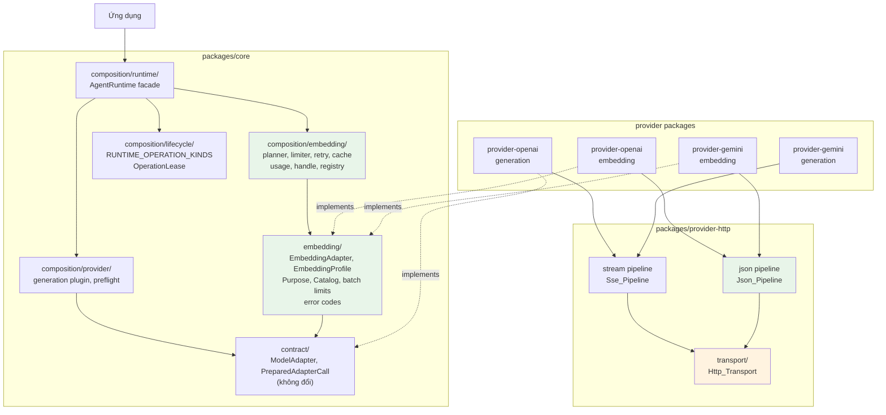
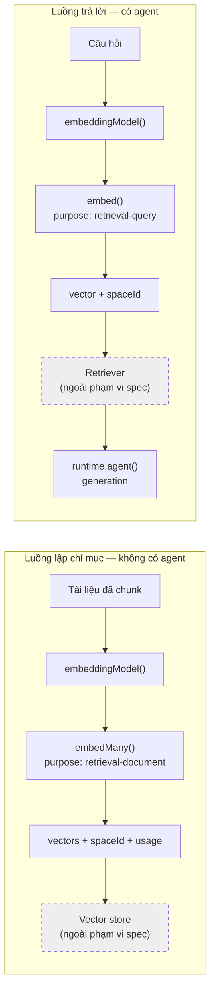
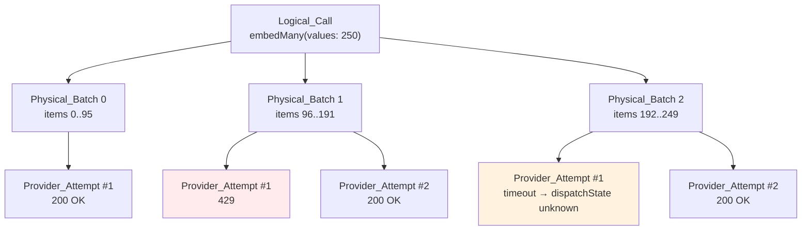
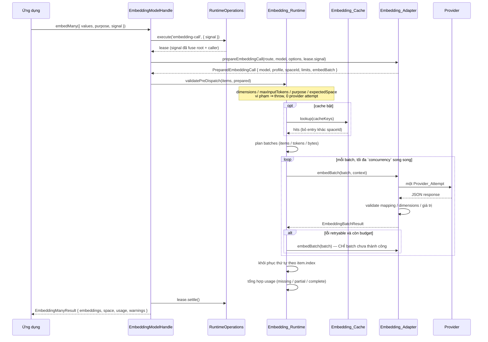
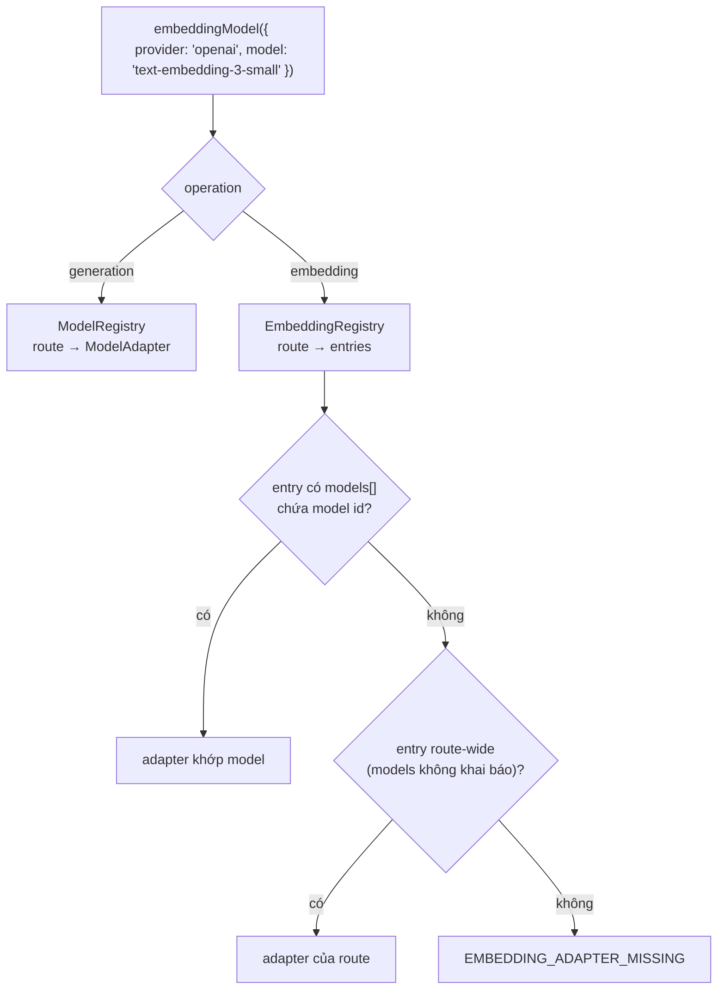
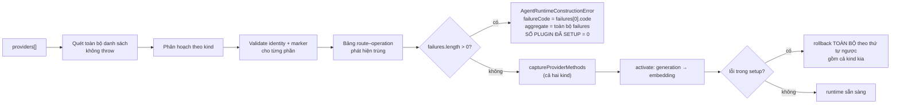
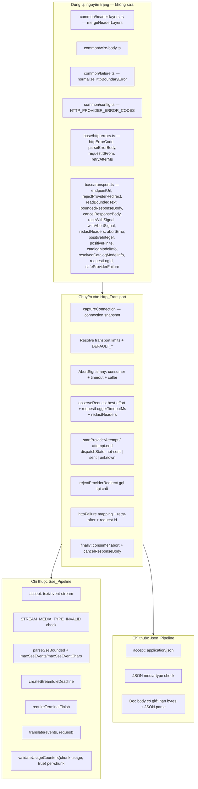
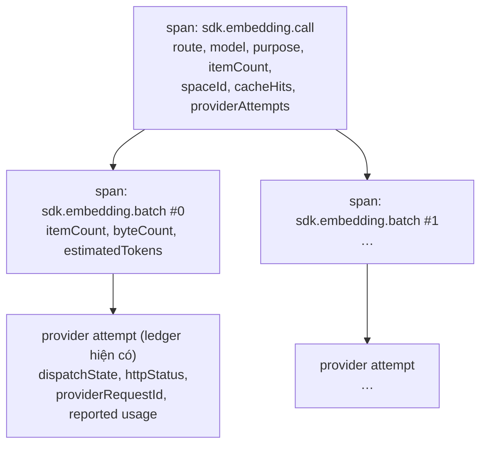

# Design Document

## Overview

Tài liệu này thiết kế năng lực **embedding** cho `ai-agent-sdk` như một model capability độc lập, đặt cạnh generation dưới cùng một `AgentRuntime`. Phạm vi là Bước 1 và Bước 2 của `embedding-request.md` mục 9: hoàn thiện đường embedding độc lập (contract, runtime composition, adapter OpenAI, bộ contract test), rồi kiểm chứng đa provider bằng adapter Gemini.

Thiết kế gồm bốn khối công việc, thực hiện theo thứ tự phụ thuộc:

1. **Tách `Http_Transport` trong `packages/provider-http`** rồi dựng lại `Sse_Pipeline` (generation, hành vi không đổi) và thêm `Json_Pipeline` (embedding) trên nền đó. Đây là khối duy nhất chạm vào code generation đang chạy production.
2. **`Embedding_Contract` tại `packages/core/src/embedding/`** — `EmbeddingAdapter`, profile/space, purpose, catalog, giới hạn batch, error code, validation. Export qua entry point mới `@alvin0/ai-agent-sdk-core/embedding`.
3. **`Embedding_Runtime` tại `packages/core/src/composition/embedding/`** — `runtime.embeddingModel()`, batching, concurrency, retry, cache tùy chọn, usage aggregation, order restoration, operation kind mới và tích hợp `close()`. Kèm plugin kind riêng và startup preflight.
4. **Hai adapter provider** — `OpenAI_Embedding_Adapter` và `Gemini_Embedding_Adapter`, cùng mở rộng `Conformance_Harness` và cập nhật `Documentation_Set`.

Ba bất biến chi phối toàn bộ thiết kế:

- **Contract generation không đổi.** `ModelAdapter` giữ đúng một abstract method `stream()`, `PreparedAdapterCall` giữ nguyên chữ ký, `PROVIDER_PLUGIN_API_VERSION` giữ giá trị `1`, `ModelProviderRegistrar` giữ đúng hai method.
- **SDK không tự sửa dữ liệu.** Input quá dài, dimensions không hỗ trợ, vector sai chiều hay chứa `NaN` đều là lỗi có cấu trúc, không phải input để cắt/pad.
- **Usage không được bịa.** Provider không trả usage thì báo `missing`/`partial`; usage sai định dạng vẫn là bằng chứng của `Provider_Attempt` nhưng không thoát ra ngoài dưới dạng số liệu công bố.

## Architecture

### Ranh giới thành phần



Chiều phụ thuộc là một chiều: `embedding/` → `contract/` + `primitives/` + `errors/` + `observation/` (chỉ type). `composition/embedding/` → `embedding/`. Không có mũi tên ngược nào, nên rule `no-circular` của `.dependency-cruiser.cjs` được thoả bằng cấu trúc chứ không bằng quy ước (Yêu cầu 1.6, 19.6).

### Hai luồng sử dụng



Cả hai luồng dùng cùng `AgentRuntime`. Luồng lập chỉ mục không tạo agent, team hay session nào (Yêu cầu 3.4). Vector store và retriever là hạng mục ngoài phạm vi; spec này dừng ở chỗ trả về vector kèm `Space_Id` đủ để tầng trên kiểm tra tương thích.

### Ba mức trong một lời gọi



`Embedding_Runtime` là tầng duy nhất sở hữu retry. `Embedding_Adapter` thực hiện đúng một `Provider_Attempt` cho mỗi lần được gọi, nên số attempt của một `Logical_Call` luôn bằng số lần `Embedding_Runtime` gọi adapter (Yêu cầu 4.3, 16.6).

### Bố cục module và entry point

#### Cấu trúc file mới

```text
packages/core/src/embedding/
  index.ts          # barrel công khai của entry point ./embedding
  adapter.ts        # EmbeddingAdapter, PreparedEmbeddingCall
  request.ts        # EmbeddingItem, EmbeddingContentPart, EmbeddingBatchRequest
  result.ts         # EmbeddingVector, EmbeddingBatchResult, EmbeddingResult, EmbeddingManyResult
  purpose.ts        # EmbeddingPurpose, EmbeddingPurposeHandling
  profile.ts        # EmbeddingProfile, EmbeddingSpaceId, deriveSpaceId, isSpaceCompatible, defaultEmbeddingProfile
  catalog.ts        # EmbeddingCapability, EmbeddingModelInfo, ResolvedEmbeddingModelInfo
  limits.ts         # EMBEDDING_BATCH_DEFAULTS, ResolvedEmbeddingBatchLimits, resolveBatchLimits, estimateTokens
  handle.ts         # EmbeddingModelHandle, EmbeddingModelOptions (type-only, không phụ thuộc composition)
  usage.ts          # EmbeddingTokenUsage, EmbeddingUsageReport, validateEmbeddingUsage
  errors.ts         # EMBEDDING_ERROR_CODES, EmbeddingError
  validation.ts     # validatePreDispatch, validateBatchResult

packages/core/src/composition/embedding/
  index.ts          # barrel nội bộ
  plugin-types.ts   # ComposableEmbeddingProviderPlugin, EmbeddingProviderRegistrar
  definition.ts     # defineEmbeddingProviderPlugin
  preflight.ts      # preflightEmbeddingIdentities, hợp nhất vào preflight runtime
  activation.ts     # activateEmbeddingProviders
  registry.ts       # EmbeddingRegistry — phân giải route + operation + model id
  planner.ts        # batch planner (lazy, bounded) — tiêu thụ ResolvedEmbeddingBatchLimits của embedding/limits.ts
  limiter.ts        # concurrency limiter
  retry.ts          # tầng retry duy nhất
  cache.ts          # EmbeddingCache tùy chọn + cache key
  usage.ts          # tổng hợp usage giữ tính trung thực
  handle.ts         # triển khai embed()/embedMany()
  manager.ts        # RuntimeEmbedding, sở hữu bởi RuntimeCompositionOwner

packages/provider-http/src/transport/
  index.ts
  connection.ts     # HttpTransportConnection, captureTransportConnection
  limits.ts         # DEFAULT_* + resolveTransportLimits
  session.ts        # withTransportSession — chuỗi an toàn dùng chung
  stream.ts         # transportStream() cho Sse_Pipeline
  json.ts           # transportJson() cho Json_Pipeline

packages/provider-openai/src/embedding.ts    # OpenAI_Embedding_Adapter + openAiEmbeddingPlugin
packages/provider-gemini/src/embedding.ts    # Gemini_Embedding_Adapter + geminiEmbeddingPlugin
packages/testkit/src/provider/embedding/     # mở rộng Conformance_Harness
```

#### Entry point mới

`packages/core/package.json`:

```jsonc
"./embedding": {
  "types": "./dist/embedding.d.ts",
  "import": "./dist/embedding.js",
  "default": "./dist/embedding.js"
}
```

`packages/core/tsdown.config.ts` thêm một entry, theo đúng khuôn `observability` đang dùng (source là một directory index, output là một file phẳng):

```ts
entry: {
  index: 'src/index.ts',
  observability: 'src/observability/index.ts',
  embedding: 'src/embedding/index.ts',   // mới
  agent: 'src/agent-public.ts',
  // ...
}
```

Phân bổ export theo entry point:

| Entry | Nội dung embedding được export |
| --- | --- |
| `./embedding` | Toàn bộ `Embedding_Contract`: `EmbeddingAdapter`, request/result type, `EmbeddingPurpose`, `EmbeddingProfile`, `deriveSpaceId`, `isSpaceCompatible`, `defaultEmbeddingProfile`, `EmbeddingCapability`, `EmbeddingModelInfo`, `EMBEDDING_BATCH_DEFAULTS`, `ResolvedEmbeddingBatchLimits`, `resolveBatchLimits`, `estimateTokens`, `EMBEDDING_ERROR_CODES`, `EmbeddingError`, validation helper |
| `.` (root) | Chỉ type của bề mặt runtime: `EmbeddingModelHandle`, `EmbeddingModelOptions`, `EmbeddingResult`, `EmbeddingManyResult`, `EmbeddingUsageReport` — cần thiết vì `AgentRuntime.embeddingModel()` nằm ở root |
| `./provider` | Tác giả plugin: `defineEmbeddingProviderPlugin`, `EMBEDDING_PROVIDER_PLUGIN_API_VERSION`, `ComposableEmbeddingProviderPlugin`, `EmbeddingProviderRegistrar` |

Đặt `defineEmbeddingProviderPlugin` ở `./provider` là chủ ý: `provider-openai` và `provider-gemini` đã import `defineModelProviderPlugin` từ đó, nên tác giả plugin không phải học một entry point thứ hai (Yêu cầu 11.3, 18.6).

## Data Models

Toàn bộ kiểu dữ liệu của `Embedding_Contract` cư trú tại `packages/core/src/embedding/` và được export qua entry point `./embedding`. Không kiểu nào ở đây phụ thuộc `composition/`, nên chiều phụ thuộc một chiều được giữ bằng cấu trúc (Yêu cầu 1.6, 19.6).

### Request: hai tầng `items[]` và `contentParts[]`

```ts
// packages/core/src/embedding/request.ts
export type EmbeddingContentPart =
  | { readonly type: 'text'; readonly text: string }

/** Một đối tượng cần embed độc lập. */
export interface EmbeddingItem {
  /** Chỉ số trong Logical_Call, KHÔNG phải chỉ số trong Physical_Batch. */
  readonly index: number
  /** Các thành phần của cùng một đối tượng; v1 chỉ có text. */
  readonly contentParts: readonly EmbeddingContentPart[]
}

export type EmbeddingTruncation = 'reject' | 'allow'

export interface EmbeddingBatchRequest {
  readonly provider: string
  readonly model: string
  readonly purpose: EmbeddingPurpose
  readonly items: readonly EmbeddingItem[]
  /** Số chiều yêu cầu; vắng mặt nghĩa là dùng default của model. */
  readonly dimensions?: number
  /** Mặc định của SDK là `'reject'`, kể cả khi mặc định provider là bật. */
  readonly truncation: EmbeddingTruncation
  readonly signal?: AbortSignal
}
```

Hai tầng này là điểm mở rộng multimodal về sau mà không phải đổi contract: `items[]` là các đối tượng cần embed độc lập, `contentParts[]` là các thành phần của một đối tượng (Yêu cầu 8.5). Nếu provider tổng hợp nhiều `contentParts` thành một embedding, adapter vẫn trả **đúng một** vector cho item đó (Yêu cầu 8.7).

### Result

```ts
// packages/core/src/embedding/result.ts
export interface EmbeddingVector {
  /** PHẢI khớp `index` của một item trong request. */
  readonly index: number
  readonly values: readonly number[]
  /** Provider báo đã cắt input này; chỉ hợp lệ khi truncation === 'allow'. */
  readonly truncated?: boolean
}

export interface EmbeddingBatchResult {
  readonly vectors: readonly EmbeddingVector[]
  /** Bằng chứng thô của provider. Runtime KHÔNG suy ra 0 khi vắng mặt. */
  readonly usage?: UsageCounters
  readonly providerRequestId?: string
  readonly warnings?: readonly EmbeddingWarning[]
}

export interface EmbeddingWarning {
  readonly code: 'input-truncated' | 'usage-unreported' | 'usage-malformed'
  readonly itemIndexes?: readonly number[]
  readonly message: string
}

export interface EmbeddingResult {
  readonly embedding: readonly number[]
  readonly space: EmbeddingSpaceId
  readonly profile: EmbeddingProfile
  readonly usage: EmbeddingUsageReport
  readonly warnings: readonly EmbeddingWarning[]
}

export interface EmbeddingManyResult {
  readonly embeddings: readonly (readonly number[])[]
  readonly space: EmbeddingSpaceId
  readonly profile: EmbeddingProfile
  readonly usage: EmbeddingUsageReport
  readonly warnings: readonly EmbeddingWarning[]
}
```

Kiểu kết quả không tham chiếu `StreamChunk`, message, tool call hay text delta ở bất kỳ vị trí nào (Yêu cầu 1.3). Output representation được biểu diễn như một capability đã khai báo trong `EmbeddingProfile.representation`, không phải giả định rằng `number[]` là contract bao trùm sparse hay multi-vector (Yêu cầu 8.8).

### Purpose

```ts
// packages/core/src/embedding/purpose.ts
export type EmbeddingPurpose = 'retrieval-query' | 'retrieval-document'

export type EmbeddingPurposeHandling =
  /** Provider có tham số wire chuyên dụng, ví dụ Gemini `taskType`. */
  | { readonly kind: 'wire-parameter'; readonly parameter: string }
  /** Provider yêu cầu prefix do adapter chèn, theo tài liệu provider. */
  | { readonly kind: 'adapter-prefix'; readonly documented: true }
  /** Provider không phơi ra cơ chế nào; adapter KHÔNG tự thêm prefix. */
  | { readonly kind: 'none' }
```

`Purpose` bắt buộc trên mọi lời gọi `embed()`/`embedMany()` (Yêu cầu 7.2), và trách nhiệm dịch sang cơ chế provider nằm hoàn toàn ở adapter (Yêu cầu 7.3, 7.6). Khi route khai báo `purposeHandling` là `unknown` hoặc `{ kind: 'none' }`, adapter gửi text nguyên văn — không có prefix nào không được tài liệu provider mô tả (Yêu cầu 7.5).

### `EmbeddingProfile` và `Space_Id`

Đây là trung tâm của tính đúng đắn dài hạn: hai vector cùng số chiều **không** vì thế mà tương thích.

```ts
// packages/core/src/embedding/profile.ts
export type EmbeddingRepresentation = 'dense-float32'

export type EmbeddingNormalization = 'unit-l2' | 'none' | 'unknown'

/** Post-processing được quản lý phiên bản; không bao giờ là slice/pad ngầm. */
export interface EmbeddingPostProcessing {
  readonly kind: 'l2-renormalize'
  readonly revision: string
}

export interface EmbeddingProfile {
  /** `${route}:${modelId}` — định danh model, không phải định danh space. */
  readonly modelIdentity: string
  readonly modelRevision?: string
  readonly dimensions: number
  readonly representation: EmbeddingRepresentation
  readonly normalization: EmbeddingNormalization
  readonly postProcessing?: EmbeddingPostProcessing
  readonly documentRecipeRevision: string
  readonly queryRecipeRevision: string
  /** Tuyên bố của nhà cung cấp về không gian embedding. Do adapter/route khai báo. */
  readonly compatibilityIdentity: string
  readonly profileRevision: string
}

export type EmbeddingSpaceId = string & { readonly __brand: 'EmbeddingSpaceId' }

/**
 * Space_Id dẫn xuất từ những gì quyết định vector có so sánh được với nhau hay không.
 *
 * ĐỒNG BỘ và KHÔNG BĂM: Space_Id là một canonical string, không phải digest.
 * Nó là định danh để so sánh, không phải secret cần che, nên không cần hàm băm và
 * `packages/core` không phải thêm phụ thuộc vào `crypto.subtle` (DD-11). Nhờ đồng bộ,
 * `prepareEmbeddingCall` gọi được trực tiếp mà không phải `await`.
 *
 * Định dạng: `emb:1|{compatibilityIdentity}|{dimensions}|{representation}|
 * {normalization}|{postProcessing.kind}:{postProcessing.revision}|{profileRevision}`,
 * trong đó mỗi thành phần được escape ký tự `|` và `\` trước khi ghép, nên hai bộ
 * thành phần khác nhau không thể cho cùng một chuỗi.
 *
 * CHÚ Ý: `documentRecipeRevision` và `queryRecipeRevision` được ghi trong profile
 * nhưng KHÔNG tham gia dẫn xuất. Đó chính là điều làm cho query và document thuộc
 * cùng một Space_Id khi chúng thuộc cùng retrieval profile.
 */
export function deriveSpaceId(profile: EmbeddingProfile): EmbeddingSpaceId

/**
 * Tương thích space là khái niệm riêng: quyết định bởi compatibility identity đã
 * khai báo, độc lập với so sánh tên model và độc lập với so sánh số chiều.
 */
export function isSpaceCompatible(a: EmbeddingProfile, b: EmbeddingProfile): boolean

/**
 * Default dùng được cho `EmbeddingAdapter.embeddingProfile()`: compatibility identity
 * dẫn xuất từ `${route}:${modelId}` khi catalog không khai báo, normalization là
 * `'unknown'`, không post-processing. Nhờ default này `EmbeddingAdapter` giữ đúng một
 * abstract method (Yêu cầu 1.2); adapter biết provider tuyên bố gì về embedding space
 * PHẢI override để khai báo identity đúng.
 */
export function defaultEmbeddingProfile(
  model: ResolvedEmbeddingModelInfo,
  request: EmbeddingProfileInput,
): EmbeddingProfile
```

`deriveSpaceId` ghép đúng năm thành phần theo thứ tự cố định: `compatibilityIdentity`, `dimensions`, `representation`, `normalization`, và `postProcessing` (kind + revision) cùng `profileRevision`. `isSpaceCompatible` so sánh đúng bộ đó.

Hệ quả trực tiếp:

| Tình huống | Kết quả |
| --- | --- |
| Cùng dimensions, khác `compatibilityIdentity` | Không tương thích (Yêu cầu 6.4) |
| Cùng `compatibilityIdentity`, khác `modelIdentity` — nhóm model dùng chung space do nhà cung cấp khai báo | Tương thích, cho phép cấu hình fallback trong nhóm (Yêu cầu 6.7) |
| Cùng mọi thứ, khác `purpose` | Cùng `Space_Id` (Yêu cầu 7.4) |
| `gemini-embedding-001` vs `gemini-embedding-2` | Không tương thích, vì hai thế hệ khai báo identity khác nhau (Yêu cầu 14.6) |

### Catalog embedding

`ResolvedModelInfo` giữ nguyên, không thêm một trường embedding nào. Embedding có catalog riêng, và mọi capability không được khai báo tường minh đều là `unknown` (Yêu cầu 10.1, 10.4, 10.5).

```ts
// packages/core/src/embedding/catalog.ts
export type EmbeddingCapability<T> =
  | { readonly state: 'supported'; readonly value: T }
  | { readonly state: 'unsupported' }
  | { readonly state: 'unknown' }

export type EmbeddingInputType = 'text'

export interface EmbeddingModelInfo {
  readonly provider: string
  readonly id: string
  readonly name: string
  readonly description?: string
  readonly inputTypes: EmbeddingCapability<readonly EmbeddingInputType[]>
  readonly representation: EmbeddingCapability<EmbeddingRepresentation>
  readonly dimensions: EmbeddingCapability<readonly number[]>
  readonly defaultDimensions: EmbeddingCapability<number>
  readonly maxInputTokens: EmbeddingCapability<number>
  readonly maxBatchItems: EmbeddingCapability<number>
  readonly maxBatchTokens: EmbeddingCapability<number>
  readonly maxBatchBytes: EmbeddingCapability<number>
  readonly purposeHandling: EmbeddingCapability<EmbeddingPurposeHandling>
  readonly normalization: EmbeddingCapability<EmbeddingNormalization>
  readonly compatibilityIdentity: EmbeddingCapability<string>
}

export interface ResolvedEmbeddingModelInfo extends EmbeddingModelInfo {
  readonly modelRevision?: string
}
```

Có một phân biệt then chốt giữa hai cách dùng catalog, và đây là chỗ dễ làm sai nhất:

| Mục đích | Khi capability là `unknown` |
| --- | --- |
| **Validation** (từ chối request trước dispatch) | KHÔNG được từ chối. Không biết giới hạn thì không được suy ra giới hạn; forward cho provider quyết định. |
| **Batching** (chia `Physical_Batch`) | Dùng default an toàn của SDK. Batching luôn cần một biên trên hữu hạn, nếu không bộ nhớ không bị chặn. |

Nhờ phân biệt này, một model id ngoài catalog vẫn dùng được (Yêu cầu 10.3), trong khi bộ nhớ của một `Logical_Call` vẫn bị chặn trên (Yêu cầu 17.4). Bộ default và kiểu giới hạn nằm ở mục dưới.

Phạm vi v1 được khai báo ngay trong catalog: `inputTypes` nhận đúng `'text'` và `representation` nhận đúng `'dense-float32'` — một dense vector cho mỗi item. Không giá trị nào trong hai capability này biểu diễn sparse, multi-vector hay input multimodal, nên phạm vi v1 là điều đọc được từ kiểu chứ không phải từ tài liệu (Yêu cầu 8.6, 8.8).

### Giới hạn batch và ước lượng token

Giới hạn batch là **dữ liệu của contract**, không phải chi tiết của tầng composition: `EmbeddingAdapter.prepareEmbeddingCall()` và `PreparedEmbeddingCall` đều mang nó, và cả hai nằm ở `packages/core/src/embedding/`. Nếu kiểu này cư trú trong `composition/embedding/planner.ts` thì `embedding/` sẽ phải import từ `composition/`, tạo đúng chiều phụ thuộc ngược mà Yêu cầu 1.6 và 19.6 cấm (DD-12). Nên nó ở `embedding/limits.ts`.

```ts
// packages/core/src/embedding/limits.ts
export const EMBEDDING_BATCH_DEFAULTS = Object.freeze({
  maxItems: 96,
  maxTokens: 100_000,
  maxBytes: 1024 * 1024,
} as const)

export interface ResolvedEmbeddingBatchLimits {
  readonly maxItems: number
  readonly maxTokens: number
  readonly maxBytes: number
  readonly estimateTokens: (text: string) => number
}

/**
 * Ước lượng token dùng chung cho batching và cho kiểm tra độ dài input.
 * Mặc định `ceil(utf8Bytes / 4)`. Đây là ƯỚC LƯỢNG, không phải tokenizer của provider:
 * nó chỉ được dùng để chia batch và để từ chối input khi `maxInputTokens` là
 * `supported` và ước lượng đã vượt giới hạn. Adapter có estimator sát hơn thì truyền
 * qua `limits.estimateTokens`.
 */
export function estimateTokens(text: string): number

/**
 * Hợp catalog (`maxBatchItems`, `maxBatchTokens`, `maxBatchBytes`) với override của
 * người gọi, và dùng `EMBEDDING_BATCH_DEFAULTS` cho mọi capability là `unknown`.
 */
export function resolveBatchLimits(
  model: ResolvedEmbeddingModelInfo,
  overrides?: Partial<ResolvedEmbeddingBatchLimits>,
): ResolvedEmbeddingBatchLimits
```

`composition/embedding/planner.ts` **tiêu thụ** `ResolvedEmbeddingBatchLimits`, không định nghĩa nó. Nhờ vậy chiều phụ thuộc vẫn là `composition/embedding/` → `embedding/`, và thứ tự task không có chỗ nào dùng một kiểu trước khi nó tồn tại.

### Usage embedding: một kiểu riêng, không phải `TokenUsage`

Embedding không có output token. Nếu tái dùng `TokenUsage`, mọi report sẽ vĩnh viễn `complete === false` (vì `validateUsageCounters` đòi cả `inputTokens` và `outputTokens`), hoặc tệ hơn, sẽ có người điền `outputTokens: 0` — đúng thứ mà nguyên tắc usage honesty cấm. Nên embedding có kiểu riêng.

```ts
// packages/core/src/embedding/usage.ts
export interface EmbeddingTokenUsage {
  readonly inputTokens: number
  readonly totalTokens?: number
}

export interface EmbeddingUsageReport {
  readonly status: 'complete' | 'partial' | 'missing'
  /** Chỉ có khi status === 'complete'. Không bao giờ là TokenUsage. */
  readonly tokens?: EmbeddingTokenUsage
  readonly batches: number
  readonly batchesWithUsage: number
  readonly providerAttempts: number
  readonly inputsFromCache: number
  readonly inputsFromProvider: number
}

/**
 * Bản đối ứng của validateUsageCounters cho embedding.
 * Usage thiếu/sai định dạng vẫn là bằng chứng của Provider_Attempt nhưng
 * không thoát ra ngoài dưới dạng số liệu công bố.
 */
export function validateEmbeddingUsage(value: unknown): EmbeddingUsageValidation
```

Quy tắc trạng thái: `complete` khi **mọi** batch gửi tới provider đều trả usage đọc được; `partial` khi một phần trả; `missing` khi không batch nào trả. Không nhánh nào gán giá trị 0 (Yêu cầu 16.2, 16.3).

## Components and Interfaces

### `EmbeddingAdapter` và `PreparedEmbeddingCall`

Một abstract class độc lập, **không** kế thừa `ModelAdapter`, với **đúng một** abstract method. Mọi member khác có default hoạt động được, giữ đúng tinh thần "một adapter tối thiểu là một method" của `ModelAdapter` (Yêu cầu 1.1, 1.2, 4.1).

```ts
// packages/core/src/embedding/adapter.ts
export abstract class EmbeddingAdapter {
  /** Metadata hiển thị cho một route; `id` PHẢI bằng `provider`. */
  providerInfo(provider: string): ProviderInfo {
    return { id: provider, name: provider }
  }

  /** Retry policy route này sở hữu; `undefined` để nhận default của runtime. */
  providerRetryPolicy(_provider: string): ResolvedRetryPolicy | undefined {
    return undefined
  }

  /** Catalog advisory. Vắng mặt KHÔNG được biến thành lý do từ chối request. */
  listEmbeddingModels(
    _provider: string,
    _signal?: AbortSignal,
  ): Promise<readonly EmbeddingModelInfo[]> {
    return Promise.resolve([])
  }

  /** Metadata chính xác cho một model; id lạ resolve về descriptor tối thiểu toàn `unknown`. */
  resolveEmbeddingModel(
    provider: string,
    model: string,
    _signal?: AbortSignal,
  ): Promise<ResolvedEmbeddingModelInfo> {
    return Promise.resolve(unknownEmbeddingModel(provider, model))
  }

  /**
   * Khai báo Embedding_Profile cho một cấu hình gọi cụ thể.
   *
   * KHÔNG abstract: default dẫn xuất compatibility identity từ `${route}:${modelId}`
   * khi catalog không khai báo, đặt normalization là `'unknown'` và không post-processing.
   * Nhờ vậy class này giữ đúng MỘT abstract method (Yêu cầu 1.2). Adapter sở hữu tuyên bố
   * thật của provider về embedding space PHẢI override — cả hai adapter OpenAI và Gemini
   * đều override, và Gemini khai báo identity riêng cho từng thế hệ model.
   */
  embeddingProfile(
    model: ResolvedEmbeddingModelInfo,
    request: EmbeddingProfileInput,
  ): EmbeddingProfile {
    return defaultEmbeddingProfile(model, request)
  }

  /**
   * Gắn metadata đã resolve với đúng generation cấu hình sẽ dispatch.
   * Adapter có connection fact đến từ cấu hình mutable PHẢI override và snapshot ở đây.
   */
  async prepareEmbeddingCall(
    provider: string,
    model: string,
    options: PrepareEmbeddingOptions,
    signal?: AbortSignal,
    context?: ModelInvocationContext,
  ): Promise<PreparedEmbeddingCall> {
    const resolved = await this.resolveEmbeddingModel(provider, model, signal)
    const profile = this.embeddingProfile(resolved, options)
    return Object.freeze({
      model: resolved,
      profile,
      // deriveSpaceId đồng bộ: canonical string, không digest (DD-11).
      spaceId: deriveSpaceId(profile),
      limits: resolveBatchLimits(resolved, options.limits),
      embedBatch: (batch, invocation = context) => this.embedBatch(batch, invocation),
    })
  }

  /**
   * Thực hiện ĐÚNG MỘT physical request embedding. Method duy nhất bắt buộc.
   *
   * Nghĩa vụ của implementation:
   * - đúng một Provider_Attempt cho mỗi lần được gọi; retry thuộc runtime;
   * - tôn trọng `batch.signal` ngay lập tức;
   * - gắn chỉ số input gốc lên từng vector trả về;
   * - phát protocol error khi response không thoả contract, không suy diễn;
   * - gắn attribution headers của SDK lên mọi request.
   */
  abstract embedBatch(
    batch: EmbeddingBatchRequest,
    context?: ModelInvocationContext,
  ): Promise<EmbeddingBatchResult>
}
```

`PreparedEmbeddingCall` là bản đối ứng của `PreparedAdapterCall` cho embedding: metadata, profile, `spaceId` và giới hạn batch đến từ **cùng một lần capture** với hàm dispatch, nên không thể kiểm tra dimensions ở một cấu hình rồi gửi request qua cấu hình khác (Yêu cầu 2.1).

```ts
export interface PreparedEmbeddingCall {
  readonly model: ResolvedEmbeddingModelInfo
  readonly profile: EmbeddingProfile
  readonly spaceId: EmbeddingSpaceId
  /** Từ `embedding/limits.ts`, không từ `composition/`. */
  readonly limits: ResolvedEmbeddingBatchLimits
  embedBatch(
    batch: EmbeddingBatchRequest,
    context?: ModelInvocationContext,
  ): Promise<EmbeddingBatchResult>
}
```

### Bề mặt công khai của `Embedding_Runtime`

```ts
// packages/core/src/embedding/handle.ts — type-only, không phụ thuộc composition
export interface EmbeddingModelOptions {
  readonly provider: string
  readonly model: string
  readonly dimensions?: number
  readonly truncation?: EmbeddingTruncation
  /** Space_Id kỳ vọng; không tương thích thì lời gọi bị từ chối. */
  readonly expectedSpace?: EmbeddingSpaceId
  readonly concurrency?: number
  readonly batchLimits?: Partial<ResolvedEmbeddingBatchLimits>
  readonly cache?: EmbeddingCacheOptions
}

export interface EmbedOneInput {
  readonly value: string | readonly EmbeddingContentPart[]
  readonly purpose: EmbeddingPurpose
  readonly signal?: AbortSignal
  readonly expectedSpace?: EmbeddingSpaceId
}

export interface EmbedManyInput {
  readonly values: readonly (string | readonly EmbeddingContentPart[])[]
  readonly purpose: EmbeddingPurpose
  readonly signal?: AbortSignal
  readonly expectedSpace?: EmbeddingSpaceId
}

export interface EmbeddingModelHandle {
  embed(input: EmbedOneInput): Promise<EmbeddingResult>
  embedMany(input: EmbedManyInput): Promise<EmbeddingManyResult>
}
```

`AgentRuntime` nhận thêm đúng một method:

```ts
// packages/core/src/composition/runtime/types.ts
export interface RuntimeCompositionView {
  providers(): readonly RuntimeProviderInfo[]
  modelCatalog(route: string, options?: ModelCatalogOptions): Promise<RuntimeModelCatalogSnapshot>
  embeddingModel(options: EmbeddingModelOptions): EmbeddingModelHandle   // mới
  agent(definition: RuntimeAgentBindingInput): RuntimeAgent
  team(options: RuntimeAgentTeamOptions): RuntimeAgentTeam
  logger(context?: RuntimeLoggerContext): SdkLogger
  diagnostics(): RuntimeDiagnosticSnapshot
  close(options?: { readonly signal?: AbortSignal }): Promise<RuntimeCloseReport>
}

export interface RuntimeOwnerOptions {
  readonly providers: readonly ComposableRuntimeProviderPlugin[]   // union mở rộng
  // ... các trường còn lại không đổi
}
```

`embeddingModel()` gọi `operations.assertActive()` rồi phân giải adapter ngay lập tức — nó là đồng bộ và không tạo agent, team hay session nào (Yêu cầu 3.1, 3.4, 12.6). Route không có `Embedding_Adapter` đăng ký thì `embeddingModel()` fail nhanh với `EMBEDDING_ADAPTER_MISSING` (Yêu cầu 3.5).

Ví dụ sử dụng (đối chiếu với API minh họa ở `embedding-request.md` mục 5):

```ts
import { createAgentRuntime } from '@alvin0/ai-agent-sdk-core'
import { openAiEmbeddingPlugin } from '@alvin0/ai-agent-sdk-provider-openai'

const runtime = await createAgentRuntime({
  providers: [openAiEmbeddingPlugin({ apiKey, routes: ['openai'] })],
})
try {
  const model = runtime.embeddingModel({
    provider: 'openai',
    model: 'text-embedding-3-small',
    dimensions: 1536,
  })
  const documents = await model.embedMany({
    values: ['Quy trình xử lý sự cố hệ thống.', 'Hướng dẫn cấu hình PostgreSQL.'],
    purpose: 'retrieval-document',
    signal: AbortSignal.timeout(30_000),
  })
  const query = await model.embed({
    value: 'Cách xử lý khi database bị lỗi?',
    purpose: 'retrieval-query',
    signal: AbortSignal.timeout(10_000),
  })
  // documents.space === query.space  ⇐ Yêu cầu 7.4
} finally {
  await runtime.close()
}
```

Khác biệt duy nhất so với API minh họa ban đầu: không có `capabilities: ['embedding']` trên plugin generation. Quyết định plugin kind riêng (mục dưới) thay nó bằng một plugin factory riêng.

### Vòng đời một `Logical_Call`



### Validation tiền-dispatch

`validatePreDispatch` chạy **trước** `Physical_Batch` đầu tiên, đọc metadata từ chính `PreparedEmbeddingCall` sẽ dùng để dispatch (Yêu cầu 2.2, 3.6):

| Kiểm tra | Điều kiện phát lỗi | Error code |
| --- | --- | --- |
| `purpose` | không thuộc hai giá trị hợp lệ | `EMBEDDING_REQUEST_INVALID` |
| `values` rỗng hoặc `contentParts` rỗng | luôn | `EMBEDDING_REQUEST_INVALID` |
| `dimensions` | `model.dimensions.state === 'supported'` và giá trị không thuộc danh sách | `EMBEDDING_DIMENSIONS_UNSUPPORTED` |
| Độ dài input | `model.maxInputTokens.state === 'supported'` và `limits.estimateTokens` vượt giới hạn | `EMBEDDING_INPUT_TOO_LARGE` (kèm `itemIndexes` và `limit`) |
| `expectedSpace` | `!isSpaceCompatible` với profile của prepared call | `EMBEDDING_SPACE_INCOMPATIBLE` |
| `truncation: 'allow'` | route khai báo provider không có tham số truncation | `EMBEDDING_TRUNCATION_UNSUPPORTED` |

Mọi lỗi ở bảng này xảy ra với **0 provider attempt**. Khi capability tương ứng là `unknown`, runtime không từ chối — nó không có cơ sở để tuyên bố giới hạn (Yêu cầu 9.1, 9.2).

Kiểm tra độ dài input và việc chia batch dùng **cùng một** `estimateTokens` của `embedding/limits.ts`. Hàm đó có đúng một chủ sở hữu, và cả hai chỗ dùng đều coi nó là ước lượng: batching luôn cần một biên trên hữu hạn nên luôn gọi nó, còn validation chỉ gọi nó khi `maxInputTokens` là `supported` — capability `unknown` không bao giờ trở thành lý do từ chối.

### Batch planner

Planner là một generator lười, không vật chất hoá toàn bộ corpus:

```ts
// packages/core/src/composition/embedding/planner.ts
import type { ResolvedEmbeddingBatchLimits } from '../../embedding/limits.ts'

/**
 * Sinh các Physical_Batch theo thứ tự input, đóng batch hiện tại ngay khi thêm
 * item tiếp theo sẽ vượt bất kỳ một trong ba giới hạn.
 *
 * Bất biến: mỗi batch ≤ mọi giới hạn; mỗi item xuất hiện đúng một lần trong
 * đúng một batch; batch chỉ rỗng khi không còn item.
 * Ngoại lệ có chủ ý: một item đơn lẻ vượt maxTokens/maxBytes vẫn thành một batch
 * một-item, vì cắt nội dung là điều SDK không làm — provider sẽ từ chối và lỗi
 * đó là câu trả lời trung thực.
 */
export function* planEmbeddingBatches(
  items: readonly EmbeddingItem[],
  limits: ResolvedEmbeddingBatchLimits,
): Generator<EmbeddingBatchPlan>
```

Ba giới hạn được áp **đồng thời**, không phải chọn một (Yêu cầu 4.4). Planner nhận `limits` từ `PreparedEmbeddingCall`, tức từ `embedding/limits.ts`, và không định nghĩa kiểu nào của riêng nó — đó là điều giữ chiều phụ thuộc `composition/embedding/` → `embedding/` một chiều. `estimateTokens` mặc định là `ceil(utf8Bytes / 4)`; adapter có thể cung cấp estimator sát hơn qua `limits`.

Bộ nhớ đỉnh của một `Logical_Call`: `O(concurrency × maxBytes)` cho payload đang bay, cộng `O(N × dimensions)` cho mảng kết quả — phần thứ hai là kích thước của chính output nên không thể nhỏ hơn. Điểm quan trọng là hằng số thứ nhất **không** tỉ lệ với corpus (Yêu cầu 17.4).

### Concurrency, retry và thứ tự

```ts
// packages/core/src/composition/embedding/retry.ts
type BatchState =
  | { readonly phase: 'pending' }
  | { readonly phase: 'in-flight'; readonly attempt: number }
  | { readonly phase: 'succeeded'; readonly vectors: readonly EmbeddingVector[] }
  | { readonly phase: 'failed'; readonly error: EmbeddingError; readonly retryable: boolean
      readonly dispatch: 'not-sent' | 'sent' | 'unknown' }
```

Quy tắc:

- **Một tầng retry duy nhất.** `Embedding_Runtime` sở hữu retry; `Embedding_Adapter` thực hiện đúng một `Provider_Attempt` mỗi lần được gọi. Không có adapter nào retry bên trong (Yêu cầu 4.3).
- **Chỉ retry batch chưa thành công.** Batch ở phase `succeeded` bị loại khỏi mọi lượt retry tiếp theo của cùng `Logical_Call`; kết quả của nó đã nằm trong mảng đích (Yêu cầu 4.7).
- **Timeout là `unknown`, không phải `not-sent`.** Khi một attempt kết thúc bằng timeout, `dispatch` được ghi là `unknown`: SDK không có cơ sở để kết luận provider chưa tính phí (Yêu cầu 4.8). `Http_Transport` đã đặt `dispatchState = 'unknown'` ngay trước khi `fetch` được gọi và chỉ nâng lên `'sent'` sau khi response về, nên giá trị này đến từ transport chứ không phải suy diễn lại ở runtime.
- **Thứ tự khôi phục bằng chỉ số, không bằng thời điểm hoàn thành.** Vector được ghi vào `results[item.index]` của một mảng cấp phát trước theo độ dài input, nên thứ tự output độc lập hoàn toàn với thứ tự batch settle (Yêu cầu 4.6).
- **Không fallback model.** Model chính lỗi thì lỗi được truyền ra ngoài. Fallback chỉ được cấu hình trong nhóm model có cùng `compatibilityIdentity` đã khai báo, và runtime kiểm tra điều kiện đó khi dựng handle, không phải khi lỗi đã xảy ra (Yêu cầu 6.6, 6.7).

### Cache tùy chọn

Mặc định **tắt**. Bật cache mà không khai báo `scope` là lỗi cấu hình — không có default nào an toàn cho câu hỏi "hai tenant có được dùng chung entry không".

```ts
// packages/core/src/composition/embedding/cache.ts
export interface EmbeddingCacheOptions {
  readonly store: EmbeddingCacheStore
  /** BẮT BUỘC. Security scope; không có default. */
  readonly scope: string
}

/**
 * cacheKey = H(
 *   1. securityScope
 *   2. modelIdentity + modelRevision + profileRevision
 *   3. purpose + recipeRevision tương ứng
 *   4. dimensions + postProcessing (kind + revision)
 *   5. H(nội dung input hiệu lực sau khi adapter chuẩn hoá)
 * )
 */
export async function embeddingCacheKey(input: EmbeddingCacheKeyInput): Promise<string>
```

Hash dùng `crypto.subtle.digest('SHA-256')` — có sẵn trên mọi runtime universal mà package này nhắm tới. Đổi bất kỳ một trong năm thành phần cho ra key khác; giữ nguyên cả năm cho ra key bằng nhau (Yêu cầu 5.2).

Đây là **chỗ duy nhất** trong thiết kế cần digest, và vì thế là chỗ duy nhất async. Cache key phải nén một lượng nội dung không bị chặn thành một khoá có độ dài cố định, nên digest là bắt buộc; hàm nằm ở tầng composition và được `await` trong đường cache của `embed()`/`embedMany()`. `deriveSpaceId` thì khác: nó chỉ ghép một số hữu hạn trường metadata ngắn thành một canonical string, nên đồng bộ và không cần `crypto.subtle` (DD-11). Nhờ tách như vậy, `packages/core` không phải đưa `crypto.subtle` vào đường đi bắt buộc — cache mặc định tắt, còn `Space_Id` luôn tính được.

Entry đọc từ store còn phải qua một cửa nữa: `Space_Id` lưu cùng entry phải khớp `Space_Id` của `PreparedEmbeddingCall` hiện tại, nếu không entry bị bỏ qua và một `Physical_Batch` mới được phát sinh (Yêu cầu 5.3). Đây là lớp phòng vệ thứ hai cho trường hợp cache key trùng do một thay đổi cấu hình không được phản ánh vào `profileRevision`.

`EmbeddingUsageReport` tách biệt `inputsFromCache` và `inputsFromProvider`, và tổng hai số luôn bằng số input của `Logical_Call` (Yêu cầu 5.4).

### Operation kind và `close()`

```ts
// packages/core/src/composition/lifecycle/types.ts
export const RUNTIME_OPERATION_KINDS = Object.freeze([
  'agent-run', 'model-catalog', 'manual-compaction', 'team-operation', 'embedding-call',
] as const)
```

Giá trị mới được **thêm vào cuối** tuple. Điều này không phải chuyện thẩm mỹ: `RuntimeOperations.beginClose()` đọc `operations[0]` làm nguồn cho `activeRunsAtClose` / `abortedRuns` / `unsettledRuns` của `QuiescenceReport`, nên `'agent-run'` phải giữ vị trí đầu.

Nhờ `beginClose()` đã map trên toàn bộ `RUNTIME_OPERATION_KINDS`, `RuntimeCloseReport.operations` tự động có một `RuntimeOperationCloseSummary` cho `'embedding-call'` với đủ bốn số `activeAtClose`, `aborted`, `settled`, `unsettled` — không cần code mới ở tầng report (Yêu cầu 12.1, 12.2).

Cancellation:

| Sự kiện | Hành vi |
| --- | --- |
| `signal` của caller abort | Lease signal abort ⇒ planner dừng phát sinh batch mới, batch `pending` bị huỷ trước khi gửi (Yêu cầu 12.3) |
| Abort trong khi attempt đang bay | `Http_Transport` abort fetch, giải phóng response body trong `finally`; runtime phát `EMBEDDING_ABORTED` (Yêu cầu 12.4) |
| `runtime.close()` khi `Logical_Call` đang chạy | Root controller abort ⇒ lease signal abort ⇒ như trên; kết quả phản ánh trong `RuntimeCloseReport` (Yêu cầu 12.5) |
| Gọi `embeddingModel()` khi đang đóng | `operations.assertActive()` throw `RUNTIME_CLOSING` / `RUNTIME_CLOSED` (Yêu cầu 12.6) |

### Plugin kind riêng cho embedding

#### Tại sao không mở rộng `ModelProviderRegistrar`

Thêm `registerEmbeddingAdapter()` vào `ModelProviderRegistrar` buộc phải nâng `PROVIDER_PLUGIN_API_VERSION`, và mọi plugin generation hiện có sẽ đứng trước một host mà nó không biết capability. Một plugin kind riêng giữ đường generation nguyên vẹn (Yêu cầu 11.1, 11.2).

```ts
// packages/core/src/composition/embedding/plugin-types.ts
export const EMBEDDING_PROVIDER_PLUGIN_API_VERSION = 1 as const

export interface EmbeddingProviderRegistrar {
  registerEmbeddingAdapter(
    routes: readonly string[],
    adapter: EmbeddingAdapter,
    models?: readonly string[],
  ): AdapterRegistrationHandle
}

export interface ComposableEmbeddingProviderPlugin {
  readonly kind: 'embedding-provider-plugin'
  readonly apiVersion: typeof EMBEDDING_PROVIDER_PLUGIN_API_VERSION
  readonly id: string
  readonly displayName: string
  readonly family?: string
  readonly routes: readonly string[]
  readonly defaultModel?: ModelTarget
  readonly setup: (registrar: EmbeddingProviderRegistrar) => void | (() => void)
}

/** Helper-only view; đăng ký không thể vượt ra ngoài route đã khai báo trước. */
export interface ComposableEmbeddingProviderRegistrar {
  readonly logger: SdkLogger
  registerEmbeddingAdapter(
    adapter: EmbeddingAdapter,
    options?: { readonly routes?: readonly string[]; readonly models?: readonly string[] },
  ): AdapterRegistrationHandle
}

export type ComposableRuntimeProviderPlugin =
  | ComposableModelProviderPlugin
  | ComposableEmbeddingProviderPlugin
```

`defineEmbeddingProviderPlugin` là bản đối ứng của `defineModelProviderPlugin`: nó đóng marker `kind` và `apiVersion`, và trao cho `setup()` một registrar view chỉ có thể đăng ký trong phạm vi `routes` đã khai báo (Yêu cầu 11.3, 11.5).

Một plugin object thuộc **đúng một** kind. Một provider muốn cung cấp cả hai năng lực thì export hai factory (`openAiPlugin` và `openAiEmbeddingPlugin`) và ứng dụng truyền cả hai vào `providers`. Đó là điều làm rollback trở nên tường minh: mỗi entry trong `providers` là một đơn vị setup/cleanup độc lập.

#### Phân giải theo route + operation + model id



Hai registry tách biệt, cùng khoá route. Một route có thể có cả plugin generation và plugin embedding; phân giải luôn theo bộ ba route + operation + model id, nên không có khả năng một `ModelAdapter` bị gọi cho embedding hay ngược lại (Yêu cầu 11.10). Preflight coi trùng lặp là trùng lặp trên **cặp** route–operation, nên hai plugin khác kind cùng route không xung đột, còn hai plugin embedding cùng route thì xung đột.

#### Startup preflight thu mọi lỗi trước khi commit

`preflightProviderIdentities` hiện tại fail nhanh ở lỗi đầu tiên. Yêu cầu 11.6 đòi kiểm tra **toàn bộ** danh sách và thu **mọi** lỗi trước khi commit bất kỳ plugin nào. Thiết kế:

```ts
// packages/core/src/composition/embedding/preflight.ts (hợp nhất vào composition/preflight.ts)
export interface ProviderPreflightFailure {
  readonly index: number
  readonly code: 'CAPABILITY_KIND_MISMATCH' | 'CAPABILITY_API_UNSUPPORTED'
    | 'PROVIDER_ROUTE_CONFLICT' | 'PROVIDER_OPERATION_CONFLICT' | 'CAPABILITY_ID_CONFLICT'
  /** Chỉ có khi id đọc được an toàn khỏi object plugin. */
  readonly pluginId?: string
  readonly conflictsWithIndex?: number
}

export interface RuntimeProviderPlan {
  readonly generation: ProviderIdentityPlan
  readonly embedding: EmbeddingIdentityPlan
}
```

`PROVIDER_OPERATION_CONFLICT` là giá trị mới, nên `RuntimeConstructionFailureCode` phải mở rộng. Union đó **đóng** và hiện có 9 giá trị tại `packages/core/src/composition/common/errors.ts`; `AgentRuntimeConstructionError.failureCode` lấy kiểu từ chính nó. Nếu không thêm giá trị ở đó thì `failureCode = failures[0].code` không compile được:

```ts
// packages/core/src/composition/common/errors.ts
export type RuntimeConstructionFailureCode =
  | 'CAPABILITY_KIND_MISMATCH'
  | 'CAPABILITY_API_UNSUPPORTED'
  | 'CAPABILITY_ID_CONFLICT'
  | 'PROVIDER_ROUTE_CONFLICT'
  | 'PROVIDER_OPERATION_CONFLICT'          // thêm mới
  | 'PROVIDER_SETUP_ASYNC_UNSUPPORTED'
  | 'OBSERVATION_BOUNDARY_UNSUPPORTED'
  | 'CAPABILITY_STARTUP_FAILED'
  | 'CAPABILITY_STARTUP_TIMEOUT'
  | 'CAPABILITY_STARTUP_ABORTED'
```

Trường `aggregate` cũng là trường mới trên `ConstructionFailure` và `AgentRuntimeConstructionError`, cùng file.

Luồng:



Hai chi tiết tương thích quan trọng:

- Error ném ra vẫn giữ `failureCode` bằng code của **lỗi đầu tiên**, đúng như hành vi hiện tại, và bổ sung trường `aggregate` liệt kê mọi failure. Nhờ vậy các assertion hiện có trên `failureCode` không vỡ, trong khi thông tin mới là thuần cộng thêm.
- Toàn bộ preflight vẫn xảy ra **trước** `captureProviderMethods`, nên không có method nào của plugin được đọc khi danh sách còn lỗi identity.

Rollback (Yêu cầu 11.7): `activateProviders` hiện đã roll back các registration đã cài theo thứ tự ngược khi một plugin lỗi. Thiết kế mở rộng nó thành một danh sách `installed[]` **dùng chung cho cả hai kind**, activate generation trước rồi embedding, và khi bất kỳ bước nào lỗi thì roll back toàn bộ danh sách chung, báo `AgentRuntimeConstructionError` với `cleanup` rows và plugin id liên quan.

Điểm cần nói thẳng: rollback **không** nguyên tử theo nghĩa "một route có cả hai năng lực thì hai năng lực cùng sống hoặc cùng chết trong một transaction của registry". Hai kind là hai plugin object, hai `install()` riêng. Cái làm cho điều này an toàn là hai lớp phòng vệ khác: preflight loại mọi xung đột route–operation trước khi commit, và rollback quét toàn bộ `installed[]` chứ không chỉ phần cùng kind. Kết quả quan sát được từ ngoài giống một transaction: hoặc runtime khởi động với đủ mọi plugin, hoặc không plugin nào còn sống.

Hai kịch bản biên phải chạy được:

| Cấu hình `providers` | Kỳ vọng |
| --- | --- |
| Chỉ plugin generation (kể cả plugin legacy chỉ đăng ký `ModelAdapter`) | Khởi động, phục vụ generation, `close()` thành công. Không cần embedding adapter nào (Yêu cầu 11.8) |
| Chỉ `Embedding_Provider_Plugin` | Khởi động, phục vụ `embeddingModel()`, `close()` thành công. `runtime.agent()` vẫn dựng được nhưng lời gọi model sẽ fail ở tầng registry như hiện tại (Yêu cầu 11.9) |

### Tái cấu trúc `packages/provider-http`

#### Vấn đề

`HttpModelAdapter.run()` là một template method hard-SSE: nó vừa sở hữu chuỗi an toàn của HTTP (snapshot, signal fusion, attempt accounting, redirect guard, error mapping, teardown) vừa sở hữu giải mã SSE (`accept: text/event-stream`, media-type check, `parseSseBounded`, idle deadline, terminal finish). Không thể dùng lại nửa đầu cho embedding mà không nhân bản nửa đó — và nhân bản chính là cách để một trong hai bản quên `cancelResponseBody` trong `finally`.

Nên tách trước, rồi dựng hai pipeline lên nền tách xong.

#### Phân chia trách nhiệm



#### API của `Http_Transport`

`HttpConnection` được chẻ đôi bằng cách **mở rộng**, không bằng cách đổi tên trường. Mọi cấu hình provider hiện có tiếp tục compile vì `HttpConnection` giữ đúng tập trường cũ với đúng tính bắt buộc cũ (Yêu cầu 13.1, 13.2).

```ts
// packages/provider-http/src/transport/connection.ts
/** Phần transport chia sẻ giữa mọi pipeline. */
export interface HttpTransportConnection {
  readonly baseUrl: string
  readonly headers: Readonly<Record<string, string>>
  readonly sensitiveHeaderNames?: readonly string[]
  readonly requestTimeoutMs?: number
  readonly maxRequestBytes?: number
  readonly maxResponseBytes?: number
  readonly maxResponseChunks?: number
  readonly maxErrorBodyBytes?: number
  readonly requestLoggerTimeoutMs?: number
  readonly allowInsecureHttp?: boolean
  readonly fetch?: typeof globalThis.fetch
  readonly retryPolicy: ResolvedRetryPolicy
}

// packages/provider-http/src/base/http-adapter.ts — chữ ký công khai không đổi
export interface HttpConnection extends HttpTransportConnection {
  readonly streamIdleTimeoutMs: number
  readonly maxSseEvents?: number
  readonly maxSseEventChars?: number
  readonly models: readonly ProviderCatalogModel[]
  readonly defaultMaxTokens: number
  readonly defaultContextWindow: number
}

// packages/provider-http/src/transport/embedding-connection.ts — dành cho embedding
/**
 * Cấu hình route embedding do người dùng khai báo. Adapter dịch nó thành
 * `EmbeddingModelInfo` của `@alvin0/ai-agent-sdk-core/embedding`: trường vắng mặt
 * trở thành capability `unknown`, trường có mặt trở thành `supported` (Yêu cầu 10.5).
 * `compatibilityIdentity` là tuyên bố tường minh về embedding space, kể cả cho
 * endpoint tự host (Yêu cầu 15.3).
 */
export interface EmbeddingCatalogModel {
  readonly id: string
  readonly name?: string
  readonly description?: string
  readonly dimensions?: readonly number[]
  readonly defaultDimensions?: number
  readonly maxInputTokens?: number
  readonly maxBatchItems?: number
  readonly maxBatchTokens?: number
  readonly maxBatchBytes?: number
  readonly purposeHandling?: EmbeddingPurposeHandling | 'unsupported'
  readonly normalization?: EmbeddingNormalization
  readonly compatibilityIdentity: string
}

export interface EmbeddingHttpConnection extends HttpTransportConnection {
  readonly models: readonly EmbeddingCatalogModel[]
}
```

`models`, `defaultMaxTokens`, `defaultContextWindow` cố ý ở lại phía generation: embedding có catalog riêng với ngữ nghĩa khác, gộp chúng lại là đúng cái sai mà Yêu cầu 10.1 loại bỏ.

`EmbeddingCatalogModel` và `EmbeddingHttpConnection` **không** thuộc khối tách transport. Chúng tham chiếu vocabulary của `Embedding_Catalog`, nên chỉ dựng được sau khi entry point `./embedding` tồn tại; kế hoạch đặt chúng ở đầu khối adapter provider, không ở task tách `HttpTransportConnection`. Bản thân `Http_Transport` và `Json_Pipeline` không cần biết gì về catalog embedding.

Chuỗi an toàn dùng chung nằm trong một hàm duy nhất, và hai pipeline là hai wrapper mỏng quanh nó:

```ts
// packages/provider-http/src/transport/session.ts
export interface HttpTransportRequestInput {
  readonly connection: HttpTransportConnection
  readonly displayName: string
  readonly provider: string
  readonly model: string
  readonly path: string
  readonly accept: string
  readonly body: PreparedWireBody
  readonly signal?: AbortSignal
  readonly context?: ModelInvocationContext
  /** Override mapping status → code cho provider có code riêng. */
  readonly errorCode?: (status: number, detail: string) => string
}

export interface HttpTransportSession {
  readonly response: Response
  readonly url: string
  readonly origin: string
  /** Signal đã fuse: consumer teardown + request timeout + caller. */
  readonly signal: AbortSignal
  readonly providerRequestId?: string
  readonly limits: ResolvedTransportLimits
  /** Bằng chứng usage cho attempt ledger; không phát ra ngoài. */
  reportUsage(usage: UsageCounters): void
  reportOutcome(status: 'success' | 'error' | 'aborted' | 'unknown', error?: ModelFailure): void
}

/**
 * Sở hữu toàn bộ chuỗi rủi ro, đúng một lần:
 *   fuse signals → kiểm tra kích thước body → observeRequest (best-effort)
 *   → startProviderAttempt → fetch(redirect: 'manual') → rejectProviderRedirect
 *   → map non-2xx → trao session cho `use`
 *   → finally: attempt.end({ dispatchState, ... }) + consumer.abort + cancelResponseBody
 */
export function transportStream<T>(
  input: HttpTransportRequestInput,
  decode: (session: HttpTransportSession) => AsyncIterable<T>,
): AsyncGenerator<T>

export function transportJson<T>(
  input: HttpTransportRequestInput,
  decode: (session: HttpTransportSession, body: unknown) => T | Promise<T>,
): Promise<T>
```

`transportStream` giữ attempt mở suốt thời gian stream đang được tiêu thụ (đúng như hiện tại), còn `transportJson` đọc trọn body trong giới hạn `maxResponseBytes` rồi đóng attempt. Cả hai chia sẻ cùng một `finally`.

#### `Sse_Pipeline` sau refactor

`HttpModelAdapter` giữ nguyên toàn bộ bề mặt mà provider hiện có đang phụ thuộc, cả phần công khai lẫn phần dành cho subclass:

| Nhóm | Member | Ghi chú |
| --- | --- | --- |
| `protected abstract` — hợp đồng với subclass | `connect`, `endpointPath`, `buildBody`, `translate` | Bốn provider hiện có đều implement; chữ ký và tính bắt buộc không đổi |
| `protected` có default — điểm override | `baseHeaders`, `observeRequest`, `providerErrorCode`, `modelInfoFor`, `decorateModel` | Default giữ nguyên hành vi |
| `public` — bề mặt của `ModelAdapter` | `providerInfo`, `listModels`, `resolveModel`, `prepareCall`, `stream` | Không đổi |

Chỉ thân `run()` (private) đổi: nó trở thành lời gọi `transportStream` với một `decode` chứa đúng phần SSE.

```ts
private run(
  options: GenerateOptions,
  connection: HttpConnection,
  model: ResolvedModelInfo,
  context?: ModelInvocationContext,
  wireBodyCache: PreparedWireBodyCache = {},
): AsyncGenerator<StreamChunk> {
  // Kiểm tra modality giữ nguyên vị trí, trước mọi hoạt động transport.
  return transportStream({ /* ... */ accept: 'text/event-stream' }, session => this.decodeSse(
    session, request,
  ))
}
```

Điều kiện nghiệm thu là **không có thay đổi hành vi quan sát được**: cùng bộ error code, cùng thứ tự chunk, cùng media-type check, cùng quy tắc terminal finish, cùng cơ chế usage honesty trong đó usage không đầy đủ vẫn là bằng chứng attempt nhưng không thoát ra dưới dạng `TokenUsage` (Yêu cầu 13.7, 13.10).

Ba chi tiết dễ mất khi refactor, nên được ghi thành điều kiện nghiệm thu riêng:

1. **Thứ tự phân loại lỗi.** `timeout.aborted && caller.signal?.aborted !== true` ⇒ `TIMEOUT`; `signal.aborted` ⇒ `ABORTED`; còn lại ⇒ `normalizeHttpBoundaryError`. Thứ tự này phải giữ nguyên trong `Http_Transport`.
2. **`admissionFailure` passthrough.** Lỗi từ `startProviderAttempt` (audit mode từ chối) được ném nguyên trạng, không bị `normalizeHttpBoundaryError` bọc lại.
3. **`wireBody` cache theo prepared call.** `PreparedWireBodyCache` giữ body đã serialize giữa các lần gọi `stream()` trên cùng một `PreparedAdapterCall`; hành vi này thuộc pipeline chứ không thuộc transport.

#### `Json_Pipeline`

```ts
// packages/provider-http/src/transport/json.ts
export const JSON_MEDIA_TYPES = Object.freeze(['application/json'] as const)

/**
 * Kiểm tra media type là JSON, đọc body trong giới hạn maxResponseBytes,
 * parse và map lỗi parse thành protocol error.
 */
export function transportJson<T>(
  input: HttpTransportRequestInput,
  decode: (session: HttpTransportSession, body: unknown) => T | Promise<T>,
): Promise<T>
```

Sai media type dùng `HTTP_PROVIDER_ERROR_CODES` mở rộng thêm một entry, đối xứng với entry SSE đang có. Theo convention hiện tại của `common/config.ts` — key ngắn, value mang tiền tố `HTTP_` — entry mới là:

```ts
// packages/provider-http/src/common/config.ts
STREAM_MEDIA_TYPE_INVALID: 'HTTP_STREAM_MEDIA_TYPE_INVALID',   // đang có
JSON_MEDIA_TYPE_INVALID: 'HTTP_JSON_MEDIA_TYPE_INVALID',       // thêm mới
```

Nên `JSON_MEDIA_TYPE_INVALID` là **key** dùng trong code (`HTTP_PROVIDER_ERROR_CODES.JSON_MEDIA_TYPE_INVALID`) còn `HTTP_JSON_MEDIA_TYPE_INVALID` là **value**, tức mã lỗi mà người dùng SDK quan sát được. Hai cách viết trong tài liệu này chỉ ra cùng một entry, không phải hai mã khác nhau. Body vượt giới hạn dùng `MODEL_ERROR_CODES.TRANSPORT` như đường SSE (Yêu cầu 13.8).

#### Chiến lược regression cho bốn provider

Refactor này chạm vào đường generation của `provider-openai`, `provider-gemini`, `provider-anthropic`, `provider-codex`. Ba lớp bảo vệ, theo thứ tự:

1. **Golden oracle ghi trước khi sửa.** Trước khi chạm `http-adapter.ts`, chạy một script sinh golden output từ toàn bộ fixture SSE hiện có của bốn provider: chuỗi `StreamChunk` (đã chuẩn hoá), error code, `dispatchState` từng attempt, số lần `attempt.end`, và tập header đã redact. Lưu vào `packages/provider-http/tests/fixtures/generation-oracle/`. Sau refactor, replay và so khớp từng byte của bản chuẩn hoá. Đây là cách duy nhất kiểm chứng "không đổi hành vi" khi pipeline cũ không còn tồn tại để so trực tiếp.
2. **Suite hiện có chạy không sửa.** `tests/unit/`, `tests/contract/` của `provider-http` và của bốn package provider phải pass **mà không sửa một test nào**. Bất kỳ test phải sửa là một tín hiệu hành vi đã đổi, và phải được xử lý như regression chứ không như test lỗi thời (Yêu cầu 13.9).
3. **Conformance harness hiện có.** Chạy lại toàn bộ 19 check id của `ProviderConformanceReport` cho cả bốn provider fixture.

Refactor được chia thành ba commit có thể kiểm chứng độc lập: (a) thêm module `transport/` và golden oracle, chưa ai dùng; (b) chuyển `HttpModelAdapter.run()` sang `transportStream`, chạy oracle + suite; (c) thêm `transportJson` và `Json_Pipeline`.

### Hai adapter provider

Hai provider được chọn vì semantics của chúng khác nhau ở đúng những chỗ dễ khiến abstraction bị bó vào OpenAI:

| Khía cạnh | OpenAI | Gemini |
| --- | --- | --- |
| Mapping vector → input | Response mang `index` tường minh | Response **theo vị trí**, không có index |
| Purpose | Không có cơ chế ⇒ `purposeHandling: unsupported` | `taskType` là tham số wire |
| Dimensions | Tham số `dimensions` trên dòng `text-embedding-3` | `outputDimensionality`, kèm khuyến nghị re-normalize |
| Usage | Có `usage.prompt_tokens` | `batchEmbedContents` không trả usage ⇒ `missing` |
| Truncation | Không có tham số ⇒ `'allow'` là `unsupported` | Không có tham số ⇒ như trên |
| Compatibility | Một identity cho mỗi dòng model | Một identity **cho mỗi thế hệ** |

Ba ô "không có" ở cột OpenAI và ô "theo vị trí" ở cột Gemini chính là các chỗ mà một contract thiết kế quanh OpenAI sẽ vỡ. Contract ở trên xử lý chúng bằng capability `unknown`/`unsupported` và bằng việc `index` do **adapter** gán, không do provider quyết định.

#### `OpenAI_Embedding_Adapter`

Cư trú tại `packages/provider-openai/src/embedding.ts`, tách hoàn toàn khỏi `openAiResponsesProtocol` (Yêu cầu 14.1).

```ts
export interface OpenAiEmbeddingProviderOptions {
  readonly apiKey: CredentialInput
  /** Trỏ tới endpoint tương thích OpenAI tự host. */
  readonly baseUrl?: string          // default: OPENAI_BASE_URL
  readonly organization?: string
  readonly project?: string
  readonly id?: string
  readonly routes?: readonly string[]
  readonly models?: readonly EmbeddingCatalogModel[]
  readonly allowInsecureHttp?: boolean
  // transport limits: requestTimeoutMs, maxRequestBytes, maxResponseBytes,
  // maxResponseChunks, maxErrorBodyBytes, requestLoggerTimeoutMs, fetch, retryPolicy
}

export function openAiEmbeddingAdapter(options: OpenAiEmbeddingProviderOptions): EmbeddingAdapter
export function openAiEmbeddingPlugin(
  options: OpenAiEmbeddingProviderOptions,
): ComposableEmbeddingProviderPlugin & { readonly family: 'openai' }
```

Wire:

```text
POST {baseUrl}/embeddings
{
  "model": "text-embedding-3-small",
  "input": ["…", "…"],              // một phần tử cho mỗi item
  "encoding_format": "float",
  "dimensions": 1536                 // CHỈ khi route khai báo dimensions supported
}
```

- `purpose` không được dịch thành gì cả, vì API không có cơ chế. Route khai báo `purposeHandling: { state: 'unsupported' }` và adapter gửi text nguyên văn (Yêu cầu 7.5).
- `dimensions` chỉ xuất hiện khi `model.dimensions.state === 'supported'`; ngược lại tham số bị bỏ và validation tiền-dispatch đã lo phần từ chối (Yêu cầu 14.4).
- Nhiều `contentParts` của một item được nối theo quy tắc khai báo trong profile (`documentRecipeRevision`) thành một phần tử `input`, và đúng một vector được trả cho item đó (Yêu cầu 8.7).
- `truncation: 'allow'` ⇒ `EMBEDDING_TRUNCATION_UNSUPPORTED`, vì API không có tham số truncation nào để đặt (Yêu cầu 9.7).

Response validation, theo thứ tự:

```text
1. data.length === items.length            ⇒ EMBEDDING_VECTOR_COUNT_MISMATCH
2. { data[i].index } là permutation 0..N-1 ⇒ EMBEDDING_VECTOR_INDEX_INVALID
3. mọi phần tử vector là số hữu hạn        ⇒ EMBEDDING_VECTOR_VALUE_INVALID
4. vector.length === dimensions yêu cầu    ⇒ EMBEDDING_VECTOR_DIMENSIONS_MISMATCH
5. shape ngoài dự kiến                     ⇒ EMBEDDING_RESPONSE_MALFORMED
```

Không có bước nào cắt, pad hay sắp xếp lại giá trị. Vector được gắn `index` bằng `items[data[i].index].index` — tức chỉ số trong `Logical_Call`, không phải chỉ số trong batch (Yêu cầu 8.1–8.4, 9.3–9.5).

`usage` map `prompt_tokens → inputTokens`, `total_tokens → totalTokens`. Không có `outputTokens`, và đó là lý do embedding dùng `EmbeddingTokenUsage` chứ không phải `TokenUsage`.

#### `Gemini_Embedding_Adapter`

Cư trú tại `packages/provider-gemini/src/embedding.ts`, tách khỏi `geminiInteractionsProtocol` (Yêu cầu 14.2).

```text
POST {baseUrl}/models/{model}:batchEmbedContents
{
  "requests": [
    {
      "model": "models/gemini-embedding-001",
      "content": { "parts": [{ "text": "…" }] },
      "taskType": "RETRIEVAL_DOCUMENT",     // hoặc RETRIEVAL_QUERY
      "outputDimensionality": 1536
    }
  ]
}
```

- `purpose` → `taskType`: `'retrieval-query' → 'RETRIEVAL_QUERY'`, `'retrieval-document' → 'RETRIEVAL_DOCUMENT'`. Route khai báo `purposeHandling: { state: 'supported', value: { kind: 'wire-parameter', parameter: 'taskType' } }` (Yêu cầu 7.3, 14.5).
- `contentParts` của một item map trực tiếp thành `content.parts[]`, và Gemini trả đúng một embedding cho mỗi request — nên tầng `items`/`contentParts` của contract khớp tự nhiên (Yêu cầu 8.7).
- `outputDimensionality` là cơ chế do model hỗ trợ. Khi số chiều yêu cầu nhỏ hơn số chiều gốc, profile khai báo `postProcessing: { kind: 'l2-renormalize', revision: '1' }` và adapter thực hiện đúng bước đó. Đây là "cơ chế model hỗ trợ + post-processing ghi trong profile", không phải slice/pad (Yêu cầu 9.8).
- **Mapping theo vị trí.** Response `{ embeddings: [{ values: number[] }] }` không có index. Adapter gán `index` theo thứ tự và bắt buộc `embeddings.length === requests.length`; lệch là `EMBEDDING_VECTOR_COUNT_MISMATCH`. Không có nhánh nào giả định thứ tự đúng mà không kiểm tra độ dài.
- **Compatibility identity theo thế hệ.** Cấu hình route khai báo identity riêng cho từng thế hệ, ví dụ `google:gemini-embedding-001` và `google:gemini-embedding-2`, nên vector hai thế hệ được `Embedding_Runtime` phát hiện là không tương thích dù có thể cùng số chiều (Yêu cầu 6.4, 14.6).
- **Usage vắng mặt.** `batchEmbedContents` không trả usage ⇒ `EmbeddingUsageReport.status = 'missing'` và một `EmbeddingWarning` code `usage-unreported`. Không có giá trị 0 nào được sinh ra (Yêu cầu 16.2).

#### Endpoint tự host

`baseUrl` cấu hình được là cơ chế duy nhất cần cho endpoint tương thích OpenAI tự host (Yêu cầu 15.1). Ba ràng buộc kèm theo:

- Package không chứa model weights và không chứa inference engine chạy trong process (Yêu cầu 15.2). Model serving là một service riêng.
- "Tương thích OpenAI" là một **profile đã kiểm thử**, khai báo tường minh trong cấu hình route (`compatibilityIdentity`, `dimensions`, `purposeHandling`), không phải giả định suy ra từ việc endpoint có đường dẫn `/embeddings` (Yêu cầu 15.3).
- Response không thoả contract ⇒ protocol error. Không có nhánh nào đọc `pathname` để đoán hành vi provider (Yêu cầu 15.4).
- Cleartext HTTP cần `allowInsecureHttp` bật tường minh; `endpointUrl()` hiện có đã thực thi đúng quy tắc này và `Http_Transport` giữ nguyên nó (Yêu cầu 15.5).

#### Attribution headers

`Http_Transport` merge header theo ba layer bằng `mergeHeaderLayers` như đường generation: `transport` (content-type, accept), `sdk-attribution` (`attributionHeaders()`), `auth`. Nhờ đặt ở transport, không adapter embedding nào có thể quên attribution headers (Yêu cầu 14.7).

## Error Handling

### Error code embedding

```ts
// packages/core/src/embedding/errors.ts
export const EMBEDDING_ERROR_CODES = Object.freeze({
  /** Route/model không có Embedding_Adapter đã đăng ký. */
  ADAPTER_MISSING: 'EMBEDDING_ADAPTER_MISSING',
  /** Request sai cấu trúc ở tầng SDK: purpose thiếu, values rỗng, item rỗng. */
  REQUEST_INVALID: 'EMBEDDING_REQUEST_INVALID',
  /** dimensions không thuộc danh sách route khai báo hỗ trợ. */
  DIMENSIONS_UNSUPPORTED: 'EMBEDDING_DIMENSIONS_UNSUPPORTED',
  /** Input vượt max input tokens đã khai báo; kèm itemIndexes và limit. */
  INPUT_TOO_LARGE: 'EMBEDDING_INPUT_TOO_LARGE',
  /** Space_Id kỳ vọng không tương thích với Prepared_Embedding_Call. */
  SPACE_INCOMPATIBLE: 'EMBEDDING_SPACE_INCOMPATIBLE',
  /** Purpose không có cơ chế biểu diễn ở route này và caller đòi phân biệt. */
  PURPOSE_UNSUPPORTED: 'EMBEDDING_PURPOSE_UNSUPPORTED',
  /** Caller bật truncation nhưng provider không có tham số tương ứng. */
  TRUNCATION_UNSUPPORTED: 'EMBEDDING_TRUNCATION_UNSUPPORTED',
  /** Số vector khác số input đã gửi. */
  VECTOR_COUNT_MISMATCH: 'EMBEDDING_VECTOR_COUNT_MISMATCH',
  /** Chỉ số trùng lặp, thiếu hoặc ngoài khoảng. */
  VECTOR_INDEX_INVALID: 'EMBEDDING_VECTOR_INDEX_INVALID',
  /** Vector chứa NaN hoặc Infinity. */
  VECTOR_VALUE_INVALID: 'EMBEDDING_VECTOR_VALUE_INVALID',
  /** Số chiều vector khác dimensions đã yêu cầu. */
  VECTOR_DIMENSIONS_MISMATCH: 'EMBEDDING_VECTOR_DIMENSIONS_MISMATCH',
  /** Response không thoả contract embedding ở mức cấu trúc. */
  RESPONSE_MALFORMED: 'EMBEDDING_RESPONSE_MALFORMED',
  /** Signal của caller hoặc runtime close đã abort lời gọi. */
  ABORTED: 'EMBEDDING_ABORTED',
  /** Cấu hình handle không hợp lệ: cache bật mà thiếu scope, fallback ngoài nhóm. */
  CONFIGURATION_INVALID: 'EMBEDDING_CONFIGURATION_INVALID',
} as const)

export class EmbeddingError extends AgentSdkError {
  /** Chỉ số input liên quan, khi lỗi thuộc về input cụ thể. */
  readonly itemIndexes?: readonly number[]
  /** Giới hạn đã áp dụng, khi lỗi là vi phạm giới hạn. */
  readonly limit?: number
  readonly provider?: string
  readonly model?: string
  readonly space?: EmbeddingSpaceId
}
```

### Phân tầng lỗi

| Tầng | Sở hữu code | Ví dụ |
| --- | --- | --- |
| `Embedding_Runtime` (tiền-dispatch) | `EMBEDDING_ERROR_CODES` | `DIMENSIONS_UNSUPPORTED`, `INPUT_TOO_LARGE`, `SPACE_INCOMPATIBLE` |
| `Embedding_Adapter` (validation response) | `EMBEDDING_ERROR_CODES` | `VECTOR_COUNT_MISMATCH`, `VECTOR_VALUE_INVALID` |
| `Http_Transport` | `MODEL_ERROR_CODES` + `HTTP_PROVIDER_ERROR_CODES` | `AUTH`, `RATE_LIMIT`, `TIMEOUT`, `TRANSPORT`, `HTTP_REDIRECT_REJECTED`, `HTTP_JSON_MEDIA_TYPE_INVALID` |
| Runtime lifecycle | mã hiện có | `RUNTIME_CLOSING`, `RUNTIME_CLOSED`, `RUNTIME_OPERATION_ABORTED` |
| Composition startup | mã preflight hiện có + một mã mới | `CAPABILITY_KIND_MISMATCH`, `CAPABILITY_API_UNSUPPORTED`, `PROVIDER_ROUTE_CONFLICT`, `PROVIDER_OPERATION_CONFLICT` |

Hai adapter OpenAI và Gemini dùng **cùng một bộ code** cho các trường hợp mapping, dimensions và vector không hợp lệ. Đó là điều kiện để một bộ contract test chạy được cho cả hai (Yêu cầu 14.8).

### Redaction

- Mọi `EmbeddingError` và mọi trace record đi qua `redactHeaders` + `safeProviderFailure` như đường generation: message không chứa credential, chỉ chứa code, status và request id (Yêu cầu 16.5).
- Nội dung input thô và giá trị vector thô **không** vào trace ở cấu hình mặc định. Record ở mức `Physical_Batch` mang `itemCount`, `byteCount`, `estimatedTokens`, `dimensions`; không mang text, không mang phần tử vector (Yêu cầu 16.4).

## Quan sát và usage

Ba mức quan sát khớp ba mức khái niệm (Yêu cầu 16.1):



Attempt vẫn dùng `context.startProviderAttempt` / `attempt.end` sẵn có, nên chi phí retry của embedding hiện lên trong cùng ledger với generation. `EmbeddingUsageReport.providerAttempts` là tổng số attempt của `Logical_Call` (Yêu cầu 16.6).

Bảng trạng thái usage:

| Điều kiện | `status` | `tokens` |
| --- | --- | --- |
| Mọi batch gửi provider đều trả usage đọc được | `complete` | có `EmbeddingTokenUsage` |
| Một phần batch trả usage | `partial` | không có |
| Không batch nào trả usage | `missing` | không có |
| Usage sai định dạng | `partial` hoặc `missing` + warning `usage-malformed` | không có |
| 100% cache hit, 0 provider request | `missing` với `batches: 0` | không có |

Không ô nào trong bảng gán giá trị 0 (Yêu cầu 16.2, 16.3).

## Correctness Properties

*A property is a characteristic or behavior that should hold true across all valid executions of a system-essentially, a formal statement about what the system should do. Properties serve as the bridge between human-readable specifications and machine-verifiable correctness guarantees.*

### Property 1: Snapshot cấu hình bất biến trong một Logical_Call

*For any* `Logical_Call` và *for any* chuỗi thay đổi cấu hình provider xen giữa lúc `Prepared_Embedding_Call` được tạo và lúc batch cuối cùng hoàn thành, mọi `Physical_Batch` phải được dispatch qua đúng một `Prepared_Embedding_Call`, mọi kiểm tra dimensions/purpose/giới hạn batch phải đọc metadata từ chính snapshot đó, và `Space_Id` trong kết quả phải là `Space_Id` của snapshot đó.

**Validates: Requirements 2.2, 2.3, 2.4**

### Property 2: Vi phạm khai báo bị từ chối trước khi có bất kỳ Provider_Attempt

*For any* request vi phạm một giới hạn hoặc một capability **đã được khai báo tường minh** — purpose không hợp lệ, `dimensions` ngoài danh sách supported, input vượt max input tokens supported, truncation không được provider hỗ trợ — `Embedding_Runtime` phải phát `EmbeddingError` nêu chỉ số input liên quan và giới hạn áp dụng, và số `Provider_Attempt` phát sinh phải bằng 0.

**Validates: Requirements 3.6, 7.2, 9.1, 9.2, 9.7**

### Property 3: Route không có adapter bị từ chối bằng code ổn định

*For any* cặp route và model không có `Embedding_Adapter` đã đăng ký — kể cả route đã có generation adapter — `Agent_Runtime.embeddingModel()` phải từ chối bằng `EMBEDDING_ADAPTER_MISSING`.

**Validates: Requirements 3.5**

### Property 4: Mọi kết quả mang vector, usage và Space_Id

*For any* lời gọi `embed()` hoặc `embedMany()` thành công — kể cả 100% cache hit, kể cả một input duy nhất, kể cả input unicode nhiều byte — kết quả phải chứa vector (hoặc danh sách vector có độ dài bằng số input), một `EmbeddingUsageReport`, và `space` bằng `deriveSpaceId(profile)` của prepared call.

**Validates: Requirements 3.2, 3.3, 6.2**

### Property 5: Batch tôn trọng ba giới hạn và bộ nhớ bị chặn trên

*For any* tập input và *for any* bộ ba giới hạn items/tokens/bytes, mọi `Physical_Batch` phải không vượt cả ba giới hạn cùng lúc, mỗi input phải xuất hiện đúng một lần trong đúng một batch, và bộ nhớ payload đỉnh của `Logical_Call` phải bị chặn bởi `concurrency × maxBytes` thay vì tỉ lệ với toàn bộ corpus. Ngoại lệ duy nhất được phép là một item đơn lẻ tự vượt giới hạn token/bytes, khi đó nó thành một batch một-item chứ không bị cắt.

**Validates: Requirements 4.4, 17.4**

### Property 6: Số batch chạy đồng thời không vượt cấu hình

*For any* số lượng input và *for any* giá trị concurrency được cấu hình, số `Physical_Batch` đang bay tại mọi thời điểm phải không vượt giá trị đó.

**Validates: Requirements 4.5**

### Property 7: Thứ tự kết quả theo chỉ số input, độc lập thứ tự hoàn thành

*For any* tập input và *for any* permutation của thứ tự các `Physical_Batch` hoàn thành, `embedMany()` phải trả vector tại vị trí `i` tương ứng với input tại vị trí `i`.

**Validates: Requirements 4.6, 8.4**

### Property 8: Số Provider_Attempt bằng số lần adapter được gọi và được báo cáo đúng

*For any* mẫu lỗi/thành công trên các batch, số lần `Embedding_Adapter.embedBatch` được gọi phải bằng số `Provider_Attempt` trong ledger, mỗi lời gọi adapter phải phát sinh đúng một physical request, và `EmbeddingUsageReport.providerAttempts` phải bằng tổng đó.

**Validates: Requirements 4.3, 16.6**

### Property 9: Batch đã thành công không bao giờ được gửi lại

*For any* mẫu lỗi trên các batch của một `Logical_Call`, mỗi batch kết thúc thành công phải được gửi tới provider đúng một lần, bất kể có bao nhiêu lượt retry xảy ra sau đó cho các batch khác.

**Validates: Requirements 4.7**

### Property 10: Timeout được ghi là dispatch không xác định

*For any* thời điểm timeout xảy ra trong một `Provider_Attempt` — trước khi gửi, sau khi gửi mà chưa có response header, hoặc trong khi đọc body — `dispatchState` được ghi phải là `'unknown'` chứ không phải `'not-sent'`.

**Validates: Requirements 4.8**

### Property 11: Cache key phản ánh đúng năm thành phần

*For any* cặp ngữ cảnh embedding, cache key phải bằng nhau khi và chỉ khi cả năm thành phần bằng nhau: security scope, model/profile revision, purpose cùng recipe revision, dimensions cùng post-processing, và hash của input hiệu lực. Đổi đúng một thành phần phải cho key khác.

**Validates: Requirements 5.2**

### Property 12: Entry cache khác embedding space bị bỏ qua

*For any* entry trong `Embedding_Cache` có `Space_Id` khác `Space_Id` của `Prepared_Embedding_Call` hiện tại, `Embedding_Runtime` phải bỏ qua entry đó và phát sinh một `Physical_Batch` mới cho input tương ứng.

**Validates: Requirements 5.3**

### Property 13: Số liệu cache và provider cộng đủ tổng input

*For any* tỉ lệ cache hit, `inputsFromCache + inputsFromProvider` phải bằng số input của `Logical_Call`, và hai số phải được báo cáo tách biệt trong usage metadata.

**Validates: Requirements 5.4**

### Property 14: Tương thích space quyết định bởi compatibility identity

*For any* cặp `Embedding_Profile`, `isSpaceCompatible` phải trả `true` khi và chỉ khi compatibility identity, số chiều, representation và normalization/post-processing của hai profile bằng nhau — độc lập với việc tên model có giống nhau hay không, và độc lập với việc chỉ số chiều có giống nhau hay không.

**Validates: Requirements 6.3, 6.4, 14.6**

### Property 15: Space_Id kỳ vọng không tương thích thì lời gọi bị từ chối

*For any* `Space_Id` kỳ vọng do ứng dụng cung cấp, `embed()` và `embedMany()` phải bị từ chối bằng `EMBEDDING_SPACE_INCOMPATIBLE` khi và chỉ khi `Space_Id` đó không tương thích với `Space_Id` của `Prepared_Embedding_Call`.

**Validates: Requirements 6.5**

### Property 16: Không có fallback ra ngoài nhóm đã khai báo tương thích

*For any* lỗi do model embedding chính trả về, lỗi phải được truyền ra ngoài và không model embedding nào khác được gọi, trừ khi model thay thế thuộc nhóm có cùng compatibility identity đã khai báo; cấu hình fallback tới model ngoài nhóm đó phải bị từ chối khi dựng handle.

**Validates: Requirements 6.6, 6.7**

### Property 17: Space_Id bất biến khi chỉ purpose thay đổi

*For any* `Embedding_Profile`, `deriveSpaceId` phải cho cùng một giá trị cho `'retrieval-query'` và `'retrieval-document'` khi hai recipe thuộc cùng một retrieval profile tương thích.

**Validates: Requirements 7.4**

### Property 18: Purpose được dịch ở adapter, không rò rỉ prefix không tài liệu

*For any* input text và *for any* purpose, wire body do adapter dựng phải chứa cơ chế phân biệt purpose của provider khi route khai báo hỗ trợ, và phải chứa text nguyên văn không có prefix nào khi route khai báo purpose handling là `unknown` hoặc `unsupported`.

**Validates: Requirements 7.3, 7.5, 7.6, 14.5**

### Property 19: N input độc lập cho đúng N vector mang chỉ số gốc

*For any* `Physical_Batch` gồm N input độc lập thành công, *for any* permutation của thứ tự vector trong response, và *for any* số lượng `contentParts` của từng item, adapter phải trả đúng N vector, mỗi vector mang chỉ số của input gốc trong `Logical_Call`, và đúng một vector cho mỗi item.

**Validates: Requirements 8.1, 8.4, 8.7, 9.3**

### Property 20: Tập chỉ số response phải là một permutation hợp lệ

*For any* response có số vector khác số input, hoặc có chỉ số trùng lặp, thiếu, hoặc ngoài khoảng `0..N-1`, adapter phải phát protocol error với code ổn định tương ứng.

**Validates: Requirements 8.2, 8.3**

### Property 21: Vector không hợp lệ là lỗi, không phải dữ liệu để sửa

*For any* vector trong response chứa `NaN` hoặc `Infinity`, và *for any* vector có số chiều khác `dimensions` đã yêu cầu, adapter phải phát protocol error thay vì cắt, chèn thêm phần tử, hay thay thế giá trị.

**Validates: Requirements 9.4, 9.5**

### Property 22: Vector trả ra trung thực với vector provider trả về

*For any* response hợp lệ, khi `Embedding_Profile` không khai báo post-processing, vector trong kết quả phải bằng từng phần tử với vector provider trả về; khi profile khai báo post-processing, biến đổi được áp dụng phải đúng bằng bước đã ghi trong profile.

**Validates: Requirements 9.8**

### Property 23: Truncation chỉ khi được bật, và luôn có warning

*For any* request không khai báo truncation, wire body phải mang cờ tắt truncation của provider hoặc adapter phải báo `EMBEDDING_TRUNCATION_UNSUPPORTED`; *for any* tập input bị provider cắt khi truncation được bật chủ động, kết quả phải kèm warning metadata nêu đúng tập chỉ số bị ảnh hưởng.

**Validates: Requirements 9.6, 9.7**

### Property 24: Capability không khai báo là `unknown`, `supported` cần khai báo tường minh

*For any* cấu hình route và *for any* tập trường capability bị bỏ trống, mọi trường bỏ trống phải có state `unknown`, và mọi trường có state `supported` phải tương ứng với một khai báo tường minh trong cấu hình adapter hoặc metadata provider.

**Validates: Requirements 10.4, 10.5**

### Property 25: Catalog là advisory

*For any* model id không xuất hiện trong `Embedding_Catalog`, `Embedding_Runtime` phải chấp nhận request và dispatch nó, thay vì từ chối vì thiếu entry catalog.

**Validates: Requirements 10.3**

### Property 26: Registrar không cho đăng ký ra ngoài route đã khai báo

*For any* route không nằm trong danh sách `routes` mà plugin khai báo trước, `Embedding_Registrar` phải từ chối lời gọi đăng ký adapter.

**Validates: Requirements 11.5**

### Property 27: Preflight thu mọi lỗi và không commit plugin nào

*For any* danh sách `providers` chứa k lỗi thuộc các loại marker kind, apiVersion và trùng lặp cặp route–operation, `Startup_Preflight` phải báo lỗi tổng hợp liệt kê đủ k mục cùng plugin id liên quan, và số plugin đã được `setup()` phải bằng 0; *for any* lỗi phát sinh trong `setup()` của plugin thứ i, mọi plugin đã setup trước đó — thuộc cả hai plugin kind — phải được rollback.

**Validates: Requirements 11.6, 11.7**

### Property 28: Phân giải adapter theo bộ ba route, operation và model id

*For any* topology đăng ký gồm nhiều route, nhiều operation và nhiều model id, adapter được chọn phải là adapter khai báo cho đúng bộ ba đó; một `ModelAdapter` không bao giờ được chọn cho operation embedding và một `Embedding_Adapter` không bao giờ được chọn cho operation generation.

**Validates: Requirements 11.10**

### Property 29: Close report cân bằng số học cho operation embedding

*For any* số `Logical_Call` embedding đang chạy khi `Agent_Runtime.close()` được gọi, `RuntimeCloseReport` phải chứa một `RuntimeOperationCloseSummary` cho operation kind embedding trong đó `activeAtClose = settled + unsettled`, và mọi `Logical_Call` đang chạy phải bị abort.

**Validates: Requirements 12.2, 12.5**

### Property 30: Abort dừng batch chưa gửi và giải phóng body

*For any* thời điểm abort trong một `Logical_Call`, số physical request phát sinh sau thời điểm abort phải bằng 0, lời gọi phải kết thúc bằng code abort ổn định, và response body của mọi attempt đang bay phải được giải phóng.

**Validates: Requirements 12.3, 12.4**

### Property 31: Runtime đang đóng từ chối handle mới

*For any* thời điểm gọi `embeddingModel()` sau khi `close()` đã bắt đầu, lời gọi phải bị từ chối bằng một error có code ổn định.

**Validates: Requirements 12.6**

### Property 32: Connection snapshot đúng một lần cho mỗi operation

*For any* số `Physical_Batch` phát sinh từ một `Prepared_Embedding_Call`, `Http_Transport` phải capture connection snapshot đúng một lần.

**Validates: Requirements 13.1**

### Property 33: Signal hợp nhất bao phủ cả ba nguồn abort

*For any* nguồn abort trong ba nguồn — signal của caller, teardown controller nội bộ, request timeout — request phải bị abort và lỗi phải được map đúng loại tương ứng với nguồn đó.

**Validates: Requirements 13.3**

### Property 34: Observer wire-request là best-effort và không rò rỉ credential

*For any* hành vi của observer — trả về bình thường, throw, hoặc treo quá `requestLoggerTimeoutMs` — dispatch vẫn phải xảy ra, và không header nhạy cảm nào xuất hiện trong record được truyền cho observer.

**Validates: Requirements 13.4**

### Property 35: Attempt accounting đóng đúng một lần trên mọi đường thoát

*For any* điểm phát sinh lỗi trong pipeline — trước khi gửi, khi redirect bị từ chối, khi status không 2xx, khi media type sai, khi đọc body lỗi, khi consumer dừng đọc sớm — `attempt.end` phải được gọi đúng một lần trong khối `finally` với `dispatchState` thuộc đúng ba giá trị `'not-sent'`, `'sent'`, `'unknown'` phù hợp với vị trí lỗi.

**Validates: Requirements 13.5**

### Property 36: Redirect guard, error mapping và teardown luôn được áp dụng

*For any* response redirect ở bất kỳ dạng nào mà Web fetch phơi ra, request phải bị từ chối trước khi theo hop thứ hai; *for any* status không 2xx kèm `retry-after` và request id, error phát ra phải mang đúng code, delay và request id; và response body phải được giải phóng trong khối `finally` ở mọi đường thoát.

**Validates: Requirements 13.6**

### Property 37: Sse_Pipeline sau refactor tương đương pipeline trước refactor

*For any* fixture SSE của bốn provider hiện có, chuỗi `StreamChunk` phát ra, tập error code, kết quả kiểm tra media type, quy tắc terminal finish, số lần `attempt.end` và `dispatchState` từng attempt phải khớp golden oracle ghi lại trước refactor.

**Validates: Requirements 13.7, 13.9**

### Property 38: Json_Pipeline kiểm tra media type và giới hạn body

*For any* content-type response và *for any* kích thước body, `Json_Pipeline` phải từ chối khi media type không phải JSON và khi body vượt giới hạn bytes đã cấu hình, và phải parse thành công trong mọi trường hợp còn lại.

**Validates: Requirements 13.8**

### Property 39: Usage không đầy đủ không bao giờ thoát ra dưới dạng số liệu công bố

*For any* usage do provider trả về — thiếu trường, sai định dạng, hoặc vắng mặt hoàn toàn — dữ liệu đó phải được giữ làm bằng chứng của `Provider_Attempt`, `EmbeddingUsageReport.status` phải là `missing` hoặc `partial`, không trường số nào được gán giá trị 0, và đường generation phải giữ đúng hành vi hiện tại là không phát `TokenUsage` khi usage chưa đầy đủ.

**Validates: Requirements 13.10, 16.2, 16.3**

### Property 40: Dimensions chỉ lên wire khi route khai báo hỗ trợ

*For any* giá trị `dimensions` thuộc danh sách supported của route, wire body phải chứa tham số số chiều của provider với đúng giá trị đó; khi route không khai báo hỗ trợ, wire body phải không chứa tham số đó.

**Validates: Requirements 14.4**

### Property 41: Attribution headers trên mọi request embedding

*For any* `Physical_Batch` gửi tới provider bởi `OpenAI_Embedding_Adapter` hoặc `Gemini_Embedding_Adapter`, request phải mang attribution headers của SDK.

**Validates: Requirements 14.7**

### Property 42: baseUrl được tôn trọng và cleartext HTTP cần bật tường minh

*For any* `baseUrl` HTTPS hợp lệ, URL request phải nằm trên đúng origin đó; *for any* `baseUrl` dùng cleartext HTTP, request phải bị từ chối khi người gọi không bật tường minh tuỳ chọn cho phép HTTP không mã hoá.

**Validates: Requirements 15.1, 15.5**

### Property 43: Response không thoả contract là protocol error, không phải cơ sở suy diễn

*For any* response từ một endpoint tự host không thoả contract embedding — JSON sai shape, thiếu trường, kiểu sai — adapter phải phát protocol error, và không nhánh nào đọc đường dẫn endpoint để suy diễn hành vi.

**Validates: Requirements 15.4**

### Property 44: Dữ liệu quan sát phân biệt đủ ba mức

*For any* `Logical_Call` với k `Physical_Batch` và m `Provider_Attempt`, dữ liệu quan sát phát ra phải chứa đúng một record mức `Logical_Call`, k record mức `Physical_Batch`, và m record mức `Provider_Attempt`, với quan hệ cha–con đúng.

**Validates: Requirements 16.1**

### Property 45: Trace và error không chứa nội dung thô, vector thô hay credential

*For any* input text, *for any* giá trị vector, và *for any* credential, ở cấu hình mặc định không giá trị nào trong ba loại đó xuất hiện trong bất kỳ trace record hay error record nào.

**Validates: Requirements 16.4, 16.5**

## Testing Strategy

### Nguyên tắc

Hai loại test bổ trợ nhau, không thay nhau:

- **Property test** kiểm chứng các bất biến phổ quát ở trên. Tối thiểu 100 iteration mỗi property vì input được sinh ngẫu nhiên. Mỗi property test phải mang tag tham chiếu tới property trong tài liệu này, theo định dạng **Feature: embedding-support, Property {number}: {property text}**.
- **Unit test** kiểm chứng ví dụ cụ thể, điểm tích hợp, và điều kiện biên. Không viết quá nhiều unit test cho những gì property test đã phủ bằng randomization.

Ba nhóm **không** dùng property test:

| Nhóm | Lý do | Cách test thay thế |
| --- | --- | --- |
| Cấu hình build, exports, tsdown, layout thư mục | Kiểm tra một lần, không biến thiên theo input | Smoke test |
| Tài liệu (`Documentation_Set`) | Không phải hành vi tính được | Docs lint kiểm tra mục bắt buộc |
| Kiến trúc dependency | Công cụ tĩnh trả lời | `dependency-cruiser` trong CI |

### Vị trí file

```text
packages/core/tests/unit/embedding/
  profile.spec.ts               # Property 14, 17
  catalog.spec.ts               # Property 24, 25
  validation.spec.ts            # Property 2
  planner.spec.ts               # Property 5, 6
  order.spec.ts                 # Property 7
  retry.spec.ts                 # Property 8, 9, 10
  cache-key.spec.ts             # Property 11, 12, 13
  usage.spec.ts                 # Property 39
  snapshot.spec.ts              # Property 1, 32
  handle.spec.ts                # Property 3, 4, 15, 16, 31
  lifecycle.spec.ts             # Property 29, 30
  plugin-preflight.spec.ts      # Property 26, 27, 28
  observation.spec.ts           # Property 44, 45
  surface.spec.ts               # cấu trúc: R1.1–1.5, R6.1, R8.5, R8.8, R10.1–10.2, R11.1–11.4, R12.1

packages/core/tests/contract/embedding/
  adapter-contract.spec.ts      # bộ contract test mà mọi Embedding_Adapter phải đạt; Property 22
packages/core/tests/fixtures/embedding/
  fake-adapter.ts               # adapter điều khiển được: lỗi, delay, permutation, usage
packages/core/tests/negative-fixtures/embedding/
  bad-mapping.ts, bad-vector.ts, bad-usage.ts, bad-plugin.ts

packages/provider-http/tests/fixtures/generation-oracle/   # golden trước refactor
packages/provider-http/tests/unit/transport/
  session.spec.ts               # Property 33, 34, 35, 36
  json.spec.ts                  # Property 38
packages/provider-http/tests/contract/
  sse-equivalence.spec.ts       # Property 37

packages/provider-openai/tests/unit/embedding.spec.ts      # Property 18, 19, 20, 21, 22, 23, 40, 41, 42, 43
packages/provider-openai/tests/integration/embedding.spec.ts
packages/provider-gemini/tests/unit/embedding.spec.ts      # cùng bộ property, semantics khác
packages/provider-gemini/tests/integration/embedding.spec.ts

packages/testkit/src/provider/embedding/                   # mở rộng harness
packages/testkit/tests/unit/embedding-harness.spec.ts      # meta-test: harness phát hiện vi phạm
```

Hai chỗ đặt cần nói rõ lý do:

- **Property 22 thuộc tầng adapter, không thuộc `profile.spec.ts`.** Nó so vector *provider trả về* với vector *trả ra ngoài*, nên chỉ quan sát được khi có một adapter và một response cụ thể. `profile.spec.ts` là unit test thuần metadata, không có vector nào của provider để so. Property 22 vì thế nằm ở `adapter-contract.spec.ts` (dùng fake adapter điều khiển được) và ở hai bộ test adapter OpenAI/Gemini — chỗ mà bước post-processing `l2-renormalize` của Gemini thực sự chạy.
- **Property 6 đi cùng Property 5 ở `planner.spec.ts`.** Giới hạn batch và giới hạn concurrency là hai nửa của cùng một biên bộ nhớ `concurrency × maxBytes`, nên kiểm chứng chúng cạnh nhau.

Test gọi provider thật đặt tại `tests/integration/` của package tương ứng và chạy bằng `vitest.integration.config.ts` (Yêu cầu 17.11, 17.12). Scaffolding và fixture của các test đó là phần **bắt buộc**; chỉ lượt chạy thật với credential provider là tùy chọn, vì nó cần bí mật mà CI công khai không có.

### Mở rộng `Conformance_Harness`

Giữ nguyên 10 giá trị `ProviderConformanceScenario` và 19 giá trị `ProviderConformanceCheckId` hiện có; chỉ thêm (Yêu cầu 17.1, 17.2):

```ts
export type ProviderConformanceScenario =
  | /* 10 giá trị hiện có, không đổi */
  | 'embedding-success'
  | 'embedding-reordered-response'
  | 'embedding-invalid-index'
  | 'embedding-invalid-vector'
  | 'embedding-batch-limits'
  | 'embedding-abort-in-flight'
  | 'embedding-retry-cost'
  | 'embedding-missing-usage'
  | 'embedding-cache-key'
  | 'embedding-space-mismatch'
  | 'embedding-only-runtime'
  | 'generation-only-plugin'

export type ProviderConformanceCheckId =
  | /* 19 giá trị hiện có, không đổi */
  | 'embedding-mapping-index-faithful'
  | 'embedding-mapping-invalid-rejected'
  | 'embedding-vector-validation'
  | 'embedding-batch-limits-respected'
  | 'embedding-batch-memory-bounded'
  | 'embedding-abort-stops-unsent'
  | 'embedding-close-covers-operation'
  | 'embedding-retry-no-resend'
  | 'embedding-timeout-dispatch-unknown'
  | 'embedding-cache-key-composition'
  | 'embedding-space-guard'
  | 'embedding-no-model-fallback'
  | 'embedding-plugin-generation-only'
  | 'embedding-plugin-embedding-only'
  | 'embedding-usage-honesty'
  | 'embedding-trace-privacy'
```

`ProviderConformanceReport` giữ `schemaVersion: 1` và cấu trúc không đổi; kết quả embedding nằm cùng mảng `checks`.

### Ánh xạ chín nhóm contract test

Tám nhóm đến từ mục 8 của `embedding-request.md`; nhóm thứ chín — usage honesty — được spec này bổ sung, vì Yêu cầu 16.2 và 16.3 cần một check riêng.

| Nhóm (mục 8 của `embedding-request.md`) | Check id | Property | Yêu cầu |
| --- | --- | --- | --- |
| Mapping và validation | `embedding-mapping-index-faithful`, `embedding-mapping-invalid-rejected`, `embedding-vector-validation` | 19, 20, 21, 22 | 17.3 |
| Batching | `embedding-batch-limits-respected`, `embedding-batch-memory-bounded` | 5, 6 | 17.4 |
| Cancellation và close | `embedding-abort-stops-unsent`, `embedding-close-covers-operation` | 29, 30, 31 | 17.5 |
| Retry và chi phí | `embedding-retry-no-resend`, `embedding-timeout-dispatch-unknown` | 8, 9, 10 | 17.6 |
| Cache | `embedding-cache-key-composition` | 11, 12, 13 | 17.7 |
| Compatibility | `embedding-space-guard`, `embedding-no-model-fallback` | 14, 15, 16, 17 | 17.8 |
| Plugin compatibility | `embedding-plugin-generation-only`, `embedding-plugin-embedding-only` | 26, 27, 28 | 17.9 |
| Privacy | `embedding-trace-privacy` | 45 | 17.10 |
| Usage honesty *(nhóm thứ chín, spec này bổ sung)* | `embedding-usage-honesty` | 39 | 16.2, 16.3 |

Hai fixture — OpenAI và Gemini — chạy qua **cùng một** bộ check này, và bộ error code phát sinh phải trùng nhau ở các trường hợp mapping, dimensions và vector không hợp lệ (Yêu cầu 14.8).

### Regression generation

Job CI riêng, chạy trước khi merge khối refactor transport:

1. `pnpm test` của `packages/provider-http` — không sửa test nào.
2. `pnpm test` của `provider-openai`, `provider-gemini`, `provider-anthropic`, `provider-codex`.
3. `sse-equivalence.spec.ts` so với golden oracle (Property 37).
4. 19 check id conformance hiện có cho bốn provider fixture.
5. `dependency-cruiser` — không chu trình mới, mọi import phân giải qua `exports`.
6. API surface snapshot của entry `.` — phần generation không đổi (Yêu cầu 19.4), và của `contract/model-info.ts` (Yêu cầu 10.1).

## Design Decision Log

### DD-1: Tách `Http_Transport` trước, rồi dựng hai pipeline

**Bối cảnh.** `HttpModelAdapter.run()` là template method hard-SSE, sở hữu đồng thời chuỗi an toàn HTTP và giải mã SSE. Embedding cần nửa đầu, không cần nửa sau.

**Các lựa chọn.** (a) Thêm một adapter JSON độc lập, nhân bản chuỗi an toàn. (b) Tổng quát hoá `HttpModelAdapter` bằng một hook trả về decoder. (c) Tách tầng transport dùng chung rồi dựng hai pipeline lên nền đó.

**Quyết định: (c).** Nhân bản chuỗi an toàn là cách đảm bảo một trong hai bản sẽ quên `cancelResponseBody` trong `finally` hoặc quên `attempt.end`. Tổng quát hoá tại chỗ giữ hai mối quan tâm trong một file, tiếp tục làm chỗ đó khó đọc.

**Rủi ro đã nhận.** Đây là khối duy nhất chạm code generation đang chạy production, ảnh hưởng bốn provider. Giảm thiểu bằng: golden oracle ghi **trước** khi sửa, ba commit tách biệt kiểm chứng độc lập, suite hiện có phải pass mà không sửa một test nào, và một danh sách tường minh ba chi tiết dễ mất (thứ tự phân loại lỗi, `admissionFailure` passthrough, `wireBody` cache).

### DD-2: Plugin kind riêng, không mở rộng `ModelProviderRegistrar`

**Bối cảnh.** Yêu cầu 11 chốt một plugin kind riêng và giữ `PROVIDER_PLUGIN_API_VERSION` ở `1`.

**Hệ quả đã chấp nhận.** Một provider muốn cung cấp cả hai năng lực phải export hai factory, và ứng dụng truyền hai entry vào `providers`. API minh họa `openAiPlugin({ capabilities: ['embedding'] })` trong `embedding-request.md` **không** được triển khai; thay bằng `openAiEmbeddingPlugin({ ... })`.

**Rollback không nguyên tử theo route.** Hai kind là hai plugin object, hai lần `install()`. Không có transaction nào của registry bao cả hai. Bù lại bằng hai lớp: `Startup_Preflight` loại mọi xung đột cặp route–operation **trước** khi commit bất kỳ plugin nào, và activation roll back toàn bộ danh sách `installed[]` dùng chung cho cả hai kind. Kết quả quan sát được từ ngoài tương đương một transaction — hoặc đủ mọi plugin sống, hoặc không plugin nào sống — nhưng cơ chế bên dưới là rollback tuần tự, không phải commit hai pha thật. Đây là đánh đổi có ý thức để không phải nâng contract version.

### DD-3: Preflight thu mọi lỗi nhưng giữ `failureCode` của lỗi đầu tiên

**Bối cảnh.** `preflightProviderIdentities` hiện fail nhanh; Yêu cầu 11.6 đòi thu mọi lỗi.

**Quyết định.** Thu toàn bộ failure vào một trường `aggregate` mới, và giữ `failureCode` bằng code của failure **đầu tiên**. Assertion hiện có trên `failureCode` không vỡ; thông tin mới là thuần cộng thêm.

### DD-4: Thêm `'embedding-call'` vào cuối `RUNTIME_OPERATION_KINDS`

**Bối cảnh.** Tuple này đang đóng và `RuntimeOperations.beginClose()` đọc `operations[0]` làm nguồn cho `activeRunsAtClose`/`abortedRuns`/`unsettledRuns`.

**Quyết định.** Append, không prepend, và thêm một assertion tường minh `RUNTIME_OPERATION_KINDS[0] === 'agent-run'` vào test để ràng buộc này không bị phá trong tương lai. Lợi ích kèm theo: `RuntimeCloseReport.operations` tự động có summary cho embedding mà không cần code mới ở tầng report.

### DD-5: Embedding dùng `EmbeddingTokenUsage`, không dùng `TokenUsage`

**Bối cảnh.** `validateUsageCounters` coi một report là `complete` khi có cả `inputTokens` và `outputTokens`. Embedding không có output token.

**Các lựa chọn.** (a) Tái dùng `TokenUsage` và chấp nhận mọi report vĩnh viễn không `complete`. (b) Tái dùng và điền `outputTokens: 0`. (c) Định nghĩa `EmbeddingTokenUsage` riêng với `inputTokens` bắt buộc và `totalTokens` tùy chọn.

**Quyết định: (c).** (b) vi phạm trực tiếp nguyên tắc không bịa usage. (a) làm tín hiệu `complete` mất nghĩa cho embedding. (c) cũng khớp với Yêu cầu 16.3, vốn đã nói usage embedding không được phát ra dưới dạng `TokenUsage`.

### DD-6: Catalog `unknown` không dùng để validation, nhưng vẫn dùng để batching

**Bối cảnh.** Catalog là advisory, và capability không khai báo là `unknown`. Nhưng batching cần một biên trên hữu hạn, nếu không bộ nhớ không bị chặn.

**Quyết định.** Tách hai cách dùng: validation chỉ từ chối khi capability là `supported` và giá trị vi phạm; batching dùng `EMBEDDING_BATCH_DEFAULTS` khi capability là `unknown`. Nhờ vậy model id ngoài catalog vẫn dùng được trong khi `Logical_Call` vẫn có bộ nhớ bị chặn.

### DD-7: `Space_Id` không chứa recipe revision

**Bối cảnh.** Query recipe và document recipe có thể khác nhau nhưng vẫn thuộc cùng một retrieval profile tương thích.

**Quyết định.** `deriveSpaceId` chỉ dùng `compatibilityIdentity`, `dimensions`, `representation`, `normalization`, `postProcessing` và `profileRevision`. Hai recipe revision được **ghi** trong profile để truy vết nhưng không tham gia dẫn xuất. Đây là cách duy nhất để Yêu cầu 7.4 đúng theo cấu trúc thay vì theo quy ước.

### DD-8: Cache `scope` là bắt buộc, không có default

**Bối cảnh.** Cache key phải chứa security scope.

**Quyết định.** Bật cache mà không khai báo `scope` là `EMBEDDING_CONFIGURATION_INVALID`. Không tồn tại default nào đúng cho câu hỏi "hai tenant có được dùng chung entry không", nên SDK không đoán.

### DD-9: Gemini là provider thứ hai, và mapping theo vị trí là phát hiện có giá trị

**Bối cảnh.** Mục tiêu của Bước 2 không phải tăng danh sách hỗ trợ mà là tìm chỗ abstraction đang vô tình phụ thuộc OpenAI.

**Ba chỗ đã tìm ra và đã đưa vào thiết kế.** (1) Gemini `batchEmbedContents` trả embedding **theo vị trí**, không có index — nên `index` do adapter gán, không do provider quyết định. (2) Gemini không trả usage cho batch embed — nên `EmbeddingUsageReport.status = 'missing'` phải là một trạng thái hợp pháp, không phải trường hợp lỗi. (3) OpenAI không có cơ chế purpose — nên `purposeHandling` phải có giá trị `unsupported` và adapter phải bị cấm tự thêm prefix.

### DD-10: Cố ý không có retrieval trong phạm vi này

**Bối cảnh.** Đề xuất gốc mô tả một hệ sinh thái gồm embedding, vector store, retriever và semantic memory.

**Quyết định.** Spec này dừng ở embedding. Không có retrieval, vector store, semantic memory, chunker, parser, OCR hay reranker trong `Embedding_Contract`; `MemoryStore` và `AgentMemorySnapshot` giữ nguyên ngữ nghĩa `load()`/`commit()`; không thêm dependency runtime tới PostgreSQL, Redis hay MinIO vào `packages/core`.

**Lý do.** Ứng dụng chỉ cần một agent đơn giản không được mang theo cả nền tảng RAG. Ranh giới đủ để tầng trên xây tiếp là `Space_Id` trong mọi kết quả — nó cho retrieval kiểm tra tương thích index mà không cần biết gì về adapter.

### DD-11: `Space_Id` là canonical string đồng bộ, không phải digest

**Bối cảnh.** Bản thiết kế đầu khai báo `deriveSpaceId` đồng bộ nhưng lại nói nó "băm" bằng `crypto.subtle.digest('SHA-256')`. Web Crypto digest là async, nên hai điều đó không thể cùng đúng — và `prepareEmbeddingCall` gọi `deriveSpaceId` ngay trong lúc dựng object trả về. Thêm nữa, `packages/core` hiện không dùng `crypto.subtle` ở đâu cả.

**Các lựa chọn.** (a) Giữ digest và làm `deriveSpaceId` async, rồi `await` xuyên qua `prepareEmbeddingCall`, `isSpaceCompatible` và mọi chỗ so sánh space. (b) Dùng một hàm băm đồng bộ tự viết. (c) Bỏ băm: `Space_Id` là canonical string ghép từ các thành phần đã escape.

**Quyết định: (c).** `Space_Id` là **định danh để so sánh**, không phải secret cần che và không phải khoá cần độ dài cố định. Nó ghép một số hữu hạn trường metadata ngắn, nên chuỗi canonical vừa đủ và vừa dễ đọc khi debug. (a) làm async lan ra toàn bộ đường so sánh space, kể cả `isSpaceCompatible` vốn là một phép so thuần. (b) thêm code mã hoá tự viết cho một việc không cần mã hoá.

**Ranh giới còn lại.** `embeddingCacheKey` **vẫn** cần digest và **vẫn** async: nó nén nội dung input không bị chặn thành một khoá độ dài cố định. Hàm đó nằm ở `composition/embedding/cache.ts`, và vì cache mặc định tắt, `crypto.subtle` không nằm trên đường đi bắt buộc của `packages/core`.

### DD-12: Giới hạn batch thuộc `embedding/`, không thuộc `composition/embedding/`

**Bối cảnh.** Bản thiết kế đầu đặt `ResolvedEmbeddingBatchLimits` trong `composition/embedding/planner.ts` nhưng tiêu thụ nó từ `embedding/adapter.ts` (`PreparedEmbeddingCall.limits`) và `embedding/handle.ts` (`EmbeddingModelOptions.batchLimits`) — đúng chiều phụ thuộc ngược mà chính thiết kế này tuyên bố không tồn tại, và Yêu cầu 1.6 / 19.6 cấm.

**Quyết định.** `EMBEDDING_BATCH_DEFAULTS`, `ResolvedEmbeddingBatchLimits`, `resolveBatchLimits` và `estimateTokens` chuyển vào `packages/core/src/embedding/limits.ts`. `planner.ts` chỉ import kiểu từ đó. Hệ quả kèm theo: `estimateTokens` có **một** chủ sở hữu duy nhất, dùng chung cho batching và cho kiểm tra độ dài input, nên hai mục trong thiết kế không còn nói khác nhau về quyền sở hữu nó.

### DD-13: `embeddingProfile()` có default hoạt động được

**Bối cảnh.** Snippet đầu tiên của `EmbeddingAdapter` viết `embeddingProfile()` không thân hàm, tức nó là abstract member thứ hai — phá vỡ "đúng một abstract method" của Yêu cầu 1.2 và assertion trong `surface.spec.ts`.

**Các lựa chọn.** (a) Thừa nhận hai abstract member và sửa Yêu cầu 1.2 cùng surface test. (b) Cho `embeddingProfile()` một default dùng được.

**Quyết định: (b).** Default `defaultEmbeddingProfile()` dẫn xuất `compatibilityIdentity` từ `${route}:${modelId}` khi catalog không khai báo, đặt normalization là `'unknown'` và không post-processing. Nó đủ đúng cho một adapter tối thiểu và giữ Yêu cầu 1.2 không phải sửa. Adapter nào biết tuyên bố thật của provider về embedding space thì override — cả OpenAI và Gemini đều override, và Gemini khai báo identity riêng theo từng thế hệ model.

## Phạm vi v1 và các hạng mục ngoài phạm vi

**Phạm vi v1** (khai báo trong capabilities, Yêu cầu 8.6, 18.7):

- Input: text.
- Output: một dense vector cho mỗi item.
- Entry point: `embed()` và `embedMany()`.
- Cancellation, batching có giới hạn, usage trung thực.
- Hai provider: OpenAI và Gemini, cùng endpoint tự host tương thích OpenAI.

**Ngoài phạm vi:** retrieval, vector store, semantic memory, RAG pipeline, parser/chunker/OCR/reranker, index migration tooling, inference engine chạy trong process, sparse và multi-vector embedding, input multimodal.

## Cập nhật tài liệu

Yêu cầu 18 gồm bảy acceptance criteria dạng SHALL, nên **toàn bộ** phần tài liệu là công việc bắt buộc — không mục nào trong bảng dưới được phép bỏ. Cột ưu tiên chỉ nói thứ tự viết: nhóm cốt lõi là những gì người dùng không thể tự suy ra từ code (mã lỗi mới, entry point mới, ranh giới phạm vi v1), nhóm mở rộng là các hướng dẫn dài hơn.

| File | Nội dung thêm | Ưu tiên | Yêu cầu |
| --- | --- | --- | --- |
| `skills/ai-agent-sdk/references/errors.md` | Toàn bộ `EMBEDDING_ERROR_CODES` + `HTTP_JSON_MEDIA_TYPE_INVALID` + `PROVIDER_OPERATION_CONFLICT` | Cốt lõi | 18.4 |
| `skills/ai-agent-sdk/references/packages.md` | Entry point `@alvin0/ai-agent-sdk-core/embedding`, vị trí `core/src/embedding/` và `core/src/composition/embedding/`, module `provider-http/src/transport/` | Cốt lõi | 18.6 |
| `web-documents/` | Hướng dẫn `embeddingModel()` / `embed()` / `embedMany()`, phạm vi v1 và các hạng mục ngoài phạm vi | Cốt lõi | 18.1, 18.7 |
| `skills/ai-agent-sdk/references/providers.md` | `Embedding_Provider_Plugin`, `openAiEmbeddingPlugin`, `geminiEmbeddingPlugin`, bảng khác biệt semantics hai provider | Mở rộng | 18.2 |
| `skills/ai-agent-sdk/references/budgets-and-usage.md` | Ba mức `Logical_Call` / `Physical_Batch` / `Provider_Attempt`, bảng trạng thái usage, `EmbeddingTokenUsage` khác `TokenUsage` | Mở rộng | 18.3 |
| `skills/ai-agent-sdk/references/testing.md` | Scenario và check id embedding của `Conformance_Harness`, bảng ánh xạ chín nhóm | Mở rộng | 18.5 |

## Truy vết yêu cầu không có correctness property

Bốn nhóm yêu cầu dưới đây được prework phân loại là EXAMPLE hoặc SMOKE, nên chúng không sinh property mà được kiểm chứng bằng test cấu trúc hoặc kiểm tra tĩnh:

| Yêu cầu | Cách kiểm chứng | Vị trí |
| --- | --- | --- |
| 1.1–1.3, 1.5, 6.1, 8.5, 8.6, 8.8, 10.1, 10.2, 11.1–11.4, 12.1, 13.2, 14.3, 15.3, 17.1, 17.2, 19.2 | Type test và API surface snapshot. Yêu cầu 8.6 nằm ở đây vì phạm vi v1 được khai báo bằng kiểu: `EmbeddingInputType` chỉ có `'text'` và `EmbeddingRepresentation` chỉ có `'dense-float32'`. | `packages/core/tests/unit/embedding/surface.spec.ts`, `catalog.spec.ts` |
| 1.4, 1.6, 14.1, 14.2, 15.2, 17.11, 17.12, 19.1, 19.3, 19.5, 19.6 | Smoke test cấu hình + `dependency-cruiser` | CI job `arch`, `packages/core/tests/unit/embedding/surface.spec.ts` |
| 3.1, 3.4, 5.1, 7.1, 11.8, 11.9, 13.9, 14.8, 19.4 | Unit/conformance test theo kịch bản cụ thể | `handle.spec.ts`, harness, CI job regression |
| 4.1, 4.2, 6.3, 7.6, 17.3–17.10, 18.1–18.7 | Ràng buộc kiến trúc, meta-test harness, docs lint | `embedding-harness.spec.ts`, CI job `docs-lint` |
