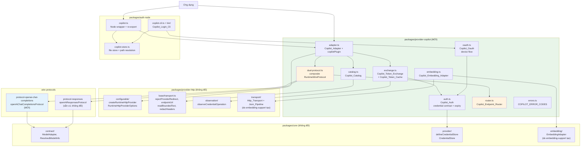
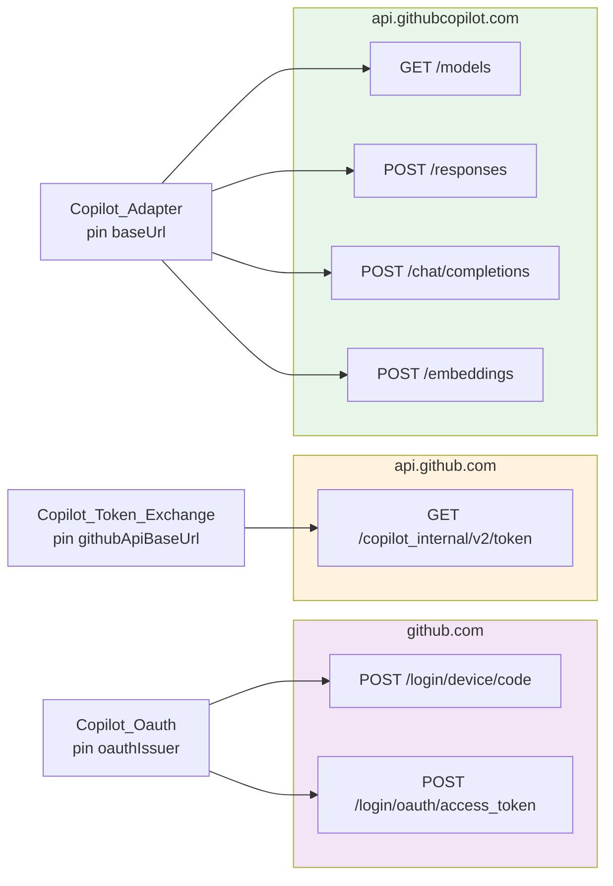
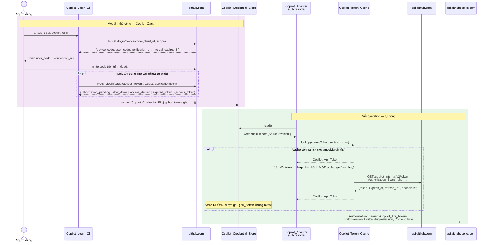
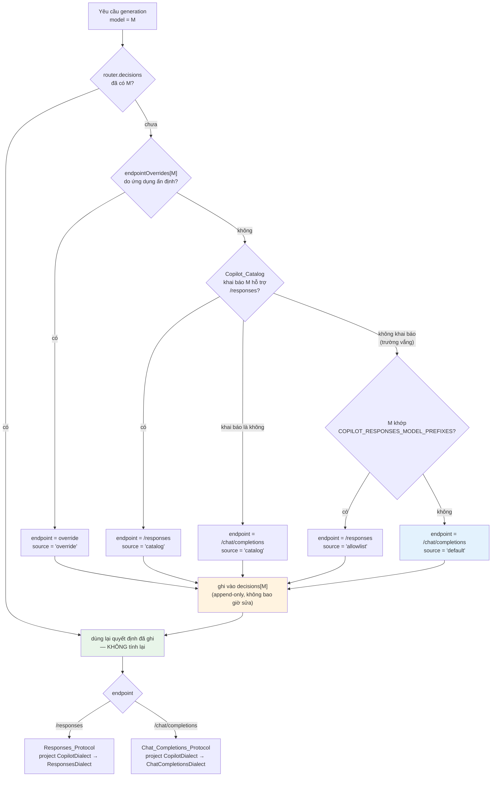
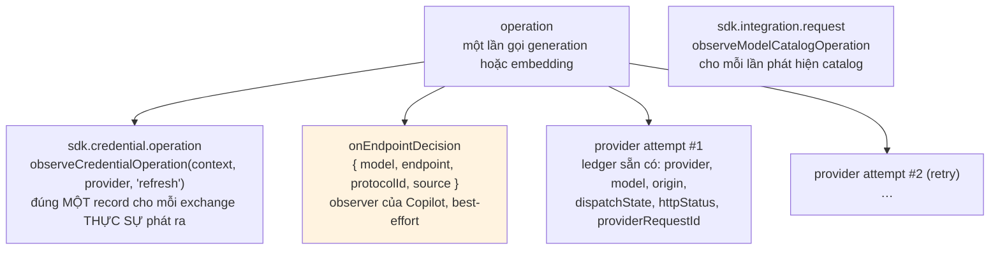

# Design Document

## Overview

Tài liệu này thiết kế **GitHub Copilot** thành một provider của `ai-agent-sdk`, phủ cả generation lẫn embedding, dùng bề mặt Copilot subscription tại `https://api.githubcopilot.com`.

Thiết kế gồm bốn khối công việc, thực hiện theo thứ tự phụ thuộc:

1. **`Chat_Completions_Protocol` tại `packages/protocol-openai-chat-completions`** — wire protocol OpenAI Chat Completions như một package độc lập, không biết Copilot tồn tại. Đây là khối duy nhất có giá trị dùng lại ngoài spec này, nên nó đi trước và được kiểm chứng riêng.
2. **`Copilot_Provider` tại `packages/provider-copilot`** — credential contract hai tầng, OAuth device flow, `Copilot_Token_Exchange`, `Copilot_Endpoint_Router`, catalog discovery, và `Copilot_Adapter` dựng bằng `Configurable_Http_Provider`.
3. **`Copilot_Node_Auth` trong `packages/auth-node`** — file store, `Copilot_Login_Cli`, bin entry. Nơi duy nhất trong code Copilot chạm filesystem.
4. **`Copilot_Embedding_Adapter` cộng mở rộng `Conformance_Harness` và `Documentation_Set`** — khối này **chặn** trên spec `embedding-support` và chỉ khởi động khi khối 1+2 của spec đó đã hạ cánh.

Bốn bất biến chi phối toàn bộ thiết kế:

- **Không subclass adapter.** `Copilot_Adapter` là cấu hình truyền vào `createRuntimeHttpProvider`, không phải một lớp con của `HttpModelAdapter`. Bề mặt công khai của `packages/core`, `packages/provider-http` và các package protocol hiện có **không đổi một dòng nào**.
- **Hai tầng token, hai vòng đời khác nhau.** `GitHub_User_Token` được persist và **không rotate**; `Copilot_Api_Token` sống trong bộ nhớ tiến trình và **không bao giờ** được ghi ra đĩa. Đây là điểm khác biệt cấu trúc so với Codex, không phải một chi tiết cấu hình.
- **Quyết định endpoint là bất biến trong một lần gọi.** Một `Logical_Call` generation chọn `/responses` hoặc `/chat/completions` đúng một lần, và mọi retry của lần gọi đó đi theo cùng lựa chọn với cùng protocol.
- **SDK không suy diễn.** Catalog sai shape, `expires_at` không đọc được, vector sai chiều, stream thiếu terminal finish — tất cả là lỗi có cấu trúc, không phải dữ liệu để đoán tiếp.

Phần embedding **phụ thuộc cứng** vào `embedding-support`. Cụ thể: task 1.x và 2.x (`Http_Transport` được tách ra, `Sse_Pipeline` dựng lại trên nó), 4.x (`Json_Pipeline`), 5.x–6.x (`Embedding_Contract`, `EmbeddingAdapter`, entry point `@alvin0/ai-agent-sdk-core/embedding`). Phần generation của Copilot **không** phụ thuộc bất kỳ task nào của spec đó và triển khai được ngay (Yêu cầu 1.4).

## Architecture

### Ranh giới thành phần



Chiều phụ thuộc là một chiều. `protocol-openai-chat-completions` → `packages/core` (chỉ type). `provider-copilot` → `core` + `provider-http` + hai package protocol. `auth-node` → `provider-copilot`. Không có mũi tên nào từ package protocol về `provider-copilot`, nên Yêu cầu 18.5 được thoả bằng cấu trúc và rule `no-circular` của `.dependency-cruiser.cjs` không cần quy ước nào để đúng (Yêu cầu 18.3).

Hai chi tiết dễ nhầm, ghi ra để không ai mất thời gian:

- `packages/provider-http/src/base/transport.ts` (sẵn có: `rejectProviderRedirect`, `endpointUrl`, `readBoundedText`, `redactHeaders`, `raceWithSignal`, `cancelResponseBody`, `safeProviderFailure`) **không phải** `packages/provider-http/src/transport/` (`Http_Transport` session layer mà `embedding-support` sẽ tạo). Đường generation và catalog của Copilot dùng cái thứ nhất, có ngay hôm nay; chỉ `Copilot_Embedding_Adapter` dùng cái thứ hai.
- `protocol-responses` **không** phụ thuộc `provider-http`: nó khai báo contract cấu trúc riêng (`ProtocolDefinition`, `ProtocolRequest`, `ProtocolSseEvent`) tương thích structurally với `RuntimeWireProtocol`. `protocol-openai-chat-completions` sao chép đúng cách đó, nên dependency thực tế của nó là tập con nghiêm ngặt của giới hạn Yêu cầu 18.5 cho phép.

### Ba origin, ba mục đích, pin riêng từng cái



Ba origin là ba option cấu hình độc lập, mỗi cái được pin riêng. Không module nào được phát request ra một origin khác origin đã pin của chính nó, và kiểm tra đó xảy ra **trước** khi phát request (Yêu cầu 3.7). Redirect bị từ chối ở cả ba (Yêu cầu 3.8, 7.8).

### Xác thực hai tầng



Ba hệ quả của sơ đồ này, và cả ba đều là lý do `CodexAuthFile`/`shouldRefresh` không sao chép được:

| | Codex | Copilot |
| --- | --- | --- |
| Credential dài hạn | refresh token, **dùng một lần, rotate mỗi lần refresh** | `ghu_` token, **không rotate** |
| Nguồn thời điểm hết hạn | claim `exp` trong JWT của access token | trường `expires_at` trong body response exchange |
| Ghi store khi làm mới | **Bắt buộc** — mất token mới là mất tài khoản | **Không bao giờ** — không có gì mới để ghi |
| Hazard khi hai tiến trình đua nhau | replay token đã tiêu → `refresh_token_reused`, đăng xuất vĩnh viễn | không có; hai tiến trình chỉ đổi token hai lần |
| Cơ chế chống đua | CAS trên file + đường phục hồi revision-conflict đọc lại và nhận token của bên thắng | hợp nhất in-process (`single-flight`) quanh exchange |

Ô cuối là điểm quan trọng nhất. `refreshCodexTokensWithOperation` **phải** có đường phục hồi revision-conflict vì mất token rotate là thảm hoạ. Copilot không có thảm hoạ tương ứng, nên nó **không** cần đường đó — và thêm vào sẽ là code không có tình huống nào chạy tới. Đổi lại, Copilot có một hazard mà Codex không có: nhiều operation đồng thời cùng thấy cache hết hạn và cùng gọi exchange, tiêu quota vô ích. Đó là lý do `single-flight` là một yêu cầu tường minh (Yêu cầu 5.4) chứ không phải một tối ưu.

`Copilot_Credential_Store` **vẫn** cung cấp biến thể compare-and-swap (Yêu cầu 6.2, 6.3) — không phải để chống đua khi làm mới, mà để hai lần login đồng thời không ghi đè nhau một cách im lặng.

### Chọn endpoint theo từng model



Bốn điểm cần đọc kỹ trong sơ đồ này:

1. **`decisions` là append-only.** Một model id đã có quyết định thì quyết định đó không bao giờ được ghi lại, kể cả khi catalog refresh sau đó trả metadata khác. Đây là cách Yêu cầu 9.7 (giữ nguyên quyết định trong một `Logical_Call`, gồm cả retry) đúng **theo cấu trúc** thay vì theo quy ước: không có đường code nào có thể đổi ý giữa hai lần retry vì không có đường code nào ghi lại một khóa đã tồn tại.
2. **Mặc định là `/chat/completions`, không phải `/responses`.** Xem DD-4 cho lập luận đầy đủ. Ngắn gọn: đoán sai về phía `/chat/completions` cho ra "chạy được nhưng không có tính năng riêng của Responses"; đoán sai về phía `/responses` cho ra HTTP 400.
3. **Allowlist là fallback duy nhất khi catalog không tiết lộ.** Không probe. Xem DD-4.
4. **Ba nguồn quyết định được phân biệt và báo cáo.** `source` đi vào observation (Yêu cầu 9.8), nên khi một model chạy sai endpoint thì log nói rõ ai quyết định.

### Bố cục module và entry point

```text
packages/protocol-openai-chat-completions/
  src/
    contract.ts     # ProtocolDefinition/ProtocolRequest/ProtocolSseEvent cấu trúc — bản sao khuôn protocol-responses
    wire.ts         # ChatCompletionsDialect + kiểu wire request/response/SSE
    serialize.ts    # GenerateOptions → body Chat Completions
    translate.ts    # SSE → ProtocolStreamChunk, gồm tool-call accumulator
    errors.ts       # map status/body lỗi → error code dùng chung
    protocol.ts     # openAiChatCompletionsProtocol
    index.ts
  fixtures/         # stream text, tool call, structured output, stream bị cắt
  package.json      # exports: "." — peerDependency chỉ @alvin0/ai-agent-sdk-core
                    # + aiAgentSdk: { runtime: 'universal', coreApi: 1, roles: ['wire-protocol'] }
  tsdown.config.ts  # libraryBuild({ entry: { index: 'src/index.ts' }, runtime: 'universal' })
  vitest.config.ts  # alias specifier → src/index.ts, include ../../tests/unit/chat-completions-*.spec.ts

packages/provider-copilot/
  src/
    common/
      store-types.ts    # CopilotAuthFile, CopilotAuthStore, CopilotCredentialStore
      store-capture.ts   # captureCopilotStore — bản đối ứng captureCodexStore
      no-follow.ts       # rejectCopilotRedirect
      http.ts            # copilotFetch: pin origin + redirect: 'manual' + bounded read + raceAbort
    errors.ts        # COPILOT_ERROR_CODES, CopilotTokenExchangeError, CopilotDeviceLoginError
    auth.ts          # contract credential + memory store + shouldExchange + requireGitHubToken
    oauth.ts         # requestCopilotDeviceCode, runCopilotDeviceLogin
    exchange.ts      # exchangeCopilotToken, createCopilotTokenCache
    catalog.ts       # discoverCopilotModels + phân hoạch generation/embedding
    router.ts        # createCopilotEndpointRouter
    dual-protocol.ts # copilotDualProtocol — composite RuntimeWireProtocol<CopilotDialect>
    adapter.ts       # copilotAdapter, copilotPlugin, CopilotDialect + hai hàm projection
    embedding.ts     # copilotEmbeddingAdapter, copilotEmbeddingPlugin   (chặn trên embedding-support)
    index.ts
  fixtures/
  package.json       # exports: "." và "./embedding"
                     # + aiAgentSdk: { runtime: 'universal', coreApi: 1, roles: ['model-provider'] }
  tsdown.config.ts   # entry: { index, embedding }
  vitest.config.ts   # alias specifier → src/*.ts, include ../../tests/unit/copilot-*.spec.ts

packages/auth-node/
  src/
    copilot-store.ts # resolveCopilotAuthPath, fileCopilotAuthStore, fileCopilotCredentialStore
    copilot.ts       # copilotNodeProviderPlugin + re-export bề mặt Universal
    copilot-cli.ts   # Copilot_Login_Cli
  bin/
    ai-agent-sdk-copilot-login.mjs
  package.json       # exports thêm "./copilot" (đuôi .mjs/.d.mts như ba entry hiện có);
                     # bin thêm ai-agent-sdk-copilot-login
  tsdown.config.ts   # entry thêm copilot + copilot-cli
  vitest.config.ts   # alias "./copilot" + include ../../tests/unit/copilot-auth-*.spec.ts, copilot-login-cli.spec.ts
```

### Đăng ký package vào allowlist chuẩn tắc

Hai package mới **phải** được khai báo trong `PACKAGE_RULES` của `scripts/package-policy.mts`, và entry `auth-node` sẵn có phải được mở rộng. Đây không phải một bước dọn dẹp cuối: `scripts/check-package-graph.mts` báo lỗi `package is absent from the normative allowlist` cho mọi package chưa đăng ký, và báo lỗi `forbidden workspace edge` cho mọi cạnh dependency không có trong `workspaceDependencies`. Thiếu bước này thì `pnpm lint` đỏ ngay khi package vừa được tạo, trước khi có một dòng logic nào.

```ts
// scripts/package-policy.mts — PACKAGE_RULES
[scoped('protocol-openai-chat-completions')]: {
  runtime: 'universal',
  workspaceDependencies: [scoped('core')],           // DD-10: chỉ core, chỉ type
  externalRuntimeDependencies: [],
},
[scoped('provider-copilot')]: {
  runtime: 'universal',
  workspaceDependencies: [
    scoped('core'), scoped('provider-http'),
    scoped('protocol-responses'), scoped('protocol-openai-chat-completions'),
  ],
  externalRuntimeDependencies: [],
},
[scoped('auth-node')]: {
  runtime: 'node',
  // hiện là [core, provider-codex]; thêm provider-copilot
  workspaceDependencies: [scoped('core'), scoped('provider-codex'), scoped('provider-copilot')],
  externalRuntimeDependencies: [],
},
```

`runtime: 'universal'` ở hai entry đầu là cách Yêu cầu 18.2 và 6.1 được thực thi. `scripts/check-runtime-boundaries.mts` đọc trường đó cộng `aiAgentSdk.runtime` của manifest, rồi cấm **mọi** import builtin của Node và bốn global `Buffer`, `process`, `__dirname`, `__filename` trong cả `src/` và `dist/`. Ràng buộc đó **mạnh hơn** "không `node:fs`/`node:path`/`process.env`", nên spec này không thêm rule trùng lặp vào `.dependency-cruiser.cjs` — file đó chỉ có `no-circular`, và đó là đúng phạm vi của nó.

Hai entry point mới của `provider-copilot` và một của `auth-node`, mỗi cái khai báo ở **cả** `package.json#exports` **và** `tsdown.config.ts#entry` (Yêu cầu 18.7):

```jsonc
// packages/provider-copilot/package.json
"exports": {
  ".":           { "types": "./dist/index.d.ts",     "import": "./dist/index.js",     "default": "./dist/index.js" },
  "./embedding": { "types": "./dist/embedding.d.ts", "import": "./dist/embedding.js", "default": "./dist/embedding.js" },
  "./package.json": "./package.json"
}
```

`./embedding` là entry riêng chủ ý: nó là entry duy nhất import `@alvin0/ai-agent-sdk-core/embedding`, nên ứng dụng chỉ dùng generation không kéo theo contract embedding vào bundle, và khối 4 lắp vào được mà không sửa entry `.` (Yêu cầu 1.4, 1.6).

Script và bin, theo đúng khuôn Codex đang dùng:

```jsonc
// package.json gốc
"provider:copilot:login-device": "pnpm --filter @alvin0/ai-agent-sdk-auth-node build --silent && node packages/auth-node/bin/ai-agent-sdk-copilot-login.mjs",
"provider:copilot:status":       "pnpm --filter @alvin0/ai-agent-sdk-auth-node build --silent && node packages/auth-node/bin/ai-agent-sdk-copilot-login.mjs --status",
"provider:copilot:models":       "pnpm --filter @alvin0/ai-agent-sdk-auth-node build --silent && node packages/auth-node/bin/ai-agent-sdk-copilot-login.mjs --models"
```

## Data Models

### Credential hai tầng

```ts
// packages/provider-copilot/src/common/store-types.ts
import type { CredentialStore } from '@alvin0/ai-agent-sdk-core/provider'

/**
 * Token GitHub dài hạn, tiền tố `ghu_`.
 *
 * KHÔNG rotate khi được dùng để đổi lấy Copilot_Api_Token. Đây là điểm khác biệt
 * cấu trúc so với refresh token dùng-một-lần của Codex, và là lý do file này được
 * ghi đúng một lần lúc đăng nhập rồi chỉ đọc từ đó về sau.
 */
export interface CopilotGitHubToken {
  /** Giá trị token. Không bao giờ được đưa vào message lỗi hay trace. */
  readonly token: string
  /** Kiểu token endpoint khai báo, khi có. Chỉ để chẩn đoán. */
  readonly tokenType?: string
  /** Scope đã cấp, khi endpoint tiết lộ. Chỉ để chẩn đoán. */
  readonly scope?: string
}

/** Danh tính phiên đăng nhập, chỉ những gì endpoint tiết lộ. */
export interface CopilotAccountIdentity {
  readonly login?: string
  readonly id?: number
  readonly name?: string
}

/** Tài liệu credential được persist. */
export interface CopilotAuthFile {
  /** Phiên bản cấu trúc file; đọc file phiên bản lạ là lỗi, không phải migrate ngầm. */
  readonly version: 1
  readonly github: CopilotGitHubToken
  readonly account?: CopilotAccountIdentity
  /** OAuth client id đã cấp token này; dùng để chẩn đoán từ chối 403. */
  readonly clientId?: string
  /** Thời điểm đăng nhập, ISO-8601. */
  readonly obtainedAt?: string
}

/** @deprecated Biến thể read/write, giữ cho tính đối xứng với Codex. */
export interface CopilotAuthStore {
  readonly location: string
  read(): Promise<CopilotAuthFile | undefined>
  write(file: CopilotAuthFile): Promise<void>
}

/** Biến thể compare-and-swap dùng bởi composition runtime bình thường. */
export type CopilotCredentialStore = CredentialStore<CopilotAuthFile>
```

Bốn điều **không** có trong `CopilotAuthFile`, và mỗi cái là một quyết định:

- **Không có `Copilot_Api_Token`.** Token ngắn hạn sống ~25 phút; persist nó thêm một đường ghi vào code, thêm một secret trên đĩa, và không tiết kiệm được gì vì lần chạy tiến trình kế tiếp gần như luôn phải đổi lại (Yêu cầu 3.3).
- **Không có trường refresh token.** Không có refresh token nào trong mô hình này. `Copilot_Token_Exchange` không tiêu thụ credential, nên không có gì để rotate (Yêu cầu 3.4, 5.1).
- **Không có `last_refresh`.** Codex cần nó làm fallback khi `exp` không đọc được. Copilot đọc `expires_at` từ response exchange, mà response đó nằm trong bộ nhớ chứ không trong file — nên fallback theo tuổi file không có nghĩa gì.
- **Không có `OPENAI_API_KEY`-tương-đương.** Bề mặt này từ chối personal access token, nên không tồn tại cấu hình "dùng API key thay vì OAuth" để biểu diễn (Yêu cầu 11.5, 13.2).

### `Copilot_Token_Cache`

```ts
// packages/provider-copilot/src/exchange.ts

/** Kết quả một Copilot_Token_Exchange, giữ trong bộ nhớ tiến trình. */
export interface CopilotApiToken {
  /** Bearer token cho api.githubcopilot.com. Ngắn hạn. */
  readonly token: string
  /** Thời điểm hết hạn, epoch MILLISECONDS. Dẫn xuất từ expires_at (giây). */
  readonly expiresAtMs: number
  /** Gợi ý `refresh_in` của endpoint, giây, khi có. ADVISORY — xem ghi chú dưới. */
  readonly refreshInSeconds?: number
  /**
   * `endpoints.api` endpoint khai báo, khi có.
   *
   * KHÔNG được dùng làm base URL. Một base URL do server chỉ định là một redirect
   * dưới tên khác, và Yêu cầu 3.8/7.8 đã chốt rằng SDK này không đi theo chuyển
   * hướng do provider điều khiển. Trường này chỉ tồn tại để `--status` in ra được
   * và để phát hiện lệch cấu hình. Xem DD-6.
   */
  readonly declaredApiEndpoint?: string
}

/** Một entry cache, gắn với đúng credential đã sinh ra nó. */
interface CopilotTokenCacheEntry {
  readonly api: CopilotApiToken
  /** Giá trị GitHub_User_Token đã dùng. So sánh chuỗi chính xác. */
  readonly sourceToken: string
  /** Revision của store lúc đọc, khi store là biến thể CAS. */
  readonly sourceRevision: string | null
}

export interface CopilotTokenCache {
  /**
   * Trả một Copilot_Api_Token còn hạn cho credential đã cho, đổi token nếu cần.
   *
   * Nhiều lời gọi đồng thời cùng cần đổi token được HỢP NHẤT thành đúng một
   * exchange đang bay (Yêu cầu 5.4).
   */
  acquire(
    source: CopilotCredentialSnapshot,
    operation: CredentialOperationOptions,
    context?: ModelInvocationContext,
  ): Promise<CopilotApiToken>
  /** Bỏ entry hiện tại; dùng khi endpoint từ chối token trước thời điểm hết hạn. */
  invalidate(): void
}
```

Ba quyết định trong cấu trúc này:

**Cache được khoá theo giá trị credential, không theo thời gian.** `sourceToken` được so sánh bằng `===` với token vừa đọc từ store. Đăng nhập lại bằng tài khoản khác làm entry cũ mất hiệu lực ngay, không cần TTL nào. Không dùng hàm băm: `packages/provider-copilot` là package Universal và thêm `crypto.subtle` vào đường đi bắt buộc chỉ để so sánh một chuỗi với chính nó là chi phí không mua được gì — đây không phải so sánh trước một attacker oracle, nên timing không phải rủi ro. `sourceRevision` là lớp thứ hai, bắt được trường hợp file đổi mà token tình cờ giống.

**`expires_at` là bắt buộc, `refresh_in` là advisory.** `expires_at` vắng mặt hoặc không phải số hữu hạn dương ⇒ `COPILOT_TOKEN_MALFORMED`, không phải một TTL đoán. `refresh_in` khi có được dùng để **rút ngắn** thời điểm làm mới nếu nó sớm hơn `expiresAtMs - exchangeMarginMs`, và không bao giờ để **kéo dài** — endpoint được phép yêu cầu làm mới sớm hơn, không được phép yêu cầu SDK giữ một token quá thời điểm hết hạn nó đã tuyên bố.

**Cache thuộc adapter instance, có thể inject để dùng chung.** Mặc định mỗi `Copilot_Adapter` sở hữu một cache. Cấu hình nhiều route trên cùng credential truyền một `CopilotTokenCache` dùng chung qua option `tokenCache` để không đổi token n lần cho n route.

### Hàm quyết định đổi token

```ts
// packages/provider-copilot/src/auth.ts

/** Biên độ mặc định: đổi token trước thời điểm hết hạn khoảng này. */
export const COPILOT_TOKEN_EXCHANGE_MARGIN_MS = 5 * 60 * 1_000

/**
 * Có phải đổi token trước request kế tiếp?
 *
 * Hàm thuần trên ba giá trị, không đọc đồng hồ toàn cục, nên property test đặt
 * được mọi vị trí biên. `undefined` (chưa có token) luôn là true.
 */
export function shouldExchange(
  api: CopilotApiToken | undefined,
  now: number,
  marginMs = COPILOT_TOKEN_EXCHANGE_MARGIN_MS,
): boolean {
  if (api === undefined) return true
  const advisory = api.refreshInSeconds === undefined
    ? Number.POSITIVE_INFINITY
    : api.expiresAtMs - api.refreshInSeconds * 1_000
  return Math.min(api.expiresAtMs - marginMs, advisory) <= now
}
```

Đây là bản đối ứng của `shouldRefresh` trong `provider-codex/src/auth.ts`, và khác nó ở đúng một điểm cấu trúc: `shouldRefresh` giải mã JWT để lấy `exp` rồi rơi về tuổi `last_refresh` khi không giải mã được; `shouldExchange` không giải mã gì cả vì `Copilot_Api_Token` không phải JWT mà SDK này có quyền đọc, và thời điểm hết hạn đã được endpoint nói thẳng trong body. Không có nhánh fallback nào, vì không có nguồn thứ hai — và một fallback bịa ra sẽ vi phạm nguyên tắc không suy diễn.

Vì refresh được quyết định **trước** dispatch, một `401` từ `api.githubcopilot.com` luôn có nghĩa credential thật sự đã chết chứ không phải "token vừa hết hạn giữa đường". Đó là lý do `AUTH` giữ được trạng thái **không retry** (Yêu cầu 5.8): không có nhánh nào biến 401 thành một lần thử lại, vì không có nhánh nào có thể sửa được nguyên nhân.

### Catalog và quyết định endpoint

```ts
// packages/provider-copilot/src/catalog.ts

/** Một entry của GET /models, đọc phòng vệ. */
interface WireCopilotModel {
  readonly id?: unknown
  readonly name?: unknown
  readonly capabilities?: {
    readonly type?: unknown
    readonly family?: unknown
    readonly limits?: {
      readonly max_context_window_tokens?: unknown
      readonly max_output_tokens?: unknown
    }
    readonly supports?: Readonly<Record<string, unknown>>
  }
  readonly vision?: unknown
  readonly model_picker_enabled?: unknown
}

/** Kết quả phân hoạch một lần phát hiện. */
export interface CopilotCatalogSnapshot {
  /** Model dùng cho generation, đã kèm quyết định endpoint sơ bộ. */
  readonly generation: readonly CopilotGenerationModel[]
  /** Model dùng cho embedding. */
  readonly embedding: readonly CopilotEmbeddingModel[]
  /** Entry bị loại, kèm lý do — đi vào observation, không vào catalog. */
  readonly omitted: readonly { readonly id: string; readonly reason: CopilotOmitReason }[]
}

export type CopilotOmitReason =
  /** capabilities.type không thuộc tập nhận dạng được. */
  | 'capability-type-unrecognized'
  /** Thiếu id dùng được. */
  | 'model-id-missing'

export interface CopilotGenerationModel {
  /** Catalog model của SDK, chuyển giao nguyên cho provider-http. */
  readonly model: ProviderCatalogModel
  /**
   * Endpoint catalog tiết lộ, khi nó tiết lộ.
   *
   * `undefined` nghĩa là KHÔNG BIẾT, không phải "không hỗ trợ". Router xử lý hai
   * trạng thái đó khác nhau (Yêu cầu 8.6).
   */
  readonly declaredEndpoint: CopilotEndpoint | undefined
}
```

`Model_Capability_Type` là trục phân hoạch (Yêu cầu 8.3):

| `capabilities.type` | Đi vào | Ghi chú |
| --- | --- | --- |
| `'chat'` | `generation` | Endpoint quyết định bởi `Copilot_Endpoint_Router` |
| `'embeddings'` | `embedding` | Chỉ dùng khi `Copilot_Embedding_Adapter` đã được đăng ký |
| bất kỳ giá trị khác, hoặc vắng, hoặc không phải string | `omitted` | `capability-type-unrecognized` |

Ô thứ ba là cách Yêu cầu 9.4 và 9.5 được thoả: một entry mà SDK không phân loại được thì SDK **không** liệt kê nó kèm cờ "capability không hỗ trợ" — nó bị bỏ khỏi cả hai catalog, và lý do đi vào observation để người vận hành thấy được endpoint đang trả về loại gì mới. Liệt kê một model không gọi được là tệ hơn không liệt kê: nó xuất hiện trong selector rồi thất bại lúc chạy.

`omitted` **không** làm request thất bại. Catalog là advisory, nên một model id bị loại vẫn dispatch được nếu ứng dụng gọi thẳng nó — nó chỉ đi theo nhánh `source = 'default'` của router (Yêu cầu 8.6).

### `CopilotDialect` — phẳng, không lồng

```ts
// packages/provider-copilot/src/adapter.ts

/**
 * Dialect của Copilot, PHẲNG chủ ý.
 *
 * `provider-http` merge dialect bằng một phép spread NÔNG
 * (`{ ...protocol.defaultDialect, ...overrides }`) và snapshot nó qua
 * `snapshotJsonObject` với giới hạn depth/node. Nếu dialect này lồng hai sub-dialect
 * vào nhau, một caller ghi đè đúng một cờ của nhánh chat sẽ im lặng làm mất toàn bộ
 * default còn lại của nhánh đó. Phẳng làm điều đó bất khả thi. Xem DD-2.
 */
export interface CopilotDialect {
  /** Gửi temperature/top_p. Cả hai endpoint đều nhận, nhưng một số model từ chối. */
  readonly sampling: boolean
  /** Gửi giới hạn output token. */
  readonly maxOutputTokens: boolean
  /** Gửi JSON-schema structured output. */
  readonly structuredOutputs: boolean
  /** Khai báo tool trong request. */
  readonly tools: boolean
  /** Chỉ Responses: `store`. */
  readonly store: boolean
  /** Chỉ Responses: `include`. */
  readonly include: readonly string[]
  /** Chỉ Responses: `reasoning.summary`. */
  readonly reasoningSummary: 'auto' | 'concise' | 'detailed' | 'none'
  /** Chỉ Chat Completions: `stream_options.include_usage`. */
  readonly streamUsage: boolean
  /** Chỉ Chat Completions: vai của system prompt. */
  readonly systemRole: 'system' | 'developer'
  /** Chỉ Chat Completions: `parallel_tool_calls`. */
  readonly parallelToolCalls: boolean
  /** Khoá cache prompt/session, dùng cho cả hai nhánh. */
  readonly promptCacheKey?: string
}

/** Projection thuần, không side effect, dùng bởi composite protocol. */
function toResponsesDialect(dialect: CopilotDialect): Partial<ResponsesDialect>
function toChatCompletionsDialect(dialect: CopilotDialect): Partial<ChatCompletionsDialect>
```

Hai hàm projection là **thuần** và **toàn phần**: mỗi cờ của `CopilotDialect` có đúng một đích trên mỗi nhánh, hoặc không có đích nào. Cờ không có đích trên một nhánh (`store` với Chat Completions, `systemRole` với Responses) bị bỏ, không dịch sang một cờ gần nghĩa. Bảng đích được kiểm chứng bằng property test trên tổ hợp cờ (Property 40).

### `ChatCompletionsDialect`

```ts
// packages/protocol-openai-chat-completions/src/wire.ts
export interface ChatCompletionsDialect {
  /** Gửi `temperature`, `top_p`, `frequency_penalty`, `presence_penalty`. */
  readonly sampling: boolean
  /** Tên trường giới hạn output; `false` để không gửi trường nào. */
  readonly maxTokensField: 'max_tokens' | 'max_completion_tokens' | false
  /** `response_format`: json_schema, json_object, hoặc không gửi. */
  readonly structuredOutputs: 'json-schema' | 'json-object' | false
  /** Gửi `tools` + `tool_choice`. */
  readonly tools: boolean
  /** Gửi `parallel_tool_calls`. */
  readonly parallelToolCalls: boolean
  /** Gửi `stream_options: { include_usage: true }`. */
  readonly streamUsage: boolean
  /** Vai của system prompt trong `messages[0]`. */
  readonly systemRole: 'system' | 'developer'
  /** Gửi `stop`. */
  readonly stop: boolean
  /** Gửi `seed`. */
  readonly seed: boolean
  /** Gửi `reasoning_effort`. */
  readonly reasoningEffort: boolean
  /** Gửi `user`/khoá cache prompt, khi endpoint nhận. */
  readonly promptCacheKey?: string
  /** Đường dẫn endpoint; cấu hình được cho gateway đặt nó ở chỗ khác. */
  readonly path: string
}
```

`maxTokensField` là một enum ba giá trị chứ không phải boolean vì đó chính là chỗ các endpoint tương thích OpenAI chia làm hai họ: model reasoning mới từ chối `max_tokens` và đòi `max_completion_tokens`, gateway cũ thì ngược lại. Một boolean sẽ buộc provider phải fork translator; một enum giữ được đúng một translator (Yêu cầu 10.7).

### Embedding: profile và compatibility identity

```ts
// packages/provider-copilot/src/embedding.ts

/**
 * Compatibility identity theo DÒNG model, tách hẳn khỏi OpenAI và Gemini.
 *
 * Copilot proxy tới model của nhà cung cấp phía sau, nhưng SDK KHÔNG được suy ra
 * rằng vector của `copilot:text-embedding-3-small` so sánh được với vector của
 * `openai:text-embedding-3-small`: tiền xử lý, phiên bản model phía sau và chính
 * sách chuẩn hoá của proxy đều không được tài liệu hoá và có thể đổi mà không thông
 * báo. Tuyên bố tương thích là một cam kết, và ở đây không ai cam kết cả.
 */
export const COPILOT_EMBEDDING_COMPATIBILITY_PREFIX = 'github-copilot'

function copilotCompatibilityIdentity(modelId: string): string {
  return `${COPILOT_EMBEDDING_COMPATIBILITY_PREFIX}:${modelFamilyOf(modelId)}`
}
```

Hệ quả trực tiếp, kiểm chứng bằng Property 44: một `Embedding_Profile` của Copilot và một `Embedding_Profile` của OpenAI **cùng số chiều** vẫn cho `isSpaceCompatible === false`. Đây đúng là tình huống mà `embedding-support` thiết kế `compatibilityIdentity` để bắt (Yêu cầu 12.3).

## Components and Interfaces

### `Copilot_Endpoint_Router` và composite protocol

Đây là quyết định kiến trúc trung tâm của spec này, nên nó được trình bày trước.

#### Vấn đề

`RuntimeHttpProviderOptions<Dialect>` nhận **đúng một** `protocol` và **đúng một** `dialect`. `createRuntimeHttpProvider` capture protocol qua `captureRuntimeProtocol`, đóng băng nó, rồi truyền xuống `createHttpProvider`. Yêu cầu 9 lại đòi hai protocol trên **một** route `copilot`, chọn theo từng model.

Thêm nữa, `ResolvedModelInfo` và `ProviderCatalogModel` **không có** slot mở rộng nào để mang metadata endpoint, và Yêu cầu 18.4 cấm đổi bề mặt công khai của `packages/core`. Nên "gắn endpoint vào model info" không phải một lựa chọn.

#### Bốn phương án và lý do ba phương án thua

| Phương án | Vì sao thua |
| --- | --- |
| **(a) Hai adapter, plugin route theo model id** | `ModelProviderRegistrar.registerAdapter` map **route → adapter**. Một route không giữ được hai adapter, nên phương án này thực chất là hai route (`copilot-responses`, `copilot-chat`). Điều đó phá Yêu cầu 9 (ứng dụng không cần biết model chạy ở endpoint nào) và Yêu cầu 7.4 (mặc định đúng một route tên `copilot`). Đổi model sẽ kéo theo đổi route — chính là chi phí mà Yêu cầu 9 tồn tại để loại bỏ. |
| **(b) `describeModel` + wrapper chọn protocol** | `describeModel(info, dialect)` chỉ trả về `ResolvedModelInfo`. Nó không có đường nào tác động tới protocol đã capture. Nó hữu ích để **ghi chú** quyết định lên model info, nhưng một mình thì không giải quyết được gì. |
| **(c) Mở rộng đường configurable: thêm `resolveProtocol` vào `RuntimeHttpProviderOptions`** | Đổi bề mặt công khai của `provider-http` (Yêu cầu 18.4), và bắt mọi provider khác phải mang theo một khái niệm multi-protocol mà chỉ Copilot cần. Chi phí rơi vào tất cả để giải quyết vấn đề của một. |
| **(d) Composite protocol trong `provider-copilot`** ✅ | Chọn. Xem dưới. |

#### Phương án (d)

`copilotDualProtocol` là một `RuntimeWireProtocol<CopilotDialect>` hợp lệ, cư trú trong `provider-copilot`, uỷ quyền từng lời gọi cho một trong hai sub-protocol.

Điều làm nó chạy được: **cả ba** method của protocol đều nhận `ProtocolRequest`, và `ProtocolRequest.model` là `ResolvedModelInfo`. Nên khoá định tuyến (`model.id`) có mặt tại **mọi** điểm quyết định — `endpointPath`, `serialize` và `translate` — không cần thêm kênh truyền nào.

```ts
// packages/provider-copilot/src/dual-protocol.ts
export type CopilotEndpoint = 'responses' | 'chat-completions'

export interface CopilotEndpointDecision {
  readonly model: string
  readonly endpoint: CopilotEndpoint
  readonly protocolId: string
  readonly source: 'override' | 'catalog' | 'allowlist' | 'default'
}

export interface CopilotEndpointRouter {
  /**
   * Quyết định endpoint cho một model id.
   *
   * MEMOIZED VÀ APPEND-ONLY: một khoá đã có quyết định thì không bao giờ được ghi
   * lại. Đây là cơ chế duy nhất bảo đảm Yêu cầu 9.7 — không có đường code nào có
   * thể đổi ý giữa hai lần retry.
   */
  decide(modelId: string): CopilotEndpointDecision
  /** Nạp metadata phát hiện được. Chỉ thêm khoá CHƯA có quyết định. */
  learn(models: readonly CopilotGenerationModel[]): void
  /** Bản chụp mọi quyết định đã ghi; dùng cho `--models` và cho harness. */
  snapshot(): readonly CopilotEndpointDecision[]
}

export interface CopilotDualProtocolOptions {
  readonly router: CopilotEndpointRouter
  readonly responses: ResponsesProtocolLike
  readonly chat: ChatCompletionsProtocolLike
  /** Observer đồng bộ, best-effort. Ném lỗi trong đây không ảnh hưởng request. */
  readonly onDecision?: (decision: CopilotEndpointDecision) => void
}

export function copilotDualProtocol(
  options: CopilotDualProtocolOptions,
): RuntimeWireProtocol<CopilotDialect>
```

Ba method được uỷ quyền như sau:

```text
endpointPath(request, dialect)
  d = router.decide(request.model.id)
  onDecision?.(d)                              // best-effort, lỗi bị chặn
  return d.endpoint === 'responses'
    ? responses.endpointPath(request, resolvedResponsesDialect(dialect))
    : chat.endpointPath(request, resolvedChatDialect(dialect))

serialize(request, dialect)     → cùng nhánh, cùng projection
translate(events, req, name)    → cùng nhánh; translator của nhánh đó
protocolHeaders(dialect)        → hợp header của nhánh, không hợp cả hai
```

`resolvedResponsesDialect` / `resolvedChatDialect` merge projection với `defaultDialect` của **sub-protocol**, không phải của composite. Đây là chỗ phép spread nông của `provider-http` sẽ làm sai nếu composite dialect lồng nhau, và là lý do `CopilotDialect` phẳng (DD-2).

#### Ba chi phí đã nhận, ghi ra tường minh

1. **`provider-http` chỉ thấy một protocol id.** `copilotDualProtocol.id` là `'copilot-dual'`. Observation chung của tầng HTTP báo id đó, không báo `'openai-responses'` hay `'openai-chat-completions'`. Yêu cầu 9.8 được thoả bằng kênh riêng của Copilot (mục dưới), không bằng cách đổi field của core.
2. **`defaultDialect` của composite phải là JSON phẳng, hữu hạn.** `defineWireProtocol` chạy nó qua `snapshotJsonObject` với `HTTP_PROTOCOL_LIMITS.dialectDepth` và `dialectNodes`. `CopilotDialect` là primitive cộng một mảng string, depth 2 — dư sức trong giới hạn.
3. **Không dùng `this`.** `captureRuntimeProtocol` gọi method bằng `Reflect.apply(method, source, args)`. Composite dùng closure bắt `router`/`responses`/`chat`, không dùng `this`, nên việc rebind receiver là vô hại.

#### Báo cáo endpoint và protocol (Yêu cầu 9.8)

`context.startProviderAttempt` nhận `{ provider, model, method, origin }` — chỉ **origin**, không có path. Cả `/responses` và `/chat/completions` cùng origin, nên attempt ledger của core **không** phân biệt được hai endpoint, và mở rộng nó sẽ đổi bề mặt core (Yêu cầu 18.4).

Kênh báo cáo, cả hai đều thuần cộng thêm:

- **`onDecision` observer** do `provider-copilot` sở hữu, gọi đồng bộ tại `endpointPath`, mang `{ model, endpoint, protocolId, source }`. Không mang prompt, không mang credential. Lỗi trong observer bị chặn và không ảnh hưởng request.
- **`requestLogger.url`** sẵn có đã chứa đường dẫn đầy đủ, nên endpoint hiện ra chính xác ở đó cho ai đã bật nó.

Đây là ranh giới còn lại của thiết kế, ghi ra để người bảo trì chọn: nếu muốn endpoint xuất hiện trong attempt ledger của core, cần thêm một field **tùy chọn** vào `ProviderAttemptInput` ở một spec riêng. Spec này không làm điều đó vì Yêu cầu 18.4 cấm.

### `Copilot_Auth`

```ts
// packages/provider-copilot/src/auth.ts

/** Store trong bộ nhớ, biến thể read/write. */
export function memoryCopilotAuthStore(initial?: CopilotAuthFile): CopilotAuthStore

/** Store trong bộ nhớ, biến thể compare-and-swap. */
export function memoryCopilotCredentialStore(initial?: CopilotAuthFile): CopilotCredentialStore

/** Ảnh chụp credential cho một operation, gồm cả revision khi store là CAS. */
export interface CopilotCredentialSnapshot {
  readonly file: CopilotAuthFile
  readonly revision: string | null
  readonly label: string
}

/**
 * Đòi một GitHub_User_Token dùng được, kèm chỉ dẫn lấy nó ở đâu.
 *
 * Ba dạng "không có credential" — store rỗng, file thiếu `github`, token là chuỗi
 * rỗng — cho ra CÙNG một code, vì với người dùng chúng là cùng một vấn đề
 * (Yêu cầu 13.4).
 */
export function requireGitHubToken(
  file: CopilotAuthFile | undefined,
  label: string,
): CopilotGitHubToken
```

`memoryCopilotCredentialStore` dựng bằng `defineCredentialStore`, `structuredClone` giá trị ở cả hai chiều, và phát `COPILOT_CREDENTIAL_REVISION_CONFLICT` khi `expectedRevision` lệch — đúng khuôn `memoryCodexCredentialStore` (Yêu cầu 6.4).

`captureCopilotStore` trong `common/store-capture.ts` là bản đối ứng `captureCodexStore`: đọc marker bằng `Object.getOwnPropertyDescriptor`, **từ chối accessor**, capture method bằng `Reflect.apply`, và không thực hiện I/O nào lúc dựng provider. Bề mặt phân biệt hai biến thể vì thế không gọi getter nào của object người dùng truyền vào (Property 24).

### `Copilot_Oauth` — device flow

```ts
// packages/provider-copilot/src/oauth.ts

/** Issuer OAuth của GitHub. */
export const DEFAULT_COPILOT_OAUTH_ISSUER = 'https://github.com'

/**
 * OAuth client id mặc định.
 *
 * Bề mặt `copilot_internal/v2/token` chỉ nhận token do một OAuth App nằm trong
 * allowlist của GitHub cấp. Giá trị mặc định này là client id của một editor client
 * đã nằm trong allowlist đó — nghĩa là SDK tự nhận là editor client ấy khi đăng
 * nhập. Đây là lý do nó là một OPTION CÓ TÊN chứ không phải hằng số ẩn: bạn thấy
 * được nó, và bạn thay được nó. Xem README và mục "Danh tính client" của tài liệu
 * để biết tradeoff đầy đủ và khuyến nghị dùng provider chính thức cho production.
 */
export const COPILOT_OAUTH_CLIENT_ID = '<editor-client-id>'   // ⚠ chốt giá trị lúc triển khai

/** Scope yêu cầu; đủ để đổi token và đọc danh tính, không hơn. */
export const COPILOT_OAUTH_SCOPE = 'read:user'
```

> `COPILOT_OAUTH_CLIENT_ID` và hai hằng số `Editor_Headers` là **ba giá trị duy nhất trong thiết kế này chưa được chốt**. Chúng phải được xác nhận trên một tài khoản thật ở task đầu của khối 2 và ghi vào code kèm ngày xác nhận, chứ không được ship dưới dạng placeholder. Chúng cũng là ba giá trị **sẽ lỗi thời**, nên chúng là hằng số exported ghi đè được — cùng lý do `CODEX_CLIENT_VERSION` là hằng số exported chứ không phải giá trị chôn trong code.

```ts

export interface CopilotDeviceCode {
  readonly verificationUrl: string
  readonly userCode: string
  readonly deviceCode: string
  readonly intervalSeconds: number
  readonly expiresInSeconds: number
}

export interface CopilotLoginProgress {
  readonly onPrompt?: (code: CopilotDeviceCode) => void
  readonly onPoll?: (elapsedMs: number, intervalSeconds: number) => void
}

export interface CopilotLoginResult {
  readonly location: string
  readonly login: string | undefined
  readonly accountId: number | undefined
  readonly scope: string | undefined
}

export function requestCopilotDeviceCode(
  options?: CopilotOAuthOptions,
): Promise<CopilotDeviceCode>

export function runCopilotDeviceLogin(
  store: CopilotCredentialStore | CopilotAuthStore,
  options?: CopilotOAuthOptions,
  progress?: CopilotLoginProgress,
): Promise<CopilotLoginResult>
```

Wire, hai chặng:

```text
POST https://github.com/login/device/code
Accept: application/json
Content-Type: application/json
{ "client_id": "…", "scope": "read:user" }
→ { device_code, user_code, verification_uri, expires_in, interval }

POST https://github.com/login/oauth/access_token
Accept: application/json
Content-Type: application/json
{ "client_id": "…", "device_code": "…",
  "grant_type": "urn:ietf:params:oauth:grant-type:device_code" }
→ { access_token, token_type, scope }
  hoặc { error: "authorization_pending" | "slow_down" | "expired_token"
                | "access_denied" | "unsupported_grant_type" | … , interval? }
```

Sáu chi tiết triển khai, mỗi cái vì một lý do cụ thể:

**`Accept: application/json` là bắt buộc.** Thiếu nó, endpoint token của GitHub trả **form-encoded** thay vì JSON. Một parser JSON gặp `error=authorization_pending&interval=10` sẽ ném, và nhánh "chưa được duyệt" biến thành nhánh "lỗi cứng". Header này không phải trang trí.

**Kênh lỗi là HTTP 200 kèm `error` trong body.** Khác với Codex, nơi "chưa duyệt" hiện ra dưới dạng `403`/`404`, GitHub trả `200` với `error` trong body. Nên phân loại đọc **body trước**, status sau.

**`slow_down` phải tăng khoảng chờ.** Server trả `interval` mới trong body của chính response `slow_down`. Interval hiệu lực là `max(intervalHiện tại, intervalServerYêuCầu, intervalHiệnTại + 5)` — cộng 5 giây theo RFC 8628 để chuỗi luôn tăng nghiêm ngặt cả khi server không gửi giá trị mới. Tính đơn điệu không giảm là bất biến được kiểm chứng (Property 12).

**`access_denied` và `expired_token` là hai code khác nhau.** Người dùng bấm từ chối và mã hết hạn cần hai hướng dẫn khác nhau: một là "bạn vừa từ chối, chạy lại nếu đổi ý", một là "mã hết hạn, chạy lại để lấy mã mới". Gộp chúng làm người dùng đọc sai vấn đề (Yêu cầu 4.5).

**Biên trên 15 phút độc lập với `expires_in`.** `expires_in` của server được tôn trọng khi nó ngắn hơn; biên 15 phút là chặn trên tuyệt đối để một server trả `expires_in` khổng lồ không treo CLI vô hạn (Yêu cầu 4.3).

**Mọi read đều có biên.** `copilotFetch` trong `common/http.ts` là bản đối ứng `oauthFetch` của Codex: `issuerOf` từ chối issuer có userinfo và từ chối `http:` khi chưa bật `allowInsecureIssuer`; origin được pin và so **trước** khi phát request; `redirect: 'manual'` cộng `rejectCopilotRedirect`; body đọc qua reader có giới hạn bytes và số chunk; `raceAbort` để signal của caller thắng ngay; `positiveSafeInteger` kiểm mọi giới hạn cấu hình (Yêu cầu 4.7).

### `Copilot_Token_Exchange`

```ts
// packages/provider-copilot/src/exchange.ts

/** Base URL API của GitHub, nơi bề mặt đổi token cư trú. */
export const DEFAULT_GITHUB_API_BASE_URL = 'https://api.github.com'

/** Đường dẫn bề mặt đổi token. */
export const COPILOT_TOKEN_EXCHANGE_PATH = '/copilot_internal/v2/token'

export interface CopilotExchangeOptions {
  readonly githubApiBaseUrl?: string
  readonly signal?: AbortSignal
  readonly fetch?: typeof globalThis.fetch
  readonly requestTimeoutMs?: number
  readonly maxResponseBytes?: number
  readonly maxResponseChunks?: number
  readonly allowInsecureIssuer?: boolean
  readonly editorHeaders?: CopilotEditorHeaders
}

export function exchangeCopilotToken(
  github: CopilotGitHubToken,
  options?: CopilotExchangeOptions,
): Promise<CopilotApiToken>
```

Wire:

```text
GET https://api.github.com/copilot_internal/v2/token
Authorization: Bearer ghu_…
Accept: application/json
Editor-Version: …
Editor-Plugin-Version: …
→ 200 { token, expires_at, refresh_in?, endpoints?: { api?: string }, … }
```

Thứ tự kiểm tra, và mỗi bước có một lý do:

```text
1. host kết thúc bằng '.ghe.com' hoặc bằng 'ghe.com'
                                    ⇒ COPILOT_TENANT_UNSUPPORTED   (trước khi phát request)
2. origin(url) !== origin(githubApiBaseUrl)
                                    ⇒ COPILOT_ENDPOINT_ORIGIN_INVALID (trước khi phát request)
3. response là redirect (mọi dạng)  ⇒ COPILOT_REDIRECT_REJECTED
4. 404                              ⇒ COPILOT_TENANT_UNSUPPORTED
5. 401                              ⇒ COPILOT_CREDENTIAL_REJECTED   (permanent)
6. 403                              ⇒ COPILOT_CREDENTIAL_REJECTED   (permanent, nêu PAT + allowlist)
7. 5xx hoặc lỗi mạng/timeout        ⇒ COPILOT_TOKEN_EXCHANGE_FAILED (transient)
8. 4xx còn lại                      ⇒ COPILOT_TOKEN_EXCHANGE_FAILED (permanent)
9. body không phải JSON, hoặc expires_at không phải số hữu hạn dương
                                    ⇒ COPILOT_TOKEN_MALFORMED
```

Bước 1 chạy **trước** bước 2 và trước mọi I/O. Phát hiện `.ghe.com` bằng so khớp suffix nhãn tên miền, không bằng `includes('ghe.com')` — `ghe.com.evil.tld` và `notghe.com` phải **không** khớp, và đó là điều property test kiểm (Property 7). Yêu cầu 3.6 cho hai đường vào cùng một code, và cả hai đều được nối vào đây.

Bước 6 là nơi thông điệp về personal access token sống. Endpoint trả 403 cho cả PAT và cho token của một OAuth App ngoài allowlist, và SDK không phân biệt được hai trường hợp từ response — nên message nêu **cả hai** khả năng cùng hướng dẫn duy nhất có tác dụng: chạy `Copilot_Login_Cli` (Yêu cầu 3.5, 13.2).

### Hợp nhất exchange đồng thời

```ts
// packages/provider-copilot/src/exchange.ts
export function createCopilotTokenCache(
  options?: CopilotExchangeOptions,
): CopilotTokenCache
```

Cơ chế, và cái bẫy nó tránh:

```text
acquire(source, operation, context):
  entry = current
  nếu entry khớp source.token, khớp source.revision, và !shouldExchange(entry.api, now):
      trả entry.api                                    ← 0 request

  nếu inflight !== undefined và inflightSource === source.token:
      trả await raceAbort(inflight, operation.signal)   ← HỢP NHẤT
                                                          (0 request thêm)

  inflight = observeCredentialOperation(context, provider, 'refresh',
               () => exchangeCopilotToken(source.file.github, {
                 ...options,
                 signal: sharedController.signal,       ← KHÔNG phải signal của caller
               }))
  finally: inflight = undefined
```

Điểm dễ sai nhất, và là lý do dòng `sharedController.signal` được viết ra: exchange dùng chung **không được** nhận `AbortSignal` của một caller cụ thể. Nếu nó nhận, caller đầu tiên bị abort sẽ hủy exchange mà mọi caller khác đang chờ, và những caller đó thất bại vì một lý do không liên quan gì đến họ. Nên: exchange dùng chung có `AbortController` + timeout **riêng**; mỗi caller `raceAbort` promise dùng chung với signal của **chính** mình. Caller abort thì caller đó thoát, exchange vẫn hoàn thành cho những người còn lại (Property 18).

Số record quan sát vì thế bằng số exchange **thực sự phát ra**, không bằng số caller — và đó là điều làm việc hợp nhất **quan sát được** thay vì chỉ là tuyên bố (Property 52).

### `Copilot_Adapter`

```ts
// packages/provider-copilot/src/adapter.ts

export const COPILOT_BASE_URL = 'https://api.githubcopilot.com'

/**
 * Editor_Headers mặc định.
 *
 * KHÔNG phải trang trí: thiếu bất kỳ header nào trong hai header này, endpoint trả
 * HTTP 400 và không có request nào chạy. Chúng cũng là chỗ SDK tự nhận là một editor
 * client — cùng lý do với COPILOT_OAUTH_CLIENT_ID, nên chúng là option có tên chứ
 * không phải hằng số ẩn.
 */
export const COPILOT_EDITOR_VERSION = 'vscode/1.99.0'
export const COPILOT_EDITOR_PLUGIN_VERSION = 'copilot-chat/0.26.0'

export interface CopilotEditorHeaders {
  readonly editorVersion?: string
  readonly editorPluginVersion?: string
}

export interface CopilotProviderOptions {
  /** Bắt buộc. Filesystem/path/env thuộc Copilot_Node_Auth. */
  readonly authStore: CopilotCredentialStore
  readonly baseUrl?: string
  readonly allowInsecureHttp?: boolean
  readonly editorHeaders?: CopilotEditorHeaders
  /** Ấn định endpoint cho model cụ thể, ghi đè router (Yêu cầu 9.6). */
  readonly endpointOverrides?: Readonly<Record<string, CopilotEndpoint>>
  /** Bổ sung tiền tố model được coi là hỗ trợ /responses khi catalog không tiết lộ. */
  readonly responsesModelPrefixes?: readonly string[]
  readonly onEndpointDecision?: (decision: CopilotEndpointDecision) => void
  /** Cache dùng chung khi nhiều route chia sẻ một credential. */
  readonly tokenCache?: CopilotTokenCache
  readonly exchangeMarginMs?: number
  readonly githubApiBaseUrl?: string

  readonly models?: readonly ProviderCatalogModel[]
  readonly maxCatalogBytes?: number
  readonly maxCatalogModels?: number
  readonly maxCatalogChunks?: number
  readonly catalogTimeoutMs?: number
  readonly catalogTtlMs?: number
  readonly catalogStaleTtlMs?: number
  readonly catalogFailureBackoffMs?: number

  readonly dialect?: Partial<CopilotDialect>
  readonly defaultMaxTokens?: number
  readonly defaultContextWindow?: number
  readonly streamIdleTimeoutMs?: number
  readonly requestTimeoutMs?: number
  readonly maxRequestBytes?: number
  readonly maxResponseBytes?: number
  readonly maxResponseChunks?: number
  readonly maxSseEvents?: number
  readonly maxSseEventChars?: number
  readonly maxErrorBodyBytes?: number
  readonly requestLoggerTimeoutMs?: number
  readonly retryPolicy?: RetryPolicyConfig
  readonly requestLogger?: ProviderRequestLogger
  readonly fetch?: typeof globalThis.fetch

  readonly id?: string
  readonly routes?: readonly string[]
  readonly defaultModel?: string | ModelTarget
}

export function copilotAdapter(options: CopilotProviderOptions): HttpModelAdapter
export function copilotPlugin(
  options: CopilotProviderOptions,
): ComposableModelProviderPlugin & { readonly family: 'copilot' }
```

Thân của `copilotAdapter`, phần quan trọng:

```ts
const captured = captureCopilotStore(options.authStore)
const router = createCopilotEndpointRouter({
  overrides: options.endpointOverrides ?? {},
  prefixes: [...COPILOT_RESPONSES_MODEL_PREFIXES, ...(options.responsesModelPrefixes ?? [])],
})
const cache = options.tokenCache ?? createCopilotTokenCache({ /* … */ })
const editorHeaders = resolveEditorHeaders(options.editorHeaders)
const sessionId = options.dialect?.promptCacheKey ?? randomId()

return createRuntimeHttpProvider<CopilotDialect>({
  displayName: 'GitHub Copilot',
  protocol: copilotDualProtocol({
    router,
    responses: openAiResponsesProtocol,
    chat: openAiChatCompletionsProtocol,
    ...(options.onEndpointDecision === undefined
      ? {} : { onDecision: options.onEndpointDecision }),
  }),
  baseUrl: options.baseUrl ?? COPILOT_BASE_URL,
  ...(options.allowInsecureHttp === undefined
    ? {} : { allowInsecureHttp: options.allowInsecureHttp }),
  dialect: { ...options.dialect, promptCacheKey: sessionId },

  auth: {
    kind: 'dynamic',
    resolve: async ({ provider, signal, context }) => {
      const operation: CredentialOperationOptions = {
        signal, logger: context?.logger ?? NULL_LOGGER,
      }
      const snapshot = await readStore(captured, operation)
      const github = requireGitHubToken(snapshot?.file, captured.label)
      const api = await cache.acquire(
        { file: snapshot.file, revision: snapshot.revision, label: captured.label },
        operation,
        context,
      )
      return {
        authorization: `Bearer ${api.token}`,
        'editor-version': editorHeaders.editorVersion,
        'editor-plugin-version': editorHeaders.editorPluginVersion,
        'content-type': 'application/json',
        'x-request-id': randomId(),
      }
    },
  },

  ...(options.models === undefined
    ? { discoverModels: async (context) => {
        const snapshot = await discoverCopilotModels(context, catalogLimits, fetchImpl)
        router.learn(snapshot.generation)          // chỉ thêm khoá CHƯA quyết định
        return snapshot.generation.map(entry => entry.model)
      } }
    : { models: options.models }),
  // … transport limits, retry policy, requestLogger: spread có điều kiện như Codex
})
```

Bốn điểm đáng chú ý:

**`auth.resolve` là nơi duy nhất token đi vào request.** Nó đọc store, đòi token dài hạn, rồi hỏi cache — và cache tự lo việc có cần đổi token hay không. `resolve` được `provider-http` gọi **một lần cho mỗi operation** (Yêu cầu 7.2), nên số lần đọc store bằng số operation, không bằng số retry. Chi phí là một lần đọc file cho mỗi operation, giống Codex đang làm; đổi lại là bất biến "credential và endpoint đến từ cùng một lần chụp".

**`router.learn` chỉ **thêm**.** Catalog refresh không bao giờ ghi lại một quyết định đã có. Đây là nơi Yêu cầu 9.7 được thực thi, và property test cho nó cố ý đổi kết quả catalog giữa hai lần retry để chứng minh quyết định không đổi (Property 34).

**`x-request-id` là của client, không phải của server.** Nó giúp đối chiếu log hai đầu và không mang thông tin gì về người dùng.

**`requireGitHubToken` chạy trước `cache.acquire`.** Không có credential thì lỗi là `MISSING_CREDENTIAL` kèm câu lệnh CLI, không phải một lỗi HTTP từ exchange (Yêu cầu 13.4).

`copilotPlugin` theo đúng khuôn `codexPlugin` cho phần composition: `id` mặc định `'copilot'`, `family: 'copilot'`, `routes` mặc định `[id]`, và `defaultModel` dạng string đòi **đúng một** route để suy ra `provider` của `ModelTarget` — cùng logic `runtimeDefaultModel` (Yêu cầu 7.4, 7.5). Khác Codex ở một điểm: Copilot **không** cần overload theo hai biến thể store ở tầng plugin, vì `Copilot_Credential_Store` (CAS) là đường chính và biến thể read/write chỉ tồn tại để đối xứng; `copilotAdapter` chấp nhận cả hai qua `captureCopilotStore` và `copilotPlugin` chỉ nhận biến thể CAS (Yêu cầu 7.3, 6.2).

### `Copilot_Catalog`

```ts
export function discoverCopilotModels(
  context: RuntimeModelDiscoveryContext,
  limits: CopilotCatalogLimits,
  fetchImpl: typeof globalThis.fetch,
): Promise<CopilotCatalogSnapshot>
```

Wire: `GET {baseUrl}/models` với header đã resolve, `redirect: 'manual'`, timeout riêng, đọc có biên bytes/chunk, và giới hạn số model — cùng khuôn `discoverCodexModels` + `readCatalogJson`.

Đọc phòng vệ, theo thứ tự:

```text
1. redirect (mọi dạng)                        ⇒ COPILOT_REDIRECT_REJECTED
2. content-length khai báo > maxBytes          ⇒ RangeError, body được cancel
3. bytes/chunks tích lũy vượt giới hạn         ⇒ RangeError, reader được cancel
4. JSON không phải object, hoặc `data` không phải array
                                               ⇒ COPILOT_CATALOG_MALFORMED
5. số entry > maxCatalogModels                 ⇒ COPILOT_CATALOG_MALFORMED
6. mỗi entry: id không phải string non-empty   ⇒ omitted 'model-id-missing'
7. mỗi entry: capabilities.type không nhận dạng ⇒ omitted 'capability-type-unrecognized'
```

Bước 4 và 5 là nơi Yêu cầu 8.8 sống: response sai shape ở mức cấu trúc là **lỗi**, không phải cơ sở để đoán ra một danh sách model. Bước 6 và 7 là mức entry, và ở đó SDK bỏ entry chứ không bỏ cả catalog — một entry lạ không được phép làm chết mọi model còn dùng được.

Dịch metadata (Yêu cầu 8.4) chỉ điền trường endpoint **có** cung cấp:

| Nguồn wire | `ProviderCatalogModel` |
| --- | --- |
| `id` | `id` |
| `name` | `name`, vắng thì bỏ (không mặc định bằng `id` ở tầng này) |
| `capabilities.limits.max_context_window_tokens` | `contextWindow`, chỉ khi là safe integer dương |
| `capabilities.limits.max_output_tokens` | `maxTokens`, cùng điều kiện |
| `vision === true` hoặc `capabilities.supports.vision === true` | `inputModalities: ['text','image']` |
| không có tín hiệu vision nào | `inputModalities` **vắng** — nghĩa là chưa biết, không phải text-only |

Ô cuối là chỗ dễ làm sai nhất: `ModelInfo.inputModalities` vắng mặt nghĩa là **UNKNOWN**, còn một danh sách tường minh thiếu `image` là một tuyên bố **phủ định** mà registry sẽ hành động theo (chiếu ảnh thành text). Nên khi endpoint không nói gì về vision, SDK cũng không nói gì — điền `['text']` sẽ âm thầm cắt ảnh khỏi mọi request.

Endpoint capability (`declaredEndpoint`) đọc từ `capabilities.supports` khi endpoint có tiết lộ, và để `undefined` khi không. `undefined` ≠ "không hỗ trợ", và router phân biệt hai trạng thái đó (sơ đồ ở mục Architecture).

### `Chat_Completions_Protocol`

Package độc lập, không biết Copilot tồn tại. Bề mặt công khai:

```ts
// packages/protocol-openai-chat-completions/src/index.ts
export const OPENAI_CHAT_COMPLETIONS_PROTOCOL_ID = 'openai-chat-completions'
export const openAiChatCompletionsProtocol: ProtocolDefinition<ChatCompletionsDialect>
  & ChatCompletionsProtocolDefinition
export type { ChatCompletionsDialect }
export type { ProtocolDefinition, ProtocolRequest, ProtocolSseEvent, ProtocolStreamChunk }
```

Marker và cấu trúc sao đúng khuôn `protocol-responses`: `kind: 'http-wire-protocol'`, `apiVersion: 1`, một contract cấu trúc khai báo tại chỗ nên package **không** import `provider-http` (Yêu cầu 18.5 thoả bằng tập con nghiêm ngặt).

Default dialect, giữ bảo thủ:

```ts
const DEFAULT_DIALECT: ChatCompletionsDialect = Object.freeze({
  sampling: true,
  maxTokensField: 'max_tokens',
  structuredOutputs: 'json-schema',
  tools: true,
  parallelToolCalls: false,   // gateway cũ từ chối trường này
  streamUsage: true,
  systemRole: 'system',
  stop: true,
  seed: false,
  reasoningEffort: false,
  path: '/chat/completions',
})
```

#### Serialize

```text
POST {baseUrl}{dialect.path}
{
  "model": "…",
  "messages": [
    { "role": "<dialect.systemRole>", "content": "<system prompt>" },   // khi có
    { "role": "user"|"assistant", "content": … },
    { "role": "assistant", "tool_calls": [ { id, type:"function",
        function:{ name, arguments:"<JSON string>" } } ] },
    { "role": "tool", "tool_call_id": "…", "content": "<kết quả tool>" }
  ],
  "stream": true,
  "stream_options": { "include_usage": true },        // khi dialect.streamUsage
  "max_tokens" | "max_completion_tokens": N,          // theo dialect.maxTokensField
  "temperature": …, "top_p": …,                       // khi dialect.sampling
  "tools": [ { type:"function", function:{ name, description, parameters } } ],
  "tool_choice": "auto"|"none"|{ type:"function", function:{ name } },
  "parallel_tool_calls": false,                       // khi dialect.parallelToolCalls
  "response_format": { type:"json_schema",
                       json_schema:{ name, schema, strict:true } }
}
```

Mọi trường có cờ dialect tương ứng **vắng hoàn toàn** khỏi body khi cờ tắt — không gửi `null`, không gửi giá trị mặc định. Tương ứng một-một giữa cờ tắt và trường vắng là bất biến được kiểm chứng trên toàn tổ hợp cờ (Property 40, Yêu cầu 10.7).

`arguments` của tool call trong lượt trước được gửi lại **nguyên văn dạng string** như đã nhận, không parse-rồi-stringify. Round-trip qua `JSON.parse`/`JSON.stringify` đổi thứ tự khoá và định dạng số, và một số model dùng chính chuỗi đó làm ngữ cảnh.

#### Translate

Cấu trúc SSE:

```text
data: {"choices":[{"index":0,"delta":{"role":"assistant"}}]}
data: {"choices":[{"index":0,"delta":{"content":"Hel"}}]}
data: {"choices":[{"index":0,"delta":{"content":"lo"}}]}
data: {"choices":[{"index":0,"delta":{"tool_calls":[
        {"index":0,"id":"call_1","type":"function",
         "function":{"name":"get_weather","arguments":"{\"ci"}}]}}]}
data: {"choices":[{"index":0,"delta":{"tool_calls":[
        {"index":0,"function":{"arguments":"ty\":\"Hanoi\"}"}}]}}]}
data: {"choices":[{"index":0,"delta":{},"finish_reason":"tool_calls"}]}
data: {"choices":[],"usage":{"prompt_tokens":42,"completion_tokens":7,"total_tokens":49}}
data: [DONE]
```

Bốn quy tắc của translator:

**Tool-call accumulator khoá theo `index`, không theo `id`.** `id` và `function.name` chỉ đến **một lần**, thường ở delta đầu của tool call đó; `arguments` đến thành nhiều mảnh và chỉ mang `index`. Accumulator là `Map<number, { id?, name?, args: string }>`, `args` được **nối chuỗi** chứ không parse từng mảnh. Mảnh có thể cắt giữa một escape sequence JSON hoặc giữa một ký tự UTF-8 nhiều byte, nên parse sớm là lỗi — và property test sinh mọi vị trí cắt để chứng minh (Property 38, Yêu cầu 10.4).

**`finish_reason` là điều kiện phát tool call.** Tool call chỉ được phát khi `finish_reason === 'tool_calls'` xuất hiện. `arguments` tích lũy được parse tại đúng thời điểm đó; parse thất bại là **protocol error**, không phải một tool call rỗng được phát ra. Một tool call chưa hoàn tất không bao giờ thoát ra ngoài.

**`[DONE]` không phải terminal finish.** Terminal finish là một chunk mang `finish_reason` khác `null` trên choice đang theo. Stream kết thúc — hết event, `[DONE]`, hay bị cắt giữa đường — mà chưa thấy `finish_reason` nào ⇒ protocol error (Yêu cầu 10.9). Đây là bất biến quan trọng nhất của translator, vì một stream bị cắt trả về text ngắn hơn trông **giống hệt** một câu trả lời ngắn, và không có cách nào để tầng trên phân biệt nếu translator im lặng.

**Chunk `usage` đến sau `finish_reason`.** Khi `stream_options.include_usage` bật, endpoint gửi một chunk cuối có `choices: []` và `usage`. Translator vẫn nhận chunk sau terminal finish để đọc usage, và usage được phát dưới dạng `ProtocolStreamChunk` kiểu `usage` với `UsageCounters` **thô** — việc phán xét usage đủ hay không thuộc tầng trên, đúng như `protocol-responses` đang làm.

#### Error mapping

`errors.ts` map `(status, body)` sang cùng tập code mà các protocol hiện có dùng: `AUTH`, `RATE_LIMIT`, `TIMEOUT`, `TRANSPORT`, `MODEL_NOT_FOUND`, `REQUEST_INVALID`, `CONTENT_FILTERED`. `retry-after` và request id header được đọc khi có. Bảng này được kiểm chứng **so sánh chéo** với provider hiện có: cùng `(status, body)` phải cho cùng code ở cả Copilot và ở một provider đã có (Property 41, Yêu cầu 10.6, 15.5).

#### Tính không-Copilot

Package **không** chứa chuỗi `githubcopilot`, `Editor-Version`, `Editor-Plugin-Version` hay `copilot` ở bất kỳ đâu. `baseUrl`, header và dialect đều đến qua tham số (Yêu cầu 10.8). Ràng buộc này được thực thi bằng một grep test trong CI, không bằng review.

### `Copilot_Embedding_Adapter`

> Khối này **chặn** trên `embedding-support` task 1.x, 2.x, 4.x, 5.x–6.x. Trước khi những task đó hạ cánh, `packages/provider-copilot/src/embedding.ts` không tồn tại và entry `./embedding` không được khai báo (Yêu cầu 1.4).

```ts
// packages/provider-copilot/src/embedding.ts
import { EmbeddingAdapter } from '@alvin0/ai-agent-sdk-core/embedding'

export interface CopilotEmbeddingProviderOptions {
  readonly authStore: CopilotCredentialStore
  readonly baseUrl?: string
  readonly editorHeaders?: CopilotEditorHeaders
  readonly tokenCache?: CopilotTokenCache
  readonly models?: readonly EmbeddingCatalogModel[]
  readonly id?: string
  readonly routes?: readonly string[]
  // transport limits + retryPolicy + fetch, cùng khuôn generation
}

export function copilotEmbeddingAdapter(
  options: CopilotEmbeddingProviderOptions,
): EmbeddingAdapter

export function copilotEmbeddingPlugin(
  options: CopilotEmbeddingProviderOptions,
): ComposableEmbeddingProviderPlugin & { readonly family: 'copilot' }
```

Wire:

```text
POST {baseUrl}/embeddings
Authorization: Bearer <Copilot_Api_Token>
Editor-Version, Editor-Plugin-Version, Content-Type: application/json
{
  "model": "text-embedding-3-small",
  "input": ["…", "…"],
  "dimensions": 1536          // CHỈ khi route khai báo dimensions supported
}
```

Sáu ràng buộc:

- Đúng **một** `Provider_Attempt` cho mỗi lần `Embedding_Runtime` gọi `embedBatch`. Retry thuộc runtime, không thuộc adapter (Yêu cầu 12.2).
- Vòng đời HTTP dùng `Json_Pipeline` trên `Http_Transport`, không tự viết (Yêu cầu 1.2).
- `dimensions` chỉ lên wire khi route khai báo hỗ trợ; ngược lại tham số bị **bỏ hẳn** khỏi body (Yêu cầu 12.9).
- Validate response theo thứ tự cố định, dùng đúng tập code của `Embedding_Contract`:

```text
1. data.length === items.length            ⇒ EMBEDDING_VECTOR_COUNT_MISMATCH
2. { data[i].index } là permutation 0..N-1 ⇒ EMBEDDING_VECTOR_INDEX_INVALID
3. mọi phần tử là số hữu hạn               ⇒ EMBEDDING_VECTOR_VALUE_INVALID
4. vector.length === dimensions yêu cầu    ⇒ EMBEDDING_VECTOR_DIMENSIONS_MISMATCH
5. shape ngoài dự kiến                     ⇒ EMBEDDING_RESPONSE_MALFORMED
```

  Không bước nào cắt, pad, sắp lại hay thay giá trị (Yêu cầu 12.4, 12.5).
- Chỉ số gắn lên vector là `items[data[i].index].index` — chỉ số trong `Logical_Call`, không phải trong `Physical_Batch`, nên `Embedding_Runtime` khôi phục được thứ tự dù response permute (Yêu cầu 12.8).
- Usage: `usage.prompt_tokens → inputTokens`, `usage.total_tokens → totalTokens`. Vắng mặt hoặc sai kiểu ⇒ `status: 'missing'` cộng warning `usage-unreported`/`usage-malformed`, và **không trường số nào** được gán `0` (Yêu cầu 12.6, 12.7).

Credential dùng **chung** `CopilotTokenCache` với generation khi ứng dụng truyền cùng một cache — đúng lợi ích mà Yêu cầu 12 mô tả ("dùng chung một credential cho cả generation và embedding").

### `Copilot_Node_Auth`

```ts
// packages/auth-node/src/copilot-store.ts
export const DEFAULT_COPILOT_AUTH_PATH = '.providers/.copilot/auth.json'
export const COPILOT_AUTH_PATH_ENV = 'AI_AGENT_SDK_COPILOT_AUTH'

export function resolveCopilotAuthPath(
  explicitPath?: string,
  options?: CopilotAuthPathOptions,
): string

/** @deprecated Dùng biến thể revisioned. */
export function fileCopilotAuthStore(path?, options?): CopilotAuthStore
export function fileCopilotCredentialStore(path?, options?): CopilotCredentialStore
```

Precedence của path, đúng khuôn `resolveCodexAuthPath`: `explicitPath` → `env[COPILOT_AUTH_PATH_ENV]` → `DEFAULT_COPILOT_AUTH_PATH`; chuỗi rỗng hoặc toàn khoảng trắng bị coi như vắng mặt; chuỗi chứa `\0` bị từ chối bằng `TypeError`; đường dẫn tương đối resolve theo `cwd` (Yêu cầu 6.5, Property 21).

Path mặc định `.providers/.copilot/auth.json` là **của SDK này**, đặt cạnh `.providers/.codex/auth.json` và tách hẳn khỏi mọi vị trí credential của editor client hay CLI nhà cung cấp (Yêu cầu 6.7). Lý do ở đây khác lý do của Codex: Codex phải tách vì refresh token rotate và chia sẻ file sẽ **đăng xuất** người dùng khỏi CLI thật của họ; Copilot không có hazard đó, nhưng vẫn tách vì hai lý do còn lại — SDK không có quyền ghi vào file của một chương trình khác, và một file do SDK sở hữu là điều kiện để `--status` nói được sự thật về trạng thái của **SDK**.

`fileCopilotCredentialStore` dựng bằng `defineCredentialStore`, `revisionOf(raw) = sha256(nội dung file thô)`, `validateExpectedRevision` chặn revision rỗng/quá dài, và commit chạy trong `withCredentialFileLock` với vòng read-compare-replace — cùng khuôn `fileCodexCredentialStore`, dùng lại nguyên `readCredentialText`/`replaceCredentialText`/`credentialFileError` từ `./common/credential-file.ts` (Yêu cầu 6.3, 6.8). Quyền file `0o600` do `replaceCredentialText` đã thực thi cho Codex, nên Copilot được nó miễn phí — và property test vẫn kiểm để một thay đổi ở helper dùng chung không âm thầm nới quyền (Property 22).

`packages/auth-node/src/copilot.ts` là wrapper mỏng theo đúng khuôn `codex.ts`: inject file store mặc định, re-export bề mặt Universal, không thêm logic nào.

```ts
export function copilotNodeProviderPlugin(
  options: Omit<CopilotProviderOptions, 'authStore'> & { readonly authStore?: CopilotCredentialStore },
): ComposableModelProviderPlugin & { readonly family: 'copilot' } {
  return copilotPlugin({
    ...options,
    authStore: options.authStore ?? fileCopilotCredentialStore(),
  })
}
```

`Copilot_Login_Cli` (`copilot-cli.ts` + `bin/ai-agent-sdk-copilot-login.mjs`), theo khuôn `cli.ts` của Codex:

| Flag | Hành vi |
| --- | --- |
| (không có) | Đăng nhập device flow, in `user_code` + URL, mở browser best-effort, persist kết quả |
| `--status` | In trạng thái: đã đăng nhập chưa, `login`, path file, và **trạng thái đổi token thử một lần** (không in token) |
| `--models` | Gọi `/models` và in `router.snapshot()` — model nào chạy endpoint nào, và ai quyết định |
| `--force` | Đăng nhập lại dù đã có credential |
| `--path <file>` | Ghi ra vị trí khác |
| `--issuer <url>` | Issuer OAuth khác, cho endpoint test cục bộ |
| `--github-api <url>` | Base URL exchange khác |

`--models` là bề mặt chẩn đoán quan trọng nhất của spec này: khi một model chạy sai endpoint, nó trả lời cả "endpoint nào" và "vì sao" (`source`) trong một lệnh (Yêu cầu 9.8, 17.4).

Prompt device flow mang cảnh báo phishing cùng nội dung Codex đang dùng — "chỉ tiếp tục nếu **bạn** vừa khởi động lần đăng nhập này" — vì device code là một bề mặt social-engineering đã biết.

`SIGINT` abort `AbortController` để Ctrl-C trong một vòng poll 15 phút thoát ngay thay vì chờ (Yêu cầu 4.6).

## Error Handling

### Tập error code của Copilot

```ts
// packages/provider-copilot/src/errors.ts
export const COPILOT_ERROR_CODES = Object.freeze({
  /** Bề mặt đổi token từ chối credential: PAT, hoặc OAuth App ngoài allowlist. */
  CREDENTIAL_REJECTED: 'COPILOT_CREDENTIAL_REJECTED',
  /** Đổi token thất bại vì lý do không phải credential. */
  TOKEN_EXCHANGE_FAILED: 'COPILOT_TOKEN_EXCHANGE_FAILED',
  /** Response đổi token thiếu `expires_at` đọc được, hoặc không phải JSON. */
  TOKEN_MALFORMED: 'COPILOT_TOKEN_MALFORMED',
  /** Tenant data-residency `*.ghe.com` không có bề mặt đổi token. */
  TENANT_UNSUPPORTED: 'COPILOT_TENANT_UNSUPPORTED',
  /** Endpoint từ chối request vì thiếu Editor_Headers. */
  EDITOR_HEADERS_MISSING: 'COPILOT_EDITOR_HEADERS_MISSING',
  /** URL đích không cùng origin với issuer/base URL đã cấu hình. */
  ENDPOINT_ORIGIN_INVALID: 'COPILOT_ENDPOINT_ORIGIN_INVALID',
  /** Response là redirect; SDK không đi theo. */
  REDIRECT_REJECTED: 'COPILOT_REDIRECT_REJECTED',
  /** Device flow: người dùng từ chối. */
  DEVICE_LOGIN_DENIED: 'COPILOT_DEVICE_LOGIN_DENIED',
  /** Device flow: mã hết hạn phía server. */
  DEVICE_LOGIN_EXPIRED: 'COPILOT_DEVICE_LOGIN_EXPIRED',
  /** Device flow: quá biên 15 phút mà chưa được duyệt. */
  DEVICE_LOGIN_TIMEOUT: 'COPILOT_DEVICE_LOGIN_TIMEOUT',
  /** Device flow: thất bại vì lý do khác. */
  DEVICE_LOGIN_FAILED: 'COPILOT_DEVICE_LOGIN_FAILED',
  /** Commit credential gặp revision khác kỳ vọng. */
  CREDENTIAL_REVISION_CONFLICT: 'COPILOT_CREDENTIAL_REVISION_CONFLICT',
  /** Response `/models` sai shape ở mức cấu trúc. */
  CATALOG_MALFORMED: 'COPILOT_CATALOG_MALFORMED',
  /** endpointOverrides ấn định một endpoint không tồn tại. */
  ENDPOINT_OVERRIDE_INVALID: 'COPILOT_ENDPOINT_OVERRIDE_INVALID',
} as const)

/** Thất bại của Copilot_Token_Exchange, mang phân loại retry. */
export class CopilotTokenExchangeError extends AgentSdkError {
  readonly kind: 'permanent' | 'transient'
}

/** Thất bại của device flow, mang lý do phân biệt được. */
export class CopilotDeviceLoginError extends AgentSdkError {
  readonly reason: 'denied' | 'expired' | 'timeout' | 'aborted' | 'failed'
}
```

Ba code **không** được tạo mới, vì code sẵn có đã đúng:

- **Không có credential** ⇒ `MISSING_CREDENTIAL` của `packages/core`, kèm message chứa `npm run provider:copilot:login-device`. Yêu cầu 13.4 nói thẳng là dùng code của SDK, và một code Copilot riêng sẽ buộc mọi consumer viết thêm một nhánh cho cùng một tình huống (Yêu cầu 13.4).
- **Abort** ⇒ code abort sẵn có của SDK (Yêu cầu 4.6).
- **Lỗi HTTP của endpoint generation/embedding** ⇒ `MODEL_ERROR_CODES` + `HTTP_PROVIDER_ERROR_CODES` sẵn có. Copilot **không** định nghĩa `COPILOT_RATE_LIMIT`; nó dùng `RATE_LIMIT` để cùng một tình huống cho cùng một code ở mọi provider (Yêu cầu 13.5, 15.5).

### Phân tầng

| Tầng | Sở hữu code | Ví dụ |
| --- | --- | --- |
| `Copilot_Oauth` | `COPILOT_ERROR_CODES` device-login | `DEVICE_LOGIN_DENIED`, `DEVICE_LOGIN_TIMEOUT` |
| `Copilot_Token_Exchange` | `COPILOT_ERROR_CODES` exchange | `CREDENTIAL_REJECTED`, `TENANT_UNSUPPORTED`, `TOKEN_MALFORMED` |
| `Copilot_Auth` | code của `packages/core` | `MISSING_CREDENTIAL` |
| `Copilot_Catalog` | `COPILOT_ERROR_CODES` catalog | `CATALOG_MALFORMED` |
| `Copilot_Endpoint_Router` | `COPILOT_ERROR_CODES` router | `ENDPOINT_OVERRIDE_INVALID` |
| `Chat_Completions_Protocol` | `MODEL_ERROR_CODES` + `HTTP_PROVIDER_ERROR_CODES` | `AUTH`, `RATE_LIMIT`, `STREAM_CLOSED` |
| `Copilot_Embedding_Adapter` | `EMBEDDING_ERROR_CODES` | `EMBEDDING_VECTOR_COUNT_MISMATCH` |
| Đường HTTP dùng chung | code hiện có | `HTTP_REDIRECT_REJECTED`, `TIMEOUT`, `TRANSPORT` |

### Bảng phân loại của `Copilot_Token_Exchange`

| Tình huống | Code | `kind` | Retryable | Hành động cho người dùng |
| --- | --- | --- | --- | --- |
| host `*.ghe.com` (trước request) | `TENANT_UNSUPPORTED` | permanent | không | Bề mặt này không tồn tại trên tenant data-residency; nêu tên miền phát hiện được |
| URL khác origin issuer | `ENDPOINT_ORIGIN_INVALID` | permanent | không | Sửa cấu hình `githubApiBaseUrl` |
| redirect | `REDIRECT_REJECTED` | permanent | không | Kiểm tra proxy đứng giữa |
| 404 | `TENANT_UNSUPPORTED` | permanent | không | Như hàng đầu |
| 401 | `CREDENTIAL_REJECTED` | permanent | không | Chạy `Copilot_Login_Cli` |
| 403 | `CREDENTIAL_REJECTED` | permanent | không | PAT không dùng được ở bề mặt này; chỉ token do OAuth App trong allowlist cấp mới được nhận. Chạy `Copilot_Login_Cli` |
| 429 | `TOKEN_EXCHANGE_FAILED` | transient | có, theo `retry-after` | Chờ |
| 5xx | `TOKEN_EXCHANGE_FAILED` | transient | có | Chờ |
| lỗi mạng / timeout | `TOKEN_EXCHANGE_FAILED` | transient | có | Kiểm tra kết nối |
| 4xx còn lại | `TOKEN_EXCHANGE_FAILED` | permanent | không | Đọc chi tiết trong `cause` |
| `expires_at` không đọc được | `TOKEN_MALFORMED` | permanent | không | Báo lỗi; SDK không đoán TTL |

Hàng 403 là hàng làm việc nhiều nhất. Endpoint trả cùng 403 cho PAT và cho OAuth App ngoài allowlist, và response không phân biệt hai trường hợp — nên message nêu **cả hai** khả năng cùng hướng dẫn duy nhất có tác dụng. Đoán một trong hai rồi nói chắc chắn sẽ dẫn người dùng đi sai đường trong 50% trường hợp (Yêu cầu 3.5, 13.2).

### Thiếu `Editor_Headers`

Endpoint trả HTTP 400 khi thiếu `Editor-Version` hoặc `Editor-Plugin-Version`. Vì cấu hình sai hai header này làm **mọi** request thất bại, chẩn đoán phải nói ngay tên header:

```text
COPILOT_EDITOR_HEADERS_MISSING
  GitHub Copilot rejected the request because required editor client headers were
  missing or not accepted. This endpoint requires both `Editor-Version` and
  `Editor-Plugin-Version`. Configure them with the `editorHeaders` option, or omit
  the option to use COPILOT_EDITOR_VERSION / COPILOT_EDITOR_PLUGIN_VERSION.
```

Phát hiện dựa trên `(status === 400) && body khớp dấu hiệu editor-header`. Khớp phải **rộng** (không phân biệt hoa thường, chấp nhận nhiều cách diễn đạt) vì nội dung message của endpoint không phải hợp đồng; và khi không khớp thì 400 giữ nguyên code `REQUEST_INVALID` chung, không bị gán sai (Yêu cầu 2.5).

### Redaction

`GitHub_User_Token` và `Copilot_Api_Token` là hai giá trị **không bao giờ** được xuất hiện trong error hay trace, ở bất kỳ trường nào:

- `credentialFailure(message, cause)` là cửa duy nhất tạo error trong đường credential của Copilot. Nó lọc `cause` qua `safeProviderFailure`, và nó **không bao giờ** nội suy giá trị token vào message.
- Body của response lỗi đi vào `cause` sau khi đọc có biên (`maxErrorBodyBytes`) — và trước khi đi vào, mọi lần xuất hiện của hai token đang giữ trong bộ nhớ bị thay bằng `[REDACTED]`. Bước này tồn tại vì một endpoint echo lại `Authorization` trong body lỗi là chuyện đã từng xảy ra.
- Header đi tới `requestLogger` qua `redactHeaders` sẵn có, cộng `sensitiveHeaderNames` khai báo `authorization` và mọi header mang danh tính tài khoản (Yêu cầu 14.3).
- Property 50 sinh token ngẫu nhiên rồi đi qua **mọi** điểm phát lỗi và assert token không xuất hiện ở bất kỳ đâu trong error đã serialize — bao gồm `message`, `code`, `stack`, và toàn bộ chuỗi `cause`.

## Quan sát

Ba mức, ánh xạ vào cơ chế sẵn có, không thêm cơ chế mới:



Bốn ràng buộc:

- **Số record attempt bằng số `Provider_Attempt`.** Dùng nguyên `context.startProviderAttempt` / `attempt.end` của đường HTTP, nên chi phí retry của Copilot hiện lên trong cùng ledger với các provider khác (Yêu cầu 14.1).
- **Số record credential bằng số exchange thực sự phát ra.** Các caller bị hợp nhất **không** sinh record riêng. Đây là điều làm `single-flight` quan sát được từ ngoài (Yêu cầu 14.2).
- **`observeCredentialOperation` dùng `'refresh'`.** Union của nó là `'resolve' | 'refresh' | 'login'` — đóng. Copilot dùng `'refresh'` cho exchange và `'login'` cho device flow, xem DD-7 cho lý do không mở rộng union.
- **Không prompt, không input embedding, không vector.** Ở cấu hình mặc định, ba loại dữ liệu đó không vào trace. Record mức attempt mang `origin`, `httpStatus`, `dispatchState`, `providerRequestId`; record mức decision mang model id và endpoint. Không cái nào mang nội dung (Yêu cầu 14.4).

`requestLogger` giữ nguyên hợp đồng best-effort sẵn có: quá `requestLoggerTimeoutMs` thì request **vẫn** đi, và lỗi của logger không lẫn vào kết quả operation (Yêu cầu 14.5).

## Correctness Properties

*A property is a characteristic or behavior that should hold true across all valid executions of a system-essentially, a formal statement about what the system should do. Properties serve as the bridge between human-readable specifications and machine-verifiable correctness guarantees.*

### Property 1: Mọi request nằm trên origin đã cấu hình, cleartext HTTP cần bật tường minh

*For any* `baseUrl` HTTPS hợp lệ và *for any* chuỗi lời gọi generation, catalog và embedding, tập origin xuất hiện trong các request phát ra phải là tập con của `{origin(baseUrl)}`; *for any* `baseUrl` dùng cleartext HTTP, provider phải từ chối khi option cho phép HTTP không mã hoá chưa được bật tường minh.

**Validates: Requirements 2.2, 2.6**

### Property 2: Ba header bắt buộc trên mọi request tới bề mặt Copilot

*For any* loại request tới base URL của Copilot — generation qua `/responses`, generation qua `/chat/completions`, catalog qua `/models`, embedding qua `/embeddings` — request phải mang `Authorization: Bearer`, `Editor-Version`, `Editor-Plugin-Version` và `Content-Type: application/json`.

**Validates: Requirements 2.3, 12.1**

### Property 3: Precedence của `Client_Identity_Constants`

*For any* tập con option ghi đè danh tính client, mỗi giá trị gửi đi phải bằng override khi override có mặt, và bằng hằng số exported tương ứng khi không.

**Validates: Requirements 2.4, 11.2**

### Property 4: HTTP 400 thiếu editor header cho chẩn đoán nêu tên cả hai header

*For any* response 400 mang dấu hiệu thiếu editor header, error phát ra phải có code `COPILOT_EDITOR_HEADERS_MISSING`, message phải chứa cả `Editor-Version` và `Editor-Plugin-Version`, và phải nêu tên option cấu hình; *for any* response 400 **không** mang dấu hiệu đó, error phải giữ code request-invalid chung.

**Validates: Requirements 2.5**

### Property 5: Store chỉ mang token dài hạn và không đổi qua mọi lần đổi token

*For any* chuỗi `Copilot_Token_Exchange` thành công sau khi đăng nhập, giá trị `GitHub_User_Token` được persist và revision của store phải không đổi, không giá trị nào đã commit vào store được chứa `Copilot_Api_Token`, và `expiresAtMs` trong cache phải dẫn xuất đúng từ `expires_at` mà endpoint trả về.

**Validates: Requirements 3.2, 3.3, 3.4**

### Property 6: Bảng phân loại thất bại của `Copilot_Token_Exchange`

*For any* status HTTP và *for any* lỗi mạng, thất bại phát ra phải mang đúng code và đúng `kind` theo bảng phân loại của thiết kế này; *for any* thất bại `permanent` do credential bị từ chối, message phải nêu rằng personal access token không dùng được ở bề mặt này và phải chứa câu lệnh chạy `Copilot_Login_Cli`.

**Validates: Requirements 3.5, 5.6, 5.7, 13.2**

### Property 7: Phát hiện tenant data-residency chính xác theo nhãn tên miền

*For any* hostname của bề mặt đổi token, error `COPILOT_TENANT_UNSUPPORTED` phải được phát khi và chỉ khi hostname bằng `ghe.com` hoặc kết thúc bằng nhãn `.ghe.com` — không khớp với các hostname chứa chuỗi đó ở vị trí khác — và khi khớp thì không request nào được phát ra; *for any* response 404 từ bề mặt đó, cùng code phải được phát; message trong cả hai trường hợp phải chứa hostname đã phát hiện.

**Validates: Requirements 3.6, 13.3**

### Property 8: Origin được pin và kiểm trước khi phát request

*For any* cặp (issuer đã cấu hình, URL đích) trong cả ba module `Copilot_Oauth`, `Copilot_Token_Exchange` và `Copilot_Adapter`, request chỉ được phát khi URL cùng origin với issuer của module đó; khi khác origin, số request phát ra phải bằng 0 và error phải được phát trước mọi I/O; issuer chứa userinfo hoặc dùng `http:` mà chưa bật option cho phép phải bị từ chối.

**Validates: Requirements 3.7**

### Property 9: Redirect bị từ chối ở mọi endpoint, trước hop thứ hai

*For any* endpoint trong tập {device code, device token, token exchange, `/models`, `/responses`, `/chat/completions`, `/embeddings`} và *for any* dạng redirect mà Web fetch phơi ra — status 3xx, `type === 'opaqueredirect'`, `redirected === true`, hoặc `response.url` khác URL đã yêu cầu — request phải thất bại bằng một structured error, số request phát ra sau đó phải bằng 0, và response body phải được giải phóng.

**Validates: Requirements 3.8, 7.8**

### Property 10: Device code luôn cho ra ba giá trị dùng được

*For any* response device-code hợp lệ, và *for any* dạng của trường `interval` — số, chuỗi số, vắng mặt, hoặc không parse được — kết quả phải mang `userCode`, `verificationUrl` và một `intervalSeconds` là số nguyên dương, dùng giá trị mặc định đã tài liệu hoá khi trường không đọc được.

**Validates: Requirements 4.2**

### Property 11: Polling dừng ở biên trên tuyệt đối 15 phút

*For any* chuỗi response `authorization_pending` và *for any* `expires_in` server khai báo, polling phải kết thúc không muộn hơn 15 phút kể từ lúc bắt đầu bằng error code `COPILOT_DEVICE_LOGIN_TIMEOUT`, và phải kết thúc sớm hơn khi `expires_in` ngắn hơn.

**Validates: Requirements 4.3**

### Property 12: Khoảng chờ không giảm và tăng sau mỗi `slow_down`

*For any* chuỗi ngẫu nhiên các response `authorization_pending` và `slow_down`, dãy khoảng chờ giữa hai lần poll phải không giảm, phải tăng nghiêm ngặt sau mỗi `slow_down` kể cả khi server không gửi `interval` mới, phải luôn không nhỏ hơn `interval` server yêu cầu, và polling phải tiếp tục thay vì dừng.

**Validates: Requirements 4.4**

### Property 13: `access_denied` và `expired_token` dừng flow bằng hai code phân biệt

*For any* vị trí xuất hiện của `access_denied` hoặc `expired_token` trong chuỗi poll, polling phải dừng ngay với số request phát ra sau đó bằng 0, và error code phải phân biệt được hai trường hợp.

**Validates: Requirements 4.5**

### Property 14: Abort dừng device flow ngay lập tức

*For any* thời điểm abort — trước khi yêu cầu device code, trong lúc chờ giữa hai lần poll, hoặc trong khi một poll đang bay — flow phải kết thúc bằng error mang code abort của SDK, và số request phát ra sau thời điểm abort phải bằng 0.

**Validates: Requirements 4.6**

### Property 15: Mọi lần đọc response của Copilot đều bị chặn trên

*For any* kích thước body, *for any* cách phân mảnh thành chunk, và *for any* giá trị `content-length` khai báo, mọi lần đọc response trong `Copilot_Oauth`, `Copilot_Token_Exchange`, `Copilot_Catalog` và đường đọc body lỗi phải từ chối khi vượt giới hạn bytes hoặc giới hạn số chunk đã cấu hình, phải giải phóng body khi từ chối, và phải tôn trọng deadline riêng của từng request.

**Validates: Requirements 4.7, 8.2, 13.6**

### Property 16: Kết quả đăng nhập luôn mang vị trí lưu, danh tính chỉ khi được tiết lộ

*For any* response đăng nhập thành công, kết quả phải mang vị trí lưu credential; các trường danh tính phải có giá trị khi và chỉ khi endpoint tiết lộ chúng, và phải là `undefined` chứ không phải giá trị bịa ra khi không.

**Validates: Requirements 4.8**

### Property 17: Quyết định đổi token đúng theo biên độ đã cấu hình

*For any* bộ ba (thời điểm hết hạn, thời điểm hiện tại, biên độ) và *for any* giá trị `refresh_in` advisory, `shouldExchange` phải trả `true` khi và chỉ khi thời điểm làm mới hiệu lực đã tới hoặc đã qua, phải luôn trả `true` khi chưa có token nào, và khi nó trả `false` thì số request đổi token phát ra phải bằng 0.

**Validates: Requirements 5.2, 5.3**

### Property 18: Nhiều caller đồng thời cho đúng một exchange, và abort của một caller không hại caller khác

*For any* số lượng caller đồng thời và *for any* thời điểm xuất phát của từng caller trong lúc một exchange đang bay, số `Copilot_Token_Exchange` phát ra phải bằng 1 và mọi caller phải nhận cùng một `Copilot_Api_Token`; *for any* tập con caller bị abort giữa lúc chờ, các caller còn lại phải vẫn nhận được token.

**Validates: Requirements 5.4**

### Property 19: Lỗi xác thực của endpoint không bao giờ được retry

*For any* chuỗi response 401 từ bề mặt Copilot, số `Provider_Attempt` của lần gọi đó phải bằng 1, lỗi phát ra phải được phân loại không retryable, và số `Copilot_Token_Exchange` phát ra để phản ứng với response 401 phải bằng 0.

**Validates: Requirements 5.8**

### Property 20: Commit đồng thời cho đúng một bên thắng

*For any* chuỗi đan xen các lượt read và commit trên `Copilot_Credential_Store`, đúng một commit cho mỗi revision cơ sở được thành công, và mọi commit còn lại phải thất bại bằng code xung đột revision riêng của Copilot.

**Validates: Requirements 6.3**

### Property 21: Phân giải path credential đúng precedence

*For any* bộ ba (path tường minh, biến môi trường, cwd), path được phân giải phải bằng path tường minh khi nó không rỗng, bằng biến môi trường khi path tường minh vắng và biến môi trường không rỗng, và bằng path mặc định trong các trường hợp còn lại; path tương đối phải được resolve theo cwd, path tuyệt đối giữ nguyên, và path chứa NUL phải bị từ chối.

**Validates: Requirements 6.5**

### Property 22: File credential luôn chỉ chủ sở hữu đọc và ghi

*For any* chuỗi lần ghi credential và *for any* quyền ban đầu của file đích — kể cả file đã tồn tại với quyền rộng hơn — quyền của file sau lần ghi phải chỉ cho phép chủ sở hữu đọc và ghi.

**Validates: Requirements 6.8**

### Property 23: Header được giải quyết một lần cho mỗi operation

*For any* số operation và *for any* số lần retry trong mỗi operation, số lần `auth.resolve` được gọi phải bằng số operation, không bằng số `Provider_Attempt`.

**Validates: Requirements 7.2**

### Property 24: Kiểm tra marker store không gọi accessor nào

*For any* giá trị truyền vào option store — biến thể read/write, biến thể compare-and-swap, object có marker sai `apiVersion`, object dùng accessor thay cho data property, object mang marker trên prototype chain — đường tạo adapter được chọn phải khớp biến thể thực tế hoặc thất bại bằng error store-invalid, và không getter nào của object truyền vào được gọi.

**Validates: Requirements 7.3**

### Property 25: `defaultModel` dạng string đòi đúng một route

*For any* danh sách route và *for any* dạng của `defaultModel`, cấu hình phải được chấp nhận khi và chỉ khi `defaultModel` là `ModelTarget`, hoặc vắng mặt, hoặc là string trên một cấu hình có đúng một route.

**Validates: Requirements 7.5**

### Property 26: Option đi tới đích, option vắng mặt không ghi đè default

*For any* tập con các option giới hạn transport, retry policy và cache catalog được truyền, mỗi giá trị truyền vào phải xuất hiện trên connection snapshot đúng bằng giá trị đó, và mỗi option vắng mặt phải không xuất hiện dưới dạng khóa mang `undefined` trong cấu hình gửi xuống đường HTTP.

**Validates: Requirements 7.6, 7.7, 8.7**

### Property 27: Truyền `models` thì không phát hiện, không truyền thì phát hiện

*For any* cấu hình có `models` tường minh, số request tới `/models` phải bằng 0 và catalog phải bằng đúng danh sách đã truyền; *for any* cấu hình không có `models`, catalog phải đến từ một lần phát hiện `/models`.

**Validates: Requirements 8.1, 8.5**

### Property 28: Phân hoạch catalog theo `Model_Capability_Type`

*For any* danh sách entry catalog với `capabilities.type` tùy ý, mỗi entry có type nhận dạng được phải xuất hiện trong đúng một trong hai catalog generation/embedding theo bảng phân loại, mỗi entry có type không nhận dạng được hoặc thiếu id dùng được phải **không** xuất hiện trong catalog nào và phải xuất hiện trong danh sách bị loại kèm lý do, và không entry nào xuất hiện trong cả hai catalog.

**Validates: Requirements 8.3, 9.4, 9.5**

### Property 29: Dịch metadata không bịa trường nào endpoint không cung cấp

*For any* entry catalog với tập con trường tùy ý, `ProviderCatalogModel` sinh ra phải chứa đúng những trường mà entry cung cấp giá trị hợp lệ và phải **không** chứa các trường còn lại; cụ thể, khi entry không có tín hiệu vision nào thì `inputModalities` phải vắng mặt chứ không phải bằng `['text']`.

**Validates: Requirements 8.4**

### Property 30: Catalog là advisory

*For any* model id không xuất hiện trong catalog — kể cả id đã bị loại vì capability không nhận dạng được — request vẫn phải được dispatch, và lỗi của endpoint phải được truyền ra nguyên vẹn thay vì bị thay bằng một lỗi do SDK tự sinh.

**Validates: Requirements 8.6**

### Property 31: Catalog sai shape là lỗi, không phải cơ sở suy diễn

*For any* response `/models` sai shape ở mức cấu trúc — JSON gốc không phải object, `data` không phải array, số entry vượt giới hạn — provider phải phát error `COPILOT_CATALOG_MALFORMED`, và catalog phải không được thay bằng một danh sách suy diễn từ dữ liệu không đọc được.

**Validates: Requirements 8.8**

### Property 32: Composite protocol nhất quán trên cả ba mặt

*For any* model id và *for any* trạng thái catalog, đường dẫn endpoint, body đã serialize và translator được dùng phải cùng thuộc **một** nhánh protocol; không tồn tại tổ hợp nào cho ra đường dẫn của một nhánh với body hoặc translator của nhánh kia.

**Validates: Requirements 9.1, 9.2, 9.3**

### Property 33: Override endpoint luôn thắng mọi nguồn khác

*For any* model id có mặt trong `endpointOverrides` và *for any* metadata catalog cho model đó, endpoint được dùng phải bằng giá trị override và `source` được báo cáo phải là `'override'`.

**Validates: Requirements 9.6**

### Property 34: Quyết định endpoint bất biến trong một lần gọi

*For any* chuỗi retry của một `Logical_Call` generation và *for any* lần catalog refresh xen giữa làm đổi metadata của model đang dùng, mọi `Provider_Attempt` của lần gọi đó phải đi tới cùng một endpoint với cùng một protocol.

**Validates: Requirements 9.7**

### Property 35: Endpoint và protocol đã chọn được báo cáo

*For any* chuỗi lời gọi generation, mỗi lần gọi phải sinh đúng một bản ghi quyết định mang model id, endpoint, protocol id và nguồn quyết định, và endpoint trong bản ghi phải khớp đường dẫn của request thực tế phát ra.

**Validates: Requirements 9.8**

### Property 36: Dịch request Chat Completions đầy đủ và đúng vai

*For any* `GenerateOptions`, body Chat Completions sinh ra phải chứa toàn bộ message theo đúng thứ tự và đúng vai, system prompt ở vai mà dialect khai báo, giới hạn output token ở đúng trường mà dialect chọn, và các tham số sampling khi dialect bật chúng.

**Validates: Requirements 10.2**

### Property 37: Stream SSE dịch thành chuỗi chunk trung thực

*For any* nội dung text và *for any* cách phân mảnh nó thành event SSE — kể cả mảnh cắt giữa một ký tự UTF-8 nhiều byte — text ghép lại từ các chunk phát ra phải bằng đúng nội dung gốc, finish reason phải xuất hiện đúng một lần, và usage phải xuất hiện khi và chỉ khi endpoint cung cấp.

**Validates: Requirements 10.3**

### Property 38: Tool call tích lũy đúng và chỉ phát khi hoàn tất

*For any* tập tool call và *for any* cách phân mảnh chuỗi `arguments` — kể cả mảnh cắt giữa một escape sequence JSON hoặc giữa một ký tự nhiều byte — `arguments` ghép lại phải bằng chuỗi gốc, `id` và tên tool phải được giữ nguyên, tool call chỉ được phát khi finish reason tool-call đã xuất hiện, và `arguments` không parse được phải cho một protocol error thay vì một tool call rỗng.

**Validates: Requirements 10.4**

### Property 39: Structured output theo trạng thái dialect

*For any* JSON schema và *for any* trạng thái cờ structured output của dialect, `response_format` phải xuất hiện với đúng schema đó khi cờ bật, và phải vắng hoàn toàn khỏi body khi cờ tắt.

**Validates: Requirements 10.5**

### Property 40: Cờ dialect tắt ⇒ trường vắng, một-một

*For any* tổ hợp cờ của `ChatCompletionsDialect`, mỗi cờ ở trạng thái tắt phải tương ứng với việc trường wire của nó vắng hoàn toàn khỏi body — không phải bằng `null`, không phải bằng giá trị mặc định — và mỗi cờ ở trạng thái bật phải tương ứng với việc trường đó có mặt.

**Validates: Requirements 10.7**

### Property 41: Cùng tình huống lỗi cho cùng error code ở mọi provider

*For any* cặp (status HTTP, body lỗi) thuộc tập tình huống dùng chung, error code, cờ retryable, delay đọc từ `retry-after` và provider request id do `Chat_Completions_Protocol` sinh ra phải bằng đúng những gì một provider hiện có sinh ra cho cùng cặp đó.

**Validates: Requirements 10.6, 13.5, 15.5**

### Property 42: Stream thiếu terminal finish là lỗi

*For any* vị trí cắt của một stream Chat Completions — trước event đầu, giữa các delta text, giữa các mảnh `arguments` của tool call, sau `[DONE]` mà chưa có finish reason — translator phải phát một protocol error có code ổn định, và không kết quả nào được trả ra như thể đã hoàn tất.

**Validates: Requirements 10.9**

### Property 43: Một `Provider_Attempt` cho mỗi lần adapter embedding được gọi

*For any* mẫu thành công và thất bại trên các batch, số physical request mà `Copilot_Embedding_Adapter` phát ra phải bằng số lần `Embedding_Runtime` gọi nó.

**Validates: Requirements 12.2**

### Property 44: Embedding space của Copilot tách khỏi OpenAI và Gemini

*For any* cặp gồm một `Embedding_Profile` của Copilot và một `Embedding_Profile` của provider embedding khác, kể cả khi hai profile có cùng số chiều và cùng tên model phía sau, hai profile phải được đánh giá là không tương thích.

**Validates: Requirements 12.3**

### Property 45: Validate response embedding theo thứ tự, không sửa dữ liệu

*For any* response embedding, các bước kiểm tra phải chạy theo thứ tự số lượng vector, tính hợp lệ của tập chỉ số, tính hữu hạn của từng giá trị, rồi số chiều, và bước đầu tiên vi phạm phải quyết định error code; *for any* response vi phạm, không phần tử vector nào được cắt, chèn thêm, sắp lại hay thay giá trị.

**Validates: Requirements 12.4, 12.5**

### Property 46: Usage embedding trung thực

*For any* dạng usage mà endpoint trả về — đầy đủ, thiếu trường, sai kiểu, vắng hoàn toàn — số liệu token chỉ được công bố khi đọc được đầy đủ, trạng thái phải phản ánh đúng mức đầy đủ đó kèm warning tương ứng khi thiếu, và không trường số nào được gán giá trị 0.

**Validates: Requirements 12.6, 12.7**

### Property 47: Chỉ số input gốc được giữ qua mọi permutation

*For any* permutation thứ tự vector trong response embedding, chỉ số gắn lên mỗi vector phải là chỉ số của input tương ứng trong `Logical_Call`, không phải chỉ số của nó trong `Physical_Batch`.

**Validates: Requirements 12.8**

### Property 48: Tham số số chiều chỉ lên wire khi model nhận nó

*For any* model embedding và *for any* giá trị số chiều yêu cầu, body request phải chứa tham số số chiều khi và chỉ khi route khai báo model đó nhận tham số ấy.

**Validates: Requirements 12.9**

### Property 49: Thiếu credential cho một code duy nhất kèm câu lệnh khắc phục

*For any* dạng thiếu credential — store rỗng, file thiếu trường token, token là chuỗi rỗng, file sai phiên bản — error phát ra phải mang code missing-credential của SDK, phải chứa câu lệnh chạy `Copilot_Login_Cli`, và số request tới bề mặt Copilot phải bằng 0.

**Validates: Requirements 13.4**

### Property 50: Không token nào rò rỉ vào error

*For any* giá trị `GitHub_User_Token` và `Copilot_Api_Token`, và *for any* điểm phát lỗi trong toàn bộ đường Copilot — kể cả khi body response lỗi echo lại chính giá trị token — không giá trị nào trong hai token được xuất hiện ở bất kỳ trường nào của error đã serialize, gồm message, code, stack và toàn bộ chuỗi cause.

**Validates: Requirements 13.7**

### Property 51: Số bản ghi attempt bằng số `Provider_Attempt`

*For any* mẫu thành công và thất bại trên một chuỗi lời gọi, số bản ghi quan sát mức attempt phải bằng số `Provider_Attempt` phát sinh, và mỗi bản ghi phải được đóng đúng một lần với `dispatchState` phù hợp vị trí lỗi.

**Validates: Requirements 14.1**

### Property 52: Bản ghi quan sát của việc đổi token bằng số exchange thực sự phát ra

*For any* số lượng caller đồng thời cần token mới, số bản ghi quan sát credential-operation phải bằng số `Copilot_Token_Exchange` thực sự phát ra, không bằng số caller.

**Validates: Requirements 5.5, 14.2**

### Property 53: Không credential, không danh tính, không nội dung thô trong quan sát

*For any* header map, *for any* nội dung prompt, *for any* input embedding và *for any* giá trị vector, ở cấu hình mặc định không giá trị nào trong số đó xuất hiện trong bản ghi truyền cho request logger hay trong bất kỳ bản ghi trace nào, và `Authorization` cùng mọi trường mang danh tính tài khoản phải được redact.

**Validates: Requirements 14.3, 14.4**

### Property 54: Request logger là best-effort

*For any* hành vi của request logger — trả về bình thường, ném lỗi, hoặc treo quá deadline đã cấu hình — request vẫn phải được dispatch, và lỗi của logger phải không xuất hiện trong kết quả của operation.

**Validates: Requirements 14.5**

### Truy vết các yêu cầu không sinh property

Các criterion dưới đây là ràng buộc bề mặt, cấu hình build, dependency tĩnh hoặc nội dung tài liệu. Chúng không có dạng "for all inputs" nào có nghĩa, nên chúng được kiểm chứng bằng test cấu trúc chứ không bằng property test.

| Yêu cầu | Loại | Cách kiểm chứng |
| --- | --- | --- |
| 1.1, 1.3, 1.5 | surface | `instanceof EmbeddingAdapter`; assert `PROVIDER_PLUGIN_API_VERSION === 1`; API surface snapshot của `provider-openai` và `provider-gemini` không đổi |
| 1.2 | dependency | transport spy: `embedBatch` đi qua `Json_Pipeline`, không gọi `fetch` trực tiếp; `check-package-graph` xác nhận cạnh dependency |
| 1.4 | sequencing | build smoke: entry `.` build và pass khi `./embedding` chưa tồn tại |
| 1.6 | dependency | assert mọi import contract embedding dùng specifier `@alvin0/ai-agent-sdk-core/embedding`; `check-package-graph` xác nhận không có cạnh nào ngoài `PACKAGE_RULES` |
| 2.1 | surface | assert hằng số `COPILOT_BASE_URL` và URL request khi không truyền `baseUrl` |
| 3.1, 5.1 | type | hai kiểu token tồn tại và không phải alias; `CopilotAuthFile` không có trường refresh-token và không import `CodexAuthFile` |
| 4.1 | example | happy-path device flow: một lần `/login/device/code`, hai lần poll `authorization_pending`, rồi `access_token`; hành vi từng nhánh do Property 10–14 phủ |
| 6.1 | dependency | `check-runtime-boundaries.mts` cấm **mọi** builtin Node và bốn global `Buffer`/`process`/`__dirname`/`__filename` trong package `universal` — đã thực thi sẵn, chỉ cần khai báo `aiAgentSdk.runtime: 'universal'`; assert dựng adapter thất bại khi thiếu store |
| 6.2, 6.4 | surface | assert bốn factory store và marker của biến thể CAS |
| 6.6 | config | `package.json#bin` trỏ tới file tồn tại; chạy `--help` thoát 0 |
| 6.7 | surface | assert `DEFAULT_COPILOT_AUTH_PATH` và assert nó không nằm trong thư mục cấu hình của editor client |
| 7.1 | static | AST/grep test: không có `extends HttpModelAdapter` trong `provider-copilot` |
| 7.4 | surface | assert `id`, `family`, `routes` mặc định của plugin |
| 10.1, 18.1, 18.7 | config | exports smoke test, `publint`, và test đối chiếu khóa `exports` với `entry` của `tsdown` |
| 10.8 | static | grep test: `protocol-openai-chat-completions` không chứa `copilot`, `githubcopilot`, `Editor-Version`, `Editor-Plugin-Version` |
| 11.1, 11.5 | surface | assert `Client_Identity_Constants` được export; assert không có API nào đọc credential từ CLI nhà cung cấp |
| 11.3, 11.4, 17.1–17.7 | docs | docs lint kiểm tra sự hiện diện của từng mục bắt buộc, gồm bảng error code, mục ghi đè endpoint, mục tenant `*.ghe.com`, và mục tradeoff danh tính client |
| 13.1 | surface | snapshot của `COPILOT_ERROR_CODES` |
| 15.1, 15.2, 15.4 | harness | chạy `Conformance_Harness` với fixture Copilot trên cả hai protocol, cộng bốn nhóm scenario đặc thù |
| 15.3 | regression | snapshot `schemaVersion` và cấu trúc báo cáo harness |
| 16.1–16.4, 16.6 | test config | kiểm tra sự tồn tại và trạng thái pass của các suite tương ứng trong CI |
| 16.5 | example | chạy suite integration không có credential; assert trạng thái skipped, không failed |
| 18.2, 18.3, 18.5, 18.6 | dependency | rule `no-circular` của `.dependency-cruiser.cjs` (rule duy nhất file đó có); `check-runtime-boundaries.mts` cho ràng buộc module Node; `check-package-graph.mts` cho allowlist `PACKAGE_RULES` và danh sách dependency của `package.json` |
| 18.4 | regression | API surface snapshot của `packages/core`, `packages/provider-http`, `protocol-responses`, `protocol-anthropic-messages`, `protocol-gemini-interactions` |

## Testing Strategy

### Nguyên tắc

Hai loại test bổ trợ nhau, không thay nhau:

- **Property test** kiểm chứng các bất biến phổ quát ở mục trên. Tối thiểu **100 iteration** mỗi property vì input được sinh ngẫu nhiên. Mỗi property test mang tag tham chiếu property trong tài liệu này, theo định dạng **Feature: github-copilot-provider, Property {number}: {property text}**.
- **Unit test** kiểm chứng ví dụ cụ thể, điểm tích hợp và điều kiện biên. Không viết thêm unit test cho những gì property test đã phủ bằng randomization.

Ba nhóm **không** dùng property test, cùng lý do:

| Nhóm | Lý do | Cách test thay thế |
| --- | --- | --- |
| Cấu hình build, `exports`, `tsdown`, layout thư mục, bin entry | Kiểm tra một lần, không biến thiên theo input | Smoke test + `publint` + `attw` |
| Tài liệu (`Documentation_Set`), comment tradeoff | Không phải hành vi tính được | Docs lint kiểm tra mục bắt buộc |
| Kiến trúc dependency, ràng buộc "không chạm filesystem" | Công cụ tĩnh trả lời chính xác hơn test | `pnpm lint` trong CI: `check-package-graph`, `check-dependency-cruiser`, `check-agent-boundaries`, `check-runtime-boundaries` |

Toàn bộ test xác thực chạy **không cần credential thật**: `Copilot_Credential_Store` dùng test double trong bộ nhớ, và HTTP dùng `fetch` được inject. Đó là điều kiện để CI công khai kiểm chứng được device flow, exchange, refresh chủ động và hợp nhất đồng thời (Yêu cầu 16.1).

### Clock ảo cho mọi test thời gian

Property 11, 12, 17 và 18 đều phụ thuộc thời gian. Cả bốn dùng **clock inject** chứ không dùng `Date.now()` thật và không dùng `setTimeout` thật:

- `shouldExchange(api, now, marginMs)` nhận `now` làm tham số, nên không cần mock gì.
- `sleep(ms, signal)` của `Copilot_Oauth` nhận một `timer` inject được, mặc định là `setTimeout`.
- Test dùng fake timer của vitest cho đường polling.

Không test nào chờ thời gian thật. Một suite chờ 15 phút để kiểm biên 15 phút là một suite sẽ bị ai đó vô hiệu hoá.

### Vị trí file

Spec file đi vào `tests/unit/` **ở gốc workspace**, không vào package. Đây là quy ước sẵn có của repository chứ không phải lựa chọn của spec này: không package nào có thư mục `tests/` riêng, cả 114 spec hiện có nằm ở `tests/unit/`, `vitest.config.ts` gốc `include` `tests/**/*.spec.ts`, và mỗi package mang một `vitest.config.ts` `include` ngược lại các đường dẫn `../../tests/unit/*.spec.ts` kèm `resolve.alias` trỏ specifier của chính nó về `./src/*.ts` — xem `packages/protocol-responses/vitest.config.ts` và `packages/provider-codex/vitest.config.ts`. Mỗi spec vì thế chạy hai lần: một lần ở `pnpm test` từ gốc, một lần theo package ở `pnpm test:packages`, lần thứ hai kiểm chứng luôn rằng package phân giải được qua specifier công khai của nó.

Vì `tests/unit/` là một thư mục phẳng dùng chung, mọi file mới mang tiền tố `chat-completions-` hoặc `copilot-` để không đụng 114 spec đang có.

`fixtures/` thì ngược lại — nằm **trong** package, theo đúng `packages/provider-codex/fixtures/` và `packages/protocol-responses/fixtures/`.

```text
tests/unit/                                   # protocol-openai-chat-completions
  chat-completions-serialize.spec.ts          # Property 36, 39, 40
  chat-completions-translate-text.spec.ts     # Property 37
  chat-completions-translate-tools.spec.ts    # Property 38
  chat-completions-translate-terminal.spec.ts # Property 42
  chat-completions-errors.spec.ts             # Property 41 (tầng protocol)
  chat-completions-surface.spec.ts            # cấu trúc: R10.1, R10.8
packages/protocol-openai-chat-completions/vitest.config.ts   # alias + include sáu spec trên
packages/protocol-openai-chat-completions/fixtures/
  text-stream.txt, tool-call-split-args.txt, structured-output.txt,
  truncated-mid-delta.txt, truncated-mid-args.txt, done-without-finish.txt,
  usage-after-finish.txt

tests/unit/                                   # provider-copilot
  copilot-oauth-device.spec.ts       # Property 10, 11, 12, 13, 14, 16
  copilot-exchange.spec.ts           # Property 5, 6, 7, 8, 15
  copilot-token-cache.spec.ts        # Property 17, 18, 19, 52
  copilot-auth-store.spec.ts         # Property 20, 24, 49
  copilot-catalog.spec.ts            # Property 27, 28, 29, 30, 31
  copilot-router.spec.ts             # Property 32, 33, 34, 35
  copilot-adapter-headers.spec.ts    # Property 1, 2, 3, 4, 23, 26
  copilot-no-follow.spec.ts          # Property 9
  copilot-redaction.spec.ts          # Property 50, 53, 54
  copilot-attempts.spec.ts           # Property 51
  copilot-surface.spec.ts            # cấu trúc: R2.1, R3.1, R5.1, R6.2, R6.4, R7.1, R7.4, R11.1, R11.5, R13.1
  copilot-embedding-request.spec.ts  # Property 48
  copilot-embedding-response.spec.ts # Property 43, 45, 46, 47
  copilot-embedding-profile.spec.ts  # Property 44
  copilot-cross-provider-errors.spec.ts  # Property 41 (tầng harness)
packages/provider-copilot/vitest.config.ts    # alias + include mười lăm spec trên
packages/provider-copilot/fixtures/
  models-ok.json, models-mixed-types.json, models-unknown-type.json,
  models-not-object.json, models-data-not-array.json, models-too-many.json,
  exchange-ok.json, exchange-no-expires.json, exchange-403.json, exchange-404.json,
  device-code.json, device-pending.json, device-slow-down.json,
  device-denied.json, device-expired.json,
  embeddings-ok.json, embeddings-count-mismatch.json,
  embeddings-index-duplicate.json, embeddings-nan.json,
  embeddings-wrong-dimensions.json, embeddings-no-usage.json

tests/integration/                   # chạy bằng vitest.integration.config.ts
  copilot-generation.spec.ts         # bỏ qua chính nó khi không có credential
  copilot-embedding.spec.ts

tests/unit/                          # auth-node
  copilot-auth-path.spec.ts          # Property 21
  copilot-auth-file-store.spec.ts    # Property 20 (phía file), 22
  copilot-login-cli.spec.ts          # --status, --models, --force; không in token
packages/auth-node/vitest.config.ts  # thêm alias "./copilot" + include ba spec trên
```

Integration spec **phải** nằm ở `tests/integration/` gốc: `vitest.integration.config.ts` chỉ `include` `tests/integration/**/*.spec.ts`, và `vitest.config.ts` gốc `exclude` đúng thư mục đó. Đặt chúng trong package sẽ khiến chúng không được lượt chạy nào nạp — chúng tồn tại mà không ai chạy, đúng dạng thất bại tệ nhất cho một suite integration.

### Negative fixture, tách riêng chủ ý

Ba nhóm negative fixture (Yêu cầu 16.3), mỗi nhóm trả lời một câu hỏi khác:

- **Catalog sai shape** — `models-not-object.json`, `models-data-not-array.json`, `models-too-many.json`, `models-unknown-type.json`: SDK có phát error thay vì đoán ra một danh sách model?
- **Embedding sai mapping** — `embeddings-count-mismatch.json`, `embeddings-index-duplicate.json`: SDK có phát hiện trước khi trả vector sai người?
- **Vector không hợp lệ** — `embeddings-nan.json`, `embeddings-wrong-dimensions.json`: SDK có từ chối thay vì cắt/pad?

Ba nhóm này cố ý **không** gộp vào một file, vì mỗi nhóm là một điểm thất bại độc lập và gộp lại sẽ làm mất thông tin khi một nhóm hồi quy.

### Integration test

Cư trú tại `tests/integration/` ở gốc workspace, cạnh `tests/integration/codex.spec.ts` sẵn có, chạy bằng `vitest.integration.config.ts` — thư mục đó là thứ duy nhất config ấy `include`, và là thư mục mà `vitest.config.ts` gốc `exclude`, nên chúng **không** chạy trong suite mặc định (Yêu cầu 16.4).

Mỗi file mở đầu bằng một guard đọc `Copilot_Credential_Store` mặc định của Node: không có credential thì suite tự **skip**, không fail (Yêu cầu 16.5). Guard là điều kiện để CI công khai xanh mà không cần secret nào.

Ba scenario integration duy nhất đáng gọi endpoint thật, vì cả ba đều kiểm chứng điều mà mock không kiểm chứng được:

1. `GET /models` trả về gì cho tài khoản này, và `capabilities.type` có những giá trị nào — nguồn duy nhất để biết bảng phân loại của Property 28 còn khớp thực tế.
2. Một model qua `/responses` và một model qua `/chat/completions`, mỗi cái một lượt stream ngắn — kiểm chứng rằng quyết định của router thật sự chạy được ở hai đầu.
3. Một lần `Copilot_Token_Exchange` thật, chỉ để xác nhận `expires_at` vẫn là trường có mặt và đọc được.

Không scenario nào chạy 100 iteration: chi phí quota là thật và biến thiên input không mua thêm thông tin gì ở đây.

### Mở rộng `Conformance_Harness`

`Copilot_Adapter` chạy toàn bộ scenario generation hiện có, **hai lần** — một lần với fixture buộc router chọn `/responses`, một lần buộc chọn `/chat/completions` (Yêu cầu 15.1). Hai lần chạy dùng chung mọi assertion; chỉ fixture và `endpointOverrides` khác nhau.

Bốn nhóm scenario mới, đặc thù Copilot (Yêu cầu 15.4):

| Nhóm | Kiểm chứng |
| --- | --- |
| Chọn endpoint theo model | Cùng một request logic, hai model khác nhau, hai endpoint khác nhau, cùng một kết quả logic |
| Thiếu `Editor_Headers` | 400 cho ra `COPILOT_EDITOR_HEADERS_MISSING` với message nêu tên cả hai header |
| Từ chối credential ở exchange | 403 cho ra `COPILOT_CREDENTIAL_REJECTED` phân loại permanent, kèm hướng dẫn |
| Refresh chủ động trước hết hạn | Token còn 4 phút ⇒ đúng một exchange **trước** khi request đi; token còn 30 phút ⇒ 0 exchange |

`schemaVersion` và cấu trúc báo cáo của harness **không đổi** — fixture Copilot là dữ liệu thêm vào, không phải một hình dạng báo cáo mới (Yêu cầu 15.3).

Một assertion so sánh chéo chạy riêng: cùng `(status, body)` đưa qua `Copilot_Adapter` và qua một provider hiện có phải cho **cùng** error code (Property 41, Yêu cầu 15.5).

### Điều kiện chấp nhận của từng khối

| Khối | Xanh khi |
| --- | --- |
| 1. `Chat_Completions_Protocol` | Property 36–42 pass; grep test không-Copilot pass; `publint` + `attw` pass; package build và test độc lập, không cần `provider-copilot` tồn tại |
| 2. `Copilot_Provider` generation | Property 1–20, 23–35, 49–54 pass; `pnpm lint` pass (gồm `check-package-graph` với entry `PACKAGE_RULES` mới và `check-runtime-boundaries`); harness generation hai protocol pass; API surface snapshot của core/provider-http **không đổi** |
| 3. `Copilot_Node_Auth` | Property 21, 22 pass; `--status`/`--models`/`--force` pass; bin entry chạy được từ package đã đóng gói |
| 4. Embedding + harness + docs | Property 43–48 pass; harness embedding pass; docs lint pass; `provider-openai`/`provider-gemini` surface snapshot **không đổi** |

## Design Decision Log

### DD-1: Composite protocol, không phải hai adapter và không phải mở rộng đường configurable

**Bối cảnh.** `RuntimeHttpProviderOptions<Dialect>` nhận đúng một `protocol` và đúng một `dialect`. Yêu cầu 9 đòi hai protocol trên một route, chọn theo từng model. `ResolvedModelInfo` và `ProviderCatalogModel` không có slot mở rộng nào, và Yêu cầu 18.4 cấm đổi bề mặt core.

**Quyết định.** Một composite `RuntimeWireProtocol<CopilotDialect>` cư trú trong `provider-copilot`, uỷ quyền `endpointPath`/`serialize`/`translate` cho một trong hai sub-protocol theo `request.model.id`.

**Vì sao chạy được.** Cả ba method đều nhận `ProtocolRequest`, và `ProtocolRequest.model` là `ResolvedModelInfo`. Khoá định tuyến có mặt tại mọi điểm quyết định, nên không cần thêm kênh truyền nào. `captureRuntimeProtocol` capture method bằng `Reflect.apply` trên object nguồn, nên một object uỷ quyền dùng closure (không dùng `this`) được capture bình thường, và `boundedRuntimeProtocol` vẫn chặn kích thước body serialize như với mọi protocol khác.

**Vì sao ba phương án kia thua.** (a) hai adapter ⇒ hai route, phá Yêu cầu 9 và 7.4 vì đổi model kéo theo đổi route. (b) `describeModel` chỉ trả `ResolvedModelInfo`, không tác động được tới protocol đã capture. (c) thêm `resolveProtocol` vào `RuntimeHttpProviderOptions` đổi bề mặt `provider-http` (Yêu cầu 18.4) và bắt mọi provider mang theo một khái niệm chỉ Copilot cần.

**Chi phí đã nhận.** `provider-http` chỉ thấy một protocol id (`'copilot-dual'`), nên observation chung của tầng HTTP không phân biệt hai sub-protocol. Bù bằng kênh riêng — xem DD-3.

### DD-2: `CopilotDialect` phẳng, không lồng hai sub-dialect

**Bối cảnh.** Cách tự nhiên nhất để biểu diễn dialect của một composite là lồng: `{ responses: {...}, chat: {...} }`.

**Vì sao nó sai.** `resolveDialect` của `provider-http` merge **nông**: `{ ...protocol.defaultDialect, ...overrides }`. Với dialect lồng, một caller ghi đè đúng một cờ của nhánh chat sẽ thay **toàn bộ** object `chat`, làm mất mọi default còn lại của nhánh đó — im lặng, không có cảnh báo nào. Thêm nữa `defineWireProtocol` chạy `defaultDialect` qua `snapshotJsonObject` với giới hạn `dialectDepth`/`dialectNodes`, nên dialect lồng sâu còn có nguy cơ bị chặn.

**Quyết định.** `CopilotDialect` phẳng, và composite sở hữu hai hàm projection thuần `CopilotDialect → Partial<ResponsesDialect>` và `CopilotDialect → Partial<ChatCompletionsDialect>`. Merge với `defaultDialect` của sub-protocol xảy ra **trong** composite, nơi nó biết mình đang merge cái gì.

**Hệ quả kèm theo.** Bảng đích của projection là một hàm toàn phần kiểm chứng được bằng property test trên tổ hợp cờ, thay vì một quy ước nằm trong đầu người viết.

### DD-3: Báo cáo endpoint qua kênh riêng của Copilot, không mở rộng attempt ledger

**Bối cảnh.** Yêu cầu 9.8 đòi báo cáo endpoint và protocol đã chọn. `context.startProviderAttempt` nhận `{ provider, model, method, origin }` — chỉ origin, và cả hai endpoint cùng origin.

**Ba phương án.** (a) Thêm field vào `ProviderAttemptInput` của core. (b) Chỉ dựa vào `requestLogger`, vốn deprecated và opt-in. (c) Observer riêng của Copilot.

**Quyết định: (c), cộng ghi nhận rằng (b) đã cho một phần miễn phí.** `onEndpointDecision` là một observer đồng bộ, best-effort, mang `{ model, endpoint, protocolId, source }`, không mang prompt hay credential. `requestLogger.url` sẵn có đã chứa đường dẫn đầy đủ nên endpoint hiện ra chính xác ở đó cho ai đã bật nó. (a) bị loại vì Yêu cầu 18.4.

**Ranh giới còn lại, ghi ra để người bảo trì chọn.** Nếu endpoint cần xuất hiện trong attempt ledger của core, đó là một field **tùy chọn** thêm vào `ProviderAttemptInput` ở một spec riêng. Spec này không làm, và không giả vờ rằng observer riêng là điều tương đương.

### DD-4: Mặc định `/chat/completions`; allowlist khi catalog không tiết lộ; không probe

**Bối cảnh.** `capabilities` của `GET /models` không luôn tiết lộ model nào chạy được `/responses`. Yêu cầu 9 vẫn đòi router quyết định, nên phải có một fallback.

**Ba phương án.**

- **Probe**: gọi thử `/responses` cho từng model. Bị loại. Một probe là một request thật, tiêu quota thật, và cần một prompt — nên nó có side effect có thể quan sát được trên tài khoản người dùng chỉ để trả lời một câu hỏi metadata. Kết quả probe cũng không cache an toàn được giữa các tài khoản, vì tập model phụ thuộc gói dịch vụ.
- **Chỉ config override**: không model nào chạy `/responses` mặc định. Bị loại. Nó biến toàn bộ thiết kế hai protocol thành code chết cho đến khi người dùng đọc tài liệu và tự cấu hình — nghĩa là Yêu cầu 9 (đổi model không kéo theo đổi cấu hình) không được thoả trong trường hợp mặc định.
- **Allowlist tiền tố model, exported và ghi đè được** ✅ Chọn.

**Quyết định.** Thứ tự: `endpointOverrides` → catalog tiết lộ → `COPILOT_RESPONSES_MODEL_PREFIXES` → mặc định `/chat/completions`.

**Vì sao mặc định là `/chat/completions`.** Đây là điểm cốt lõi của quyết định. Hai kiểu đoán sai không đối xứng:

| Đoán sai | Hậu quả |
| --- | --- |
| Model hỗ trợ `/responses` nhưng ta gửi `/chat/completions` | **Chạy được**, mất một số tính năng riêng của Responses |
| Model không hỗ trợ `/responses` nhưng ta gửi `/responses` | **HTTP 400**, request chết |

Bất đối xứng đó chọn mặc định giúp: chi phí của đoán sai theo hướng an toàn là mất tính năng, chi phí của đoán sai theo hướng kia là mất chức năng.

**Vì sao allowlist là hằng số exported.** Cùng lý do `CODEX_CLIENT_VERSION` là hằng số exported chứ không phải giá trị chôn trong code: nó là một sự thật về endpoint **sẽ lỗi thời**, và người dùng phải sửa được nó mà không cần chờ bản phát hành mới. `responsesModelPrefixes` **cộng thêm** vào danh sách chứ không thay thế, nên override không âm thầm làm mất các tiền tố đã biết.

### DD-5: Quyết định endpoint là append-only, không phải "đọc catalog mỗi lần"

**Bối cảnh.** Yêu cầu 9.7 đòi giữ nguyên quyết định endpoint trong một `Logical_Call`, gồm cả retry. Catalog có TTL và có thể refresh giữa hai lần retry.

**Hai phương án.** (a) Truyền quyết định như một tham số của lần gọi, xuyên qua các tầng. (b) Memoize theo model id trong router, và **không bao giờ** ghi lại một khoá đã có.

**Quyết định: (b).** (a) sẽ phải mở một kênh truyền mới qua `provider-http` — chính là DD-3 nhưng theo chiều ngược, và cũng vướng Yêu cầu 18.4.

**Vì sao (b) đủ mạnh.** Với (b), Yêu cầu 9.7 đúng **theo cấu trúc**: không tồn tại đường code nào có thể đổi quyết định của một model id đã quyết định, nên không cần bất kỳ đoạn code nào "giữ" nó. `router.learn()` chỉ thêm khoá mới.

**Chi phí đã nhận.** Một model bị phân loại sai ở lần gọi đầu sẽ **giữ** phân loại sai đó suốt vòng đời adapter instance. Đây là đánh đổi có ý thức: `endpointOverrides` là đường sửa tức thời, `--models` là đường phát hiện, và dựng lại runtime là đường reset. Đổi lại là một bất biến không có ngoại lệ, thay vì một bất biến "trừ khi catalog refresh".

### DD-6: `endpoints.api` trong response đổi token bị bỏ qua

**Bối cảnh.** Response của `copilot_internal/v2/token` có thể mang `endpoints.api`. Việc dùng nó làm base URL nghe hợp lý — server biết rõ endpoint của nó ở đâu.

**Quyết định.** Đọc, phơi ra cho chẩn đoán, **không** dùng làm base URL.

**Lý do.** Một base URL do server chỉ định là một redirect dưới tên khác. Yêu cầu 3.8 và 7.8 đã chốt rằng SDK này không đi theo chuyển hướng do provider điều khiển, và một trường JSON không nên có nhiều quyền hơn một header `Location`. Nếu response đổi token bị can thiệp, `endpoints.api` là đường ngắn nhất để mọi prompt tiếp theo đi tới một origin khác — trong khi cấu hình `baseUrl` do ứng dụng sở hữu thì không.

**Ranh giới còn lại.** Nếu về sau bề mặt này thật sự cần một endpoint khác cho một số tài khoản, đường đúng là một option cấu hình tường minh cộng một cảnh báo khi `endpoints.api` lệch với `baseUrl` đang dùng — không phải im lặng đi theo.

### DD-7: `observeCredentialOperation` dùng `'refresh'`, không mở rộng union

**Bối cảnh.** Yêu cầu 5.5 đòi bọc exchange bằng `observeCredentialOperation` với "tên operation mô tả việc đổi token". Union của tham số đó là `'resolve' | 'refresh' | 'login'` — đóng.

**Hai phương án.** (a) Thêm `'exchange'` vào union. (b) Dùng `'refresh'`.

**Quyết định: (b).** (a) là thay đổi thuần cộng thêm về mặt runtime, nhưng nó **vẫn** đổi một type công khai của `provider-http`, và code hạ nguồn có `switch` exhaustive trên union đó sẽ không compile. Yêu cầu 18.4 nói rõ bề mặt công khai của `provider-http` không đổi.

**Vì sao (b) không phải một sự thoả hiệp về ngữ nghĩa.** Với người tiêu thụ observation, `Copilot_Token_Exchange` **là** một lần làm mới credential: một credential ngắn hạn được cấp lại. `'login'` được dùng cho device flow, nơi nó chính xác. Hai member sẵn có phủ đúng hai tình huống.

**Ranh giới còn lại.** Nếu người bảo trì muốn tên chính xác hơn, `'exchange'` thêm vào union là một thay đổi nhỏ và độc lập — nhưng nó thuộc một spec đổi bề mặt `provider-http`, không thuộc spec này.

### DD-8: Không sao chép đường phục hồi revision-conflict của Codex

**Bối cảnh.** `refreshCodexTokensWithOperation` có một đường phục hồi: commit gặp xung đột thì đọc lại, và nếu bên thắng đã ghi token dùng được thì nhận token đó thay vì báo lỗi.

**Quyết định.** Copilot **không** có đường tương ứng.

**Lý do.** Đường đó tồn tại vì refresh token của Codex **rotate và dùng một lần**: mất token mới nghĩa là lần refresh sau replay một token đã tiêu, nhận `refresh_token_reused`, và người dùng bị đăng xuất vĩnh viễn. Đường phục hồi mua lại đúng cái đó. `GitHub_User_Token` không rotate, nên hai tiến trình đua nhau chỉ dẫn tới hai lần đổi token — một chi phí quota nhỏ, không phải mất credential. Sao chép đường phục hồi sẽ thêm một nhánh code mà không tình huống nào chạy tới, và một nhánh không chạy tới là một nhánh không được kiểm chứng.

**Cái Copilot cần thay vào đó.** Hợp nhất in-process (`single-flight`, Yêu cầu 5.4) — một hazard Codex không có, vì Codex refresh theo `exp` của JWT chứ không theo một TTL 25 phút mà mọi operation cùng thấy hết hạn gần như đồng thời.

### DD-9: Không persist `Copilot_Api_Token`

**Bối cảnh.** Token ngắn hạn sống ~25 phút. Persist nó sẽ tiết kiệm được một lần exchange khi tiến trình khởi động lại nhanh.

**Quyết định.** Không persist.

**Lý do.** Ba chi phí, một lợi ích. Chi phí: một secret nữa trên đĩa; một đường ghi nữa vào file credential, nghĩa là CAS chuyển từ "chỉ ghi lúc login" thành "ghi thường xuyên" và mọi lập luận của DD-8 phải làm lại; và một trạng thái mới cần suy nghĩ — file có token ngắn hạn đã hết hạn. Lợi ích: tiết kiệm một request HTTP trong một cửa sổ 25 phút. Không đáng.

### DD-10: `Chat_Completions_Protocol` chỉ phụ thuộc `packages/core`

**Bối cảnh.** Yêu cầu 18.5 cho phép dependency trong `packages/core` **và** `packages/provider-http`.

**Quyết định.** Chỉ `packages/core`, và chỉ ở dạng type.

**Lý do.** `protocol-responses` đã làm đúng cách này: nó khai báo contract cấu trúc riêng (`ProtocolDefinition`, `ProtocolRequest`, `ProtocolSseEvent`, `ProtocolStreamChunk`) tương thích structurally với `RuntimeWireProtocol` mà **không** import `provider-http`. Sao chép khuôn đó cho package mới giữ hai package protocol đối xứng, và cho ra một tập dependency là tập con nghiêm ngặt của giới hạn Yêu cầu 18.5 cho phép. Một package protocol không cần biết transport nào sẽ chạy nó.

### DD-11: Cache khoá theo giá trị credential, so sánh chuỗi, không băm

**Bối cảnh.** `Copilot_Token_Cache` phải mất hiệu lực khi credential đổi. Cách thông thường là lưu một fingerprint băm của credential.

**Quyết định.** Lưu chính giá trị `GitHub_User_Token` trong entry cache và so bằng `===`, cộng `sourceRevision` làm lớp thứ hai.

**Lý do.** Băm cần `crypto.subtle`, vốn async và hiện không có mặt ở đâu trên đường đi bắt buộc của các package Universal trong repository. Thêm nó vào chỉ để so một chuỗi với chính nó là chi phí không mua được gì: đây không phải so sánh trước một attacker oracle, nên timing không phải rủi ro, và token đã nằm trong bộ nhớ ở dòng ngay trên. `sourceRevision` bắt trường hợp file đổi mà token tình cờ giống.

**Ràng buộc kèm theo.** Vì entry cache **giữ** giá trị token, Property 50 phải phủ cả đường serialize error từ cache: không đường nào được đưa `sourceToken` vào một error hay một trace record.
