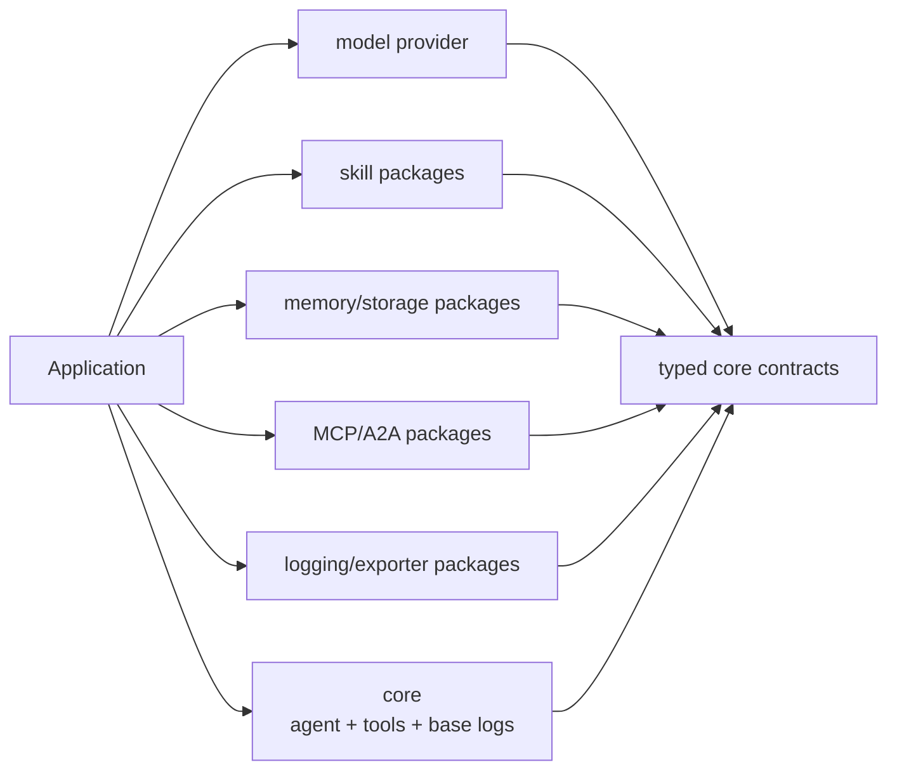

# Core + Capability Package Architecture Plan

Status: **Approved — staged implementation authorized; provider-default amendment included**

Last reviewed: **2026-09-04**

Scope: simplify the consumer installation model around one Web Standards-first
agent core, explicit model providers, and typed capability packages. This plan
supersedes the prior target package plan under the recorded Phase 0 approval;
existing runtime gates remain mandatory during implementation.

Required companion design:
[`core-capability-composition-design.md`](./core-capability-composition-design.md)

Audit status: **companion design/contracts/TODO are detailed enough for staged
implementation; I0 owner approval is recorded and I1 is the next source slice**.
This is not full-runtime acceptance: MCP Web declaration portability and real-agent
Edge research evidence remain open exit items in the audit and human-test design.

## 1. Proposed product decision

Owner amendment: each agent may choose its own model. A model omitted at
`runtime.agent()` uses an explicitly configured provider default; when multiple
providers define defaults, select `defaultProvider` explicitly. Full per-agent
targets always override defaults. This is not failure-time model switching.
See composition design 4.1.1 for exact route and compatibility semantics.

The primary public model should be:

```text
core + one model provider + only the capabilities selected by the application
```

The application runtime is determined by its selected capabilities, not by a
top-level `node` or `edge` edition.

```text
@ai-agent-sdk/core                 Web Standards agent runtime
@ai-agent-sdk/provider-openai      model capability
@ai-agent-sdk/skill-filesystem     Node filesystem capability
@ai-agent-sdk/mcp                  Universal remote MCP client/tool source
@ai-agent-sdk/mcp-server           Universal Web MCP server hosting
@ai-agent-sdk/mcp-node             Node stdio MCP client transport
@ai-agent-sdk/mcp-node-server      Node stdio/HTTP MCP server hosting
@ai-agent-sdk/observability-node   Node durable journal and gated diagnostics
```

There should be no recommended batteries-included `@ai-agent-sdk/node` install.
Node is an environment constraint, not a product capability. A coding harness is
created by composing filesystem, process, MCP stdio, durable logging, and an auth
provider; a Node web server that needs none of those should not receive them.

The first-use journey becomes:

```sh
pnpm add @ai-agent-sdk/core @ai-agent-sdk/provider-openai
```

`@ai-agent-sdk/core` must already contain a usable agent runtime and base
observability. Installing `agent` and `observability` separately should not be a
prerequisite for the first agent.

## 2. What was learned from Mastra

### 2.1 The useful product pattern

Mastra presents `@mastra/core` as the central framework package. Its official
README says core contains agents, workflows, tools, memory, storage contracts,
MCP, and observability integration. Its getting-started guide creates an agent
from `@mastra/core/agent`, creates tools from `@mastra/core/tools`, and registers
them through the main `Mastra` object. That gives users one obvious starting
point rather than asking them to understand the repository graph first.

Mastra then adds concrete capabilities as packages. Examples include
`@mastra/memory` and storage adapters such as `@mastra/pg`. Those packages peer
on `@mastra/core`, implement contracts owned by core, and are passed explicitly
to the application. This is the part of the Mastra model worth adopting.

Official sources reviewed:

- [Mastra core README](https://github.com/mastra-ai/mastra/blob/main/packages/core/README.md)
- [Mastra getting-started guide](https://mastra.ai/docs)
- [Mastra core package manifest](https://github.com/mastra-ai/mastra/blob/main/packages/core/package.json)
- [Mastra memory package manifest](https://github.com/mastra-ai/mastra/blob/main/packages/memory/package.json)
- [Mastra PostgreSQL adapter manifest](https://github.com/mastra-ai/mastra/blob/main/stores/pg/package.json)

### 2.2 What should not be copied

Mastra's current core is not a suitable runtime template for this project:

- its manifest declares Node `>=22.13.0`;
- its current runtime dependency list contains more than thirty packages,
  including Node-oriented packages such as `execa`, `dotenv`, `ws`, and
  `posthog-node`;
- it exposes a very large number of subpaths and owns server, A2A, MCP, browser,
  scheduler, storage, workflow, and other framework domains;
- its model router may discover provider credentials from environment variables,
  while this SDK intentionally keeps environment access out of Universal code.

Therefore the intended lesson is **one obvious core plus adapters**, not “put
every integration into core.” Our differentiator remains a strict Web Standards
closure and explicit credential/runtime capabilities.

## 3. Consumer mental model

Users should need to understand only three concepts:

1. `core` runs agents.
2. a provider connects a model.
3. a capability adds one optional behavior.

They should not need to understand `provider-http`, wire protocols, observation
ports, environment elevation, or internal package ownership to start.



“Plugin” is the ecosystem model, but it should not become one untyped catch-all
`Plugin` interface. Each extension point has different lifecycle, reliability,
and security rules. Packages should implement typed contracts owned by core:

| Capability family | Core contract | Typical composition point |
| --- | --- | --- |
| Model provider | marker-free advanced `ModelAdapter` / `ModelProviderPlugin`; marker-based `ComposableModelProviderPlugin` for normal runtime composition | agent model or model registry |
| Tool | `Tool` | agent `tools` |
| Skill source | marker-free advanced `SkillProvider`; marker-based `SkillProviderPlugin` for revision/reference runtime composition | agent `skills` |
| Memory persistence | `MemoryStore` | agent/session `memory`; shared and caller-owned |
| Tool source | `ToolSource` with `apiVersion: 1` | agent/session `toolSources`; immutable snapshot per invocation |
| Observation sink | `ObservationExporterPlugin` | runtime observability configuration; advanced marker-free `ObservationExporter` remains on `core/observability` |
| Authentication | versioned `CredentialSource` / `CredentialStore` | provider construction; caller-owned |

This preserves explicit dependency injection and avoids package scanning, global
registries, install-time execution, and hidden environment discovery.

## 4. Target responsibility of core

`@ai-agent-sdk/core` should be a complete Universal agent SDK, not the current
thin package kernel.

### 4.1 Included in core

- messages, content blocks, normalized stream chunks, errors, and abort behavior;
- model registry, adapter/plugin contracts, retries, and provider-attempt usage;
- `defineAgent`, sessions, bounded agent/tool loops, modes, and tool execution;
- Web-safe approval/user-input brokers, interceptors, hooks, JSON-safe session
  snapshot/resume, and Universal local-team composition;
- in-memory history, memory interfaces, compaction interfaces, and team contracts;
- tool and skill contracts, validation, catalogs, and explicit composition;
- canonical model-call and agent-run token accounting;
- missing/partial/estimated/not-applicable usage coverage;
- structured observation events, logger, trace/run/span correlation;
- privacy processors, bounded observation bus, health state;
- no-op and in-memory/test exporters;
- all behavior required for a deterministic Edge/browser/Node agent test.

### 4.2 Excluded from core

- concrete OpenAI, Anthropic, or Codex HTTP implementations;
- SSE parser dependency and provider wire protocols;
- filesystem, environment variables, local paths, processes, shell, or stdio;
- IndexedDB, local JSONL journals, or provider-specific telemetry exporters;
- concrete databases, vector stores, MCP transports, or A2A codec packages;
- automatic API-key discovery or implicit local credential files;
- global plugin discovery or dynamic package loading.

### 4.3 Base logging contract

Core logging is always operational for correlation and accounting, even when no
external exporter is configured. “Base logging included” means:

- every agent/model/tool operation receives stable correlation identifiers;
- every metadata event retains run/trace/span identity, per-run order, phase,
  priority, and monotonic timing;
- terminal usage coverage and errors are recorded in the run report;
- reported input/output/cache-read/cache-write/reasoning counters remain
  disjoint, estimates remain separate, and physical retry attempts are retained;
- the host can subscribe to bounded structured events;
- memory/no-op sinks are available without dependencies;
- content capture remains disabled by default;
- no claim of durable delivery is made without an exporter capability.

Accounting has one owner: the core run ledger. Every provider-backed model call,
including maintenance calls such as context compaction, enters that ledger once.
Callers must not add a second total from stream/history usage. A terminal
`RunReport` preserves physical attempts, dispatch state, coverage, possibly
billed attempts without usage, operation counts, delivery health, and the
authoritative flag. Before its own delivery checkpoint, core freezes a
`RunTerminalRecord` without delivery state; export batches carry zero or more of
those records and never attach one usage scalar to a batch that may mix several
runs. After acknowledgment, the caller-facing `RunReport` adds the resulting
delivery summary without mutating the exported record.

Lifecycle also has one owner: the core runtime operation registry. Agent runs,
model discovery, manual compaction, and local-team work acquire typed leases
before executable capability access. Runtime close stops admission, aborts and
quiesces leases, seals late publication, then disposes providers and flushes
observations. This prevents a catalog refresh or maintenance call from publishing
after its provider has been removed.

Durability remains opt-in:

```text
core base log + fetch exporter      -> Web Standards / Edge
core base log + IndexedDB exporter  -> Browser
core base log + JSONL exporter      -> Node
core base log + OTEL bridge         -> runtime of the caller's OTEL stack
```

Recommended composition also covers caller-owned integration setup, not only
agent execution. Create the runtime before connecting MCP or linking A2A, pass a
runtime-bound child logger into the integration, quiesce/close the runtime first,
then close or unlink the integration in a nested cleanup guard. Preserved
low-level integration APIs keep `logger` optional for standalone use and never
install an implicit console sink; runtime-oriented recipes must supply it. This
keeps connect/auth/reconnect/serve failures correlated without turning logs into
token accounting or ownership transfer. A checked six-family/27-operation matrix
requires logical start/terminal/error evidence and preserves every physical
network/process attempt without logging headers, bodies, prompts, results, or
agent-card content. Because the runtime logger is intentionally no-op after
runtime close, later caller-owned MCP/A2A teardown is proved by its independent
support-safe close/unlink/dispose report rather than a fabricated log event.
Runtime-active rows use the shared `core/observability`
`IntegrationOperationEvidenceFields` grammar so logical and physical-attempt IDs,
phases, statuses, durations, and support-safe codes do not drift per package.
The connected MCP convenience factories also own partial-start rollback: a
failed connect yields `McpConnectionError` with the support-safe primary failure
and bounded `McpCloseReport`, re-exported from both HTTP and stdio client routes,
so cleanup cannot mask startup and users need no deep import.

Complete trace is a separate claim from base logging. Runtime health reports
integration records accepted, filtered, dropped, and rejected without changing
the advanced health API. Zero loss counters alone are insufficient: required
event-ID acknowledgments, logical/attempt pairing, and teardown reports must also
reconcile. Critical-checkpoint `delivery.complete` and the evictable diagnostic
ring do not prove a complete integration trace; missing evidence must be visible.

## 5. Recommended public package taxonomy

Top-level package choices describe capabilities, not environment editions. A
runtime suffix may still disambiguate an adapter that complements a Universal
package, such as `mcp` and `mcp-node`.

### 5.1 First-class packages shown in normal documentation

| Package | Runtime | User purpose |
| --- | --- | --- |
| `@ai-agent-sdk/core` | Universal | Complete agent runtime plus base observability |
| `@ai-agent-sdk/provider-openai` | Universal | OpenAI model provider |
| `@ai-agent-sdk/provider-anthropic` | Universal | Anthropic model provider |
| `@ai-agent-sdk/provider-codex` | Universal with injected store | Codex model/auth provider |
| `@ai-agent-sdk/skill-filesystem` | Node | Filesystem-backed skill source |
| `@ai-agent-sdk/mcp` | Universal | Fetch-shaped MCP client/tool source |
| `@ai-agent-sdk/mcp-server` | Universal | Web-standard MCP server handler |
| `@ai-agent-sdk/mcp-node` | Node | MCP child process and stdio client transport |
| `@ai-agent-sdk/mcp-node-server` | Node | MCP stdio/HTTP server hosting adapters |
| `@ai-agent-sdk/a2a` | Node until binary Worker gate passes | A2A integration |
| `@ai-agent-sdk/observability-fetch` | Universal | Acknowledged HTTPS export |
| `@ai-agent-sdk/observability-browser` | Browser | IndexedDB durability/lifecycle |
| `@ai-agent-sdk/observability-node` | Node | Durable JSONL journal and explicitly gated diagnostics |
| `@ai-agent-sdk/observability-otel` | capability-dependent | OpenTelemetry mapping bridge |
| `@ai-agent-sdk/auth-node` | Node | Environment credential source; Codex file auth only when `provider-codex` is also selected |

Client and server packages are separate because package-manager installation is
package-wide: an Edge client subpath cannot tree-shake away an installed server
dependency. They must not be hidden behind a general `node` facade.

Package splitting does not silently delete established import routes. The target
therefore keeps A2A `/client` and `/server`, MCP `/client` and `/server`, and
observability-node `/journal` and `/diagnostic`. MCP `/server` is a compatibility
view that requires the optional `mcp-server` peer; importing MCP root or
`/client` must not install or load that server closure. The 32-specifier target
map and exact export maps for all 18 target packages are machine-checked. The
same topology mechanically renders normal dependencies,
required core peers, optional-peer metadata, and catalog-backed external edges;
an implementation package cannot choose those manifest sections independently.
It also renders descriptive `aiAgentSdk` metadata with runtime, `coreApi: 1`,
and exact package roles; this metadata is never a runtime discovery mechanism.

The retained `auth-node` name does not authorize a hidden provider bundle. Its
`/env` subpath must peer only on core. `provider-codex` becomes an optional peer
for `/codex`, and the Codex harness installs both explicitly. This keeps one
understandable auth package without making an OpenAI user receive Codex code.
The root mirrors `/env`; it does not re-export `/codex` and therefore remains
usable in the two-package env-only closure.

### 5.2 Supporting packages not emphasized in the getting-started guide

Low-level packages can remain separate publish artifacts when dependency
ownership or third-party provider authoring requires them:

- `@ai-agent-sdk/provider-http`, with `provider-kit` as a possible future name;
- `@ai-agent-sdk/protocol-responses`;
- `@ai-agent-sdk/protocol-anthropic-messages`.

They are transitive implementation packages for normal users. They remain public
only if third-party provider authors need their contracts. A monorepo may contain
many packages without forcing users to make many installation decisions.

### 5.3 Packages to remove from the recommended surface

| Current package | Proposed action | Reason |
| --- | --- | --- |
| `@ai-agent-sdk/agent` | merge implementation into `core` | agent is the base product, not an optional capability |
| `@ai-agent-sdk/observability` | merge base bus/logger into `core` | correlation and usage tracking are mandatory base behavior |
| `@ai-agent-sdk/node` | remove before publication | environment facade hides dependency/capability choices |
| `ai-agent-sdk` | remove or retain only as temporary internal compatibility | no published users currently require compatibility debt |
| `@ai-agent-sdk/mcp-node` | retain as client-only | identifies the Node stdio client boundary without server hosting dependencies |
| `@ai-agent-sdk/observability-node` | retain; audit exact-wire diagnostics separately | package splitting is a security follow-up, not required to remove the Node facade |

The absence of an npm release makes this the cheapest time to remove duplicate
facades rather than promising them through 1.x.

### 5.4 One recommended composition route per retained package

Every non-core package has one machine-checked public entrypoint. Advanced
exports remain available, but a new user should not need to infer which class or
adapter belongs in which slot.

| Package | Recommended public entry | Composition point | Lifecycle/ownership |
| --- | --- | --- | --- |
| `@ai-agent-sdk/provider-openai` | `openAiPlugin()` | `runtime.providers` | inert factory; runtime owns registration |
| `@ai-agent-sdk/provider-anthropic` | `anthropicPlugin()` | `runtime.providers` | inert factory; runtime owns registration |
| `@ai-agent-sdk/provider-codex` | `codexPlugin()` | `runtime.providers` | inert factory; runtime owns registration |
| `@ai-agent-sdk/provider-http` | `createRuntimeHttpProvider()` | provider author adapter | inert authoring value |
| `@ai-agent-sdk/protocol-responses` | `openAiResponsesProtocol` | provider author protocol | inert authoring value |
| `@ai-agent-sdk/protocol-anthropic-messages` | `anthropicMessagesProtocol` | provider author protocol | inert authoring value |
| `@ai-agent-sdk/mcp` | `connectMcpHttp()` | agent `toolSources` | connected and caller-owned |
| `@ai-agent-sdk/mcp-server` | `createMcpServer()` | host MCP server | inert server; host owns mounting, no cleanup handle |
| `@ai-agent-sdk/mcp-node` | `connectMcpStdio()` | agent `toolSources` | connected and caller-owned |
| `@ai-agent-sdk/mcp-node-server` | `serveMcpStdio()` | host MCP server | host-owned handle; caller closes and inspects report |
| `@ai-agent-sdk/skill-filesystem` | `fileSystemSkillProviderPlugin()` | agent `skills` | lazy, borrowed, caller-owned |
| `@ai-agent-sdk/observability-fetch` | `fetchObservationExporter()` | runtime observability exporters | registration chooses owned/borrowed |
| `@ai-agent-sdk/observability-browser` | `indexedDbObservationExporter()` | runtime observability exporters | registration chooses owned/borrowed |
| `@ai-agent-sdk/observability-node` | `jsonlObservationExporter()` | runtime observability exporters | registration chooses owned/borrowed |
| `@ai-agent-sdk/observability-otel` | `createOpenTelemetryBridge()` | runtime `openSpan` and `processors` | OTel providers remain caller-owned |
| `@ai-agent-sdk/auth-node` | `envCredential()` | provider factory credential | borrowed caller value |
| `@ai-agent-sdk/a2a/client` | `linkA2AAgent()` | runtime-team `linkAgent` | borrowed transport; caller retains unlink and teardown report |

The checker resolves each entry against its exact public declaration route and a
direct install journey, then verifies package-specific wiring fragments in a
TypeScript fixture. It rejects a missing symbol, wrong package owner, import-only
proof, renamed slot, changed lifecycle, or package without a recommended path.
This table does not introduce a generic plugin array: each value still enters
its family-specific typed slot.

### 5.5 Documentation cutover is part of the package migration

The current docs still contain executable examples for all four target-removed
facades. They cannot be rewritten before the corresponding product exports
exist, but they also cannot be left to an informal cleanup after deletion.
`documentation-migration.json` therefore freezes 27 affected Markdown files and
their exact legacy routes across `pending → active-guides-migrated → complete`.

At I6, both human journeys reach their target package selections and active
guides are rewritten to core plus explicitly selected capability packages; the
facade READMEs still exist in this middle state. At I7, the README files
belonging to agent, base observability, Node, and unscoped facade packages
disappear with those packages. ADRs, API baselines,
and audit records may retain old names as historical evidence; superseded
current-architecture documents must say so explicitly. No unclassified document
may introduce a new legacy package example.

Both post-I6 states also check composition ergonomics rather than only absence:
the core README must show `createAgentRuntime`, `defineAgent`, and `SdkLogger`,
and every non-core package README must import its frozen recommended entrypoint
and include its own install command. This keeps “core + provider + capabilities”
discoverable without recreating a full Node facade in documentation.

## 6. Example installation journeys

### 6.1 Edge Worker chat agent

The static browser UI installs no SDK package. Its trusted Edge Worker installs:

```sh
pnpm add @ai-agent-sdk/core @ai-agent-sdk/provider-openai
```

```ts
import { createAgentRuntime } from '@ai-agent-sdk/core'
import { openAiPlugin } from '@ai-agent-sdk/provider-openai'

const runtime = await createAgentRuntime({
  providers: [openAiPlugin({ apiKey })],
})

const agent = runtime.agent({
  id: 'assistant',
  model: { provider: 'openai', id: 'gpt-5.4' },
  instructions: 'Help the user.',
})
```

### 6.2 Edge agent with remote telemetry and remote MCP

```sh
pnpm add @ai-agent-sdk/core @ai-agent-sdk/provider-openai \
  @ai-agent-sdk/observability-fetch @ai-agent-sdk/mcp
```

The runtime remains Web Standards because every selected capability is
Universal. Its checked recipe creates the runtime before `connectMcpHttp()`,
passes `runtime.logger({ fields: { integration: 'mcp-http' } })`, attaches the
connection through `toolSources`, closes runtime work first, and then closes the
caller-owned MCP connection with a support-safe report.

### 6.3 Direct-browser BYOK agent with durable local observations (opt-in)

```sh
pnpm add @ai-agent-sdk/core @ai-agent-sdk/provider-openai \
  @ai-agent-sdk/observability-browser
```

This is not the default website recipe. Browser credentials still require a
host-designed proxy, short-lived token, explicit BYOK handling, or another safe
credential boundary. Core does not weaken that boundary for convenience.

### 6.4 Coding harness on Node

```sh
pnpm add @ai-agent-sdk/core @ai-agent-sdk/provider-codex \
  @ai-agent-sdk/skill-filesystem @ai-agent-sdk/mcp-node \
  @ai-agent-sdk/observability-node @ai-agent-sdk/auth-node
```

This is Node because selected capabilities require Node, not because the agent
runtime changed. A future project generator or documented preset may choose this
set, but the preset must not become an opaque runtime facade. The checked harness
uses the same runtime-first/logger-bound/runtime-close-before-MCP-close order for
`connectMcpStdio()`; selecting Node changes capabilities, not the logging or
ownership model.

### 6.5 Minimal Node HTTP service

```sh
pnpm add @ai-agent-sdk/core @ai-agent-sdk/provider-anthropic
```

Even though the application runs on Node, it does not need filesystem, MCP stdio,
A2A, JSONL, or every provider.

### 6.6 Responses-compatible third-party provider

```sh
pnpm add @ai-agent-sdk/core @ai-agent-sdk/provider-http \
  @ai-agent-sdk/protocol-responses
```

This is the shortest authoring path when the upstream uses the Responses wire
shape. The published provider package peers on core and normally depends on its
HTTP/protocol implementation packages; applications still install only core plus
the finished provider.

### 6.7 Custom HTTP protocol provider

```sh
pnpm add @ai-agent-sdk/core @ai-agent-sdk/provider-http
```

Use `defineWireProtocol()` and `createRuntimeHttpProvider()` when the upstream
wire shape is not one of the official protocol packages. The result remains a
Universal composable provider; environment credentials and I/O are injected.

### 6.8 Direct non-HTTP provider

```sh
pnpm add @ai-agent-sdk/core
```

Implement the advanced `ModelAdapter` surface from `core/provider`, then expose
an inert composable provider wrapper with declared routes. A provider package
does not need HTTP support merely to participate in core composition.

### 6.9 Browser observations with OpenTelemetry

```sh
pnpm add @ai-agent-sdk/core @ai-agent-sdk/provider-openai \
  @ai-agent-sdk/observability-browser @ai-agent-sdk/observability-otel \
  @opentelemetry/api@1.9.1
```

`@opentelemetry/api` is a required peer and must therefore be a direct
application selection; it is not hidden as a transitive implementation
dependency. The optional logs API is needed only when the application supplies
an OTel logger. The caller continues to own the OTel providers, while runtime
ownership of the IndexedDB exporter remains explicit.

### 6.10 Node MCP server host

```sh
pnpm add @ai-agent-sdk/core @ai-agent-sdk/mcp-node-server
```

Import both `createMcpServer()` and `serveMcpStdio()` from
`@ai-agent-sdk/mcp-node-server`. The package re-exports the Universal server
constructor from its normal `mcp-server` dependency, so applications do not need
to install or import a transitive implementation package directly. This remains
a focused MCP-server capability, not a general Node facade. The host retains the
returned handle, calls its bounded `close({ signal })`, and checks
`deadlineReached` plus `unsettledRequests` rather than treating process exit as
successful cleanup.

### 6.11 Anthropic Messages-compatible third-party provider

```sh
pnpm add @ai-agent-sdk/core @ai-agent-sdk/provider-http \
  @ai-agent-sdk/protocol-anthropic-messages
```

Use `anthropicMessagesProtocol` with `createRuntimeHttpProvider()` when authoring
a compatible provider. Like the Responses author path, the resulting provider
remains Universal and its eventual consumers install core plus the finished
provider package rather than these authoring dependencies individually.

### 6.12 Link a remote A2A agent into a runtime team

```sh
pnpm add @ai-agent-sdk/core @ai-agent-sdk/a2a
```

Create the local team through `runtime.team()`, then pass that
`RuntimeAgentTeam` to `linkA2AAgent()`. The returned link is borrowed by the team;
the caller retains the unlink handle and remains responsible for any transport
resources. The checked recipe derives the link logger from `runtime.logger()`,
closes/quiesces the runtime first, and invokes the idempotent
`unlinkWithReport()` in `finally`, retaining it beside `RuntimeCloseReport`.
Adding A2A elevates only this application closure to Node and pulls the A2A SDK
transitively.

### 6.13 Edge MCP server host

```sh
pnpm add @ai-agent-sdk/core @ai-agent-sdk/mcp-server
```

Import `createMcpServer()` directly from `@ai-agent-sdk/mcp-server`. The returned
`McpWebServer` accepts Web Standards `Request`/`Response` values and can be
mounted by a Worker, Deno, Bun, or Node HTTP adapter without selecting stdio or
the Node transport package. `@modelcontextprotocol/server` remains the package's
transitive implementation dependency.

## 7. Runtime elevation remains package-local

Each capability publishes one minimum runtime classification:

```text
Universal + Universal = Universal
Universal + Browser   = Browser
Universal + Node      = Node
```

Core never conditionally loads a Node implementation. Runtime-specific packages
import core contracts and point inward. Documentation states the runtime beside
each capability, but users choose by feature name.

The machine closure ledger probes every retained package when selected directly
beside core. “Additional workspace” excludes the two packages the user selected;
optional peers stay excluded until their route is explicitly selected.

| Direct addition beside core | Additional workspace packages | Exact external runtime/required-peer closure | Result |
| --- | --- | --- | --- |
| `@ai-agent-sdk/provider-openai` | `@ai-agent-sdk/provider-http`, `@ai-agent-sdk/protocol-responses` | `eventsource-parser@4.1.0` | Universal |
| `@ai-agent-sdk/provider-anthropic` | `@ai-agent-sdk/provider-http`, `@ai-agent-sdk/protocol-anthropic-messages` | `eventsource-parser@4.1.0` | Universal |
| `@ai-agent-sdk/provider-codex` | `@ai-agent-sdk/provider-http`, `@ai-agent-sdk/protocol-responses` | `eventsource-parser@4.1.0` | Universal |
| `@ai-agent-sdk/provider-http` | — | `eventsource-parser@4.1.0` | Universal |
| `@ai-agent-sdk/protocol-responses` | — | — | Universal |
| `@ai-agent-sdk/protocol-anthropic-messages` | — | — | Universal |
| `@ai-agent-sdk/mcp` | — | `@modelcontextprotocol/client@2.0.0` | Universal |
| `@ai-agent-sdk/mcp-server` | — | `@modelcontextprotocol/server@2.0.0` | Universal |
| `@ai-agent-sdk/mcp-node` | `@ai-agent-sdk/mcp` | `@modelcontextprotocol/client@2.0.0` | Node |
| `@ai-agent-sdk/mcp-node-server` | `@ai-agent-sdk/mcp-server` | `@modelcontextprotocol/node@2.0.0`, `@modelcontextprotocol/server@2.0.0` | Node |
| `@ai-agent-sdk/skill-filesystem` | — | — | Node |
| `@ai-agent-sdk/observability-fetch` | — | — | Universal |
| `@ai-agent-sdk/observability-browser` | — | — | Browser |
| `@ai-agent-sdk/observability-node` | — | — | Node |
| `@ai-agent-sdk/observability-otel` | — | required `@opentelemetry/api@1.9.1` | Universal |
| `@ai-agent-sdk/auth-node` root/`env` | — | — | Node |
| `@ai-agent-sdk/a2a` | — | `@a2a-js/sdk@1.1.0` | Node |

This table is not permission for applications to install protocol/support
packages unnecessarily. Normal provider consumers install core plus the provider;
the support closure is transitive. It exists to make runtime elevation and hidden
dependency cost reviewable for every package, including packages masked by the
larger Node harness recipe.

The exact Web Platform, Browser, and Node 22.12 feature baselines live in the
machine topology. Runtime construction fails before plugin setup when a required
Universal feature is missing; core does not silently add polyfills or fall back
to weak/random environment-specific behavior. Fetch remains injected or owned by
the selected HTTP capability rather than becoming a hidden core dependency.

Package and packed-artifact gates continue to reject:

- `node:*`, `process`, `Buffer`, filesystem, child process, or stdio in core;
- a Universal capability importing a Node capability;
- undeclared or deep imports;
- dynamic plugin discovery and import-time global registration;
- provider credentials read from environment/files inside Universal code.

## 8. Dependency and supply-chain rules

The proposed larger core must not become a Mastra-sized dependency aggregator.

Required gates:

1. `@ai-agent-sdk/core` has zero third-party runtime dependencies unless a
   separate ADR proves a dependency is unavoidable and Web Standards-safe.
2. A provider owns only its transport/protocol closure.
3. `eventsource-parser` remains isolated in the HTTP provider layer; installing
   core alone never installs it.
4. Capability packages own their external dependencies and install scripts.
5. Every external plugin peers on a compatible core range to avoid duplicate
   contract/runtime identities.
6. No package runs install-time code without a reviewed allowlist entry.
7. Packed dependency closures, not workspace hoisting, determine runtime claims.
8. An optional subpath cannot force an unrelated provider/integration closure;
   packed subpath recipes verify what is actually installed.
9. A supporting package that imports core runtime values also peers on core. A
   provider may depend normally on that support package, but cannot reintroduce
   core as a nested normal dependency through it.
10. Packed official capability closures resolve one physical core path and do
    not embed core implementation; public aliases re-export canonical values.
11. Plugin admission and foreign failure normalization use structural markers
    and bounded validated data, never cross-package `instanceof` or a global
    duplicate-core singleton.
12. `provider-http` remains a complete extension kit with a versioned executable
    wire-protocol contract; official factory-focused docs do not remove retained
    adapter/protocol/auth/discovery/retry APIs without an approved migration.
13. HTTP headers compose through disjoint case-insensitive ownership layers;
    collisions fail, auth provenance always redacts, and credentials never cross
    redirect origins.
14. Core's composition root exposes immutable provider/model catalog snapshots
    for Web UIs; route/account caches are isolated and discovery failure is never
    presented as successful empty metadata or required for explicit invocation.
15. Runtime discovery exposes route, plugin instance, and provider family as
    separate identities; one row represents one route and catalog lookup never
    guesses account ownership from display names or credentials.
16. Providers entering the normal composition root declare inert route claims;
    all plugin IDs/routes preflight before setup, while route-in-setup legacy
    plugins remain confined to the advanced registry compatibility surface.
17. Memory persistence is always borrowed and requires explicit conversation or
    acknowledged fixed sharing scope; session override and snapshot binding IDs
    prevent silent cross-conversation or cross-tenant rebinding.
18. Skill catalogs are revisioned and candidates carry bounded JSON-safe locators;
    snapshots retain exact references only and resume requires provider validation
    before instructions or resources can be loaded.
19. Live tool sources expose one synchronous atomic revisioned snapshot per agent
    invocation; schema and execution come from one generation and terminal
    evidence records only source ID/revision.
20. Inline/package tools remain marker-free core leaf contracts, but definition
    and runtime binding capture a detached bounded schema with immutable behavior
    references so post-capture mutation cannot redirect execution.
21. Local brokers, interceptors, hooks, and usage estimators remain marker-free
    core leaves whose runtime-used methods are captured once at session binding;
    operational state stays live while policy replacement cannot redirect a run.
22. Provider-native tools use one merge-extensible typed JSON-safe vocabulary from
    agent definition through model capability validation and wire serialization;
    provider progress remains distinct from host execution and default logs.
23. HTTP wire protocols synchronously return one bounded JSON object; the adapter
    validates, deep-detaches, and encodes it once per prepared logical call, then
    reuses identical bytes across physical retries without exposing the body to
    default observations.
24. `provider-http` alone owns exact-pinned SSE framing. It validates streaming
    media type, resets one idle clock on raw/comment activity, bounds raw bytes,
    raw chunks, event size and event count, drains callback queues linearly, and
    requires exactly one terminal finish without reconnecting from SSE metadata.
25. Official provider packages hide HTTP/protocol support transitively and expose
    one side-effect-free preferred plugin factory that preserves provider-specific
    adapter controls. A custom instance ID becomes its default route, while
    explicit routes remain aliases; instance-scoped cache hints are never called
    conversation or tenant isolation.
26. Additive capabilities compose through their own typed slots: lazy borrowed
    skills, caller-closed connected tool sources, explicitly owned/borrowed
    exporters, and a caller-owned OTel `openSpan + processor` bridge. Factories
    preserve bounds/host injection and runtime elevation belongs only to the
    selected capability package.
27. Recommended runtime journeys bootstrap caller-owned MCP/A2A integrations only
    after runtime creation, inject its bound logger, quiesce runtime operations
    before integration teardown, retain optional logger/no-console behavior for
    standalone advanced callers, and use independent support-safe reports for
    post-runtime close/unlink/dispose rather than a no-op runtime logger.

Merging source into core reduces public choices but does not justify adding
unrelated external dependencies to core.

## 9. Migration plan

No phase below should begin until this document is accepted.

The concrete owner choices are tracked by stable IDs in
[`core-capability-phase0-approval.md`](./core-capability-phase0-approval.md); this
plan does not maintain a second independent approval list.

### Phase 0 — Freeze the target API

- decide whether provider names remain `provider-openai` or shorten to `openai`;
- decide whether the unpublished unscoped compatibility facade is deleted;
- freeze the core subpaths: `.`, `/agent`, `/tools`, `/skills`, `/memory`,
  `/observability`, and `/provider` at most; keep conformance helpers outside the
  core runtime package;
- freeze `.` as a curated re-export-only application facade rather than exposing
  the internal canonical barrel; retain the 184 current core-root names and add
  only the reviewed everyday composition surface;
- define typed contracts for provider, skill, memory-store, tool-source, exporter, and
  credential capabilities;
- keep marker-free local `tools` separate from executable borrowed `toolSources`;
  official MCP connections satisfy versioned `ToolSource` directly and remain
  caller-owned;
- explicitly reject a universal catch-all plugin/service locator;
- approve the composition-root, provider/model binding, lifecycle ownership,
  shutdown, peer-version, and core-entry contracts in the companion design.

Exit gate: installation and composition examples compile as type-only fixtures.

### Phase 1 — Make core the complete Universal base

- move current `packages/agent/src` ownership into `packages/core/src/agent`;
- move the base observation bus, logger, processors, health, and memory/test
  exporters into `packages/core/src/observability`;
- perform each complete root move and its exact route-complete compatibility
  bridge atomically according to the checked 56-file source-migration state
  machine; observability retains only `.`, while the temporary agent bridge
  retains both `.` and `./skill-validation`; never accept a partially split
  source owner;
- keep public subpath exports small and intentional;
- implement one non-exported canonical owner plus a machine-frozen root facade
  and focused author views; do not point the package root at an export-all barrel;
- preserve one implementation of usage accounting and agent/tool lifecycle;
- remove source duplication rather than re-exporting through dependency cycles.

Exit gate: core alone runs a deterministic in-memory agent with a mock adapter,
tool call, trace, token report, missing-usage report, and base logs in strict
Worker, browser, Deno/Bun-compatible standards fixture, and Node.

### Phase 2 — Repoint capability packages

- provider, MCP, A2A, filesystem, auth, and exporter packages depend or peer on
  core's canonical contracts;
- convert `provider-http` and runtime-valued wire protocol imports to bounded
  core peers even though provider packages retain them as normal dependencies;
- replace current `agent` and `observability` dependency edges with `core`;
- make the Codex dependency of `auth-node` an optional peer so `/env` stays
  provider-neutral while the Codex recipe remains explicit;
- verify every plugin installs, disposes, retries, and fails transactionally;
- keep protocols and HTTP transport below providers as supporting packages.

Exit gate: zero workspace cycles, duplicate runtime identities, deep imports, or
runtime-boundary findings.

### Phase 3 — Remove environment facades

- remove `@ai-agent-sdk/node` from examples, docs, build entries, and package
  allowlists;
- retain feature-specific Node packages during this migration and review any
  split/rename as a separate ownership or security decision;
- ensure no replacement “full” package silently restores the same dependency
  closure;
- optionally create a project template that writes explicit dependencies into
  the consuming application's manifest.

Exit gate: the Node coding harness installs only its declared feature packages
and retains canonical core class identity.

### Phase 4 — Remove unpublished compatibility debt

- decide whether `ai-agent-sdk` and leaf shims have any real external consumer;
- if not, delete the facade before the first registry release;
- if local consumers exist, keep a time-bounded migration-only workspace package
  with an explicit removal date, not a permanent public promise.

Exit gate: repository and packed tests import the intended scoped packages only.

### Phase 5 — Rebuild consumer tests around capability selection

- Edge website: static browser client with no SDK; trusted Worker uses core +
  provider + optional Universal capabilities;
- direct-browser BYOK website: add browser observation durability only when that
  separate credential model is intentionally selected;
- minimal Node service: core + one provider only;
- coding harness: explicitly add filesystem, stdio, auth-file, and JSONL;
- third-party provider fixture: peer on core and use only public contracts;
- third-party skill fixtures: one Universal fetch skill and one Node filesystem
  skill implementing the same core contract.

Exit gate: installation manifests prove each journey receives no unselected
capability or external dependency.

## 10. Validation matrix

| Gate | Core | Universal plugin | Browser plugin | Node plugin |
| --- | --- | --- | --- | --- |
| No Node globals/built-ins | required | required | required | not applicable |
| Strict Worker packed run | required | required | negative/NA if IndexedDB | negative/NA |
| Chromium packed run | required | required | required | negative/NA |
| Node 22.12 packed run | required | required | optional | required |
| Token usage/coverage | required | provider-specific | inherited | inherited |
| Structured error/trace events | required | required | required | required |
| Portable no-redirect fetch semantics | inherited | required | required | required |
| Explicit/dynamic catalog behavior | inherited | provider-specific | provider-specific | provider-specific |
| Host + provider-native tool projection | required | provider-specific | inherited | inherited |
| No undeclared install scripts | required | required | required | required |
| Transitive dependency snapshot | required | required | required | required |

Strict Worker means more than starting workerd. Fixtures deliberately set
`globalThis.Buffer` and `globalThis.process` to `undefined` before SDK execution,
because current workerd compatibility dates may expose those globals without an
explicit Node flag. Emitted import inspection remains a separate mandatory gate.

Human acceptance tests must also show capability events rather than merely prove
that packages resolve. The Edge chat and coding harness journeys remain, but the
coding harness fixture must stop depending on the removed Node facade.

## 11. Risks and countermeasures

### Risk: core becomes a dumping ground

Countermeasure: core includes only behavior required by a generic agent in every
runtime. Concrete I/O integrations remain packages. New core features require a
strict Worker test and an explanation of why most agents need the behavior.

### Risk: one generic plugin interface hides important semantics

Countermeasure: use typed capability contracts and explicit constructor/config
slots. “Plugin” describes packaging and extension, not one runtime method shape.

### Risk: many capability packages still feel complex

Countermeasure: document recipes and offer a project generator that adds explicit
packages. Do not solve documentation complexity with an opaque all-dependencies
facade.

### Risk: provider authors receive an overly large peer

Core remains zero-dependency and tree-shakeable. If measured provider-author
fixtures prove core is materially too heavy, introduce a narrowly scoped
`provider-kit` package; do not expose a user-facing “kernel” unless a real
external authoring need is demonstrated.

### Risk: renaming packages creates churn

There is no npm release yet. Prefer one deliberate rename now over compatibility
aliases that must be maintained after publication.

## 12. Recommended decision

Adopt the Mastra-style **consumer model**, with stricter implementation rules:

- one complete `@ai-agent-sdk/core` for building an agent;
- one explicitly installed provider;
- typed capability packages for skills, memory, transports, auth, and exporters;
- no recommended `@ai-agent-sdk/node` facade;
- no Node behavior or third-party integration closure inside core;
- no single catch-all plugin interface or automatic discovery;
- project templates may select packages, but the resulting manifest remains
  explicit and auditable.

This changes the current architecture from “packages mirror technical ownership”
to “technical ownership remains modular, while the public product starts from one
complete core.”
