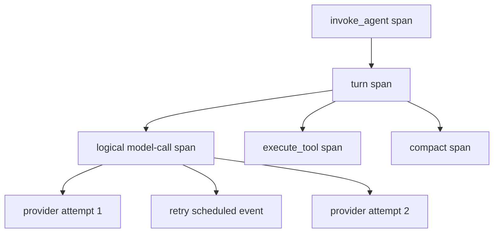
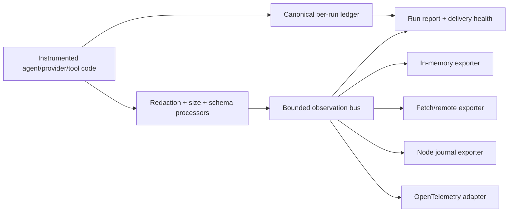

# Observability, Usage Accounting, and Logging Architecture

Status: **Implemented and verified; npm publication intentionally deferred**

Last reviewed: **2026-09-01**

Scope: model-call accounting, token-usage coverage, traces, structured logs, metrics, errors, exporter health, privacy, and Web Standards/Node runtime boundaries.

Implementation contract: [`observability-implementation-design.md`](./observability-implementation-design.md)  

Implementation ledger: [`implementation-todo.md`](./implementation-todo.md)

Executable evidence: [`implementation-spike-evidence.md`](./implementation-spike-evidence.md)

Non-goal: this document does not promise that a third-party provider will always report exact billing data.

## 1. Decision summary

The SDK has an observability system, not only a logger.

It has four connected but distinct signals:

1. A **canonical run ledger** records every logical model call, physical provider attempt, tool execution, terminal outcome, and usage-coverage state.
2. **Traces** describe parent/child relationships and duration across agent, model, retry, tool, and compaction operations.
3. **Structured logs** carry human-readable diagnostics correlated to the active trace and span.
4. **Metrics** aggregate latency, calls, errors, retries, token usage, missing-usage counts, and exporter drops without high-cardinality identifiers.

The ledger is the accounting source. Logs and exporters are observation and delivery mechanisms; they must not be the only place where the SDK knows that a call happened.

The universal observability contract uses Web Standards. Edge and browser applications select fetch/in-memory exporters, while Node applications may add durable JSONL journals, OpenTelemetry SDKs, or other Node sinks. Adding a Node exporter elevates the consumer runtime to Node without changing the universal agent or provider packages.

## 2. What “do not miss” can guarantee

There are three different guarantees and they must not be conflated.

### 2.1 Instrumentation coverage

While the runtime remains alive and able to execute finalization, the SDK can guarantee that every operation crossing an instrumented boundary creates one start record and exactly one terminal record, including validation failures, cancellation, timeouts, stream errors, and consumer abandonment.

This is an SDK invariant and is testable.

### 2.2 Usage-accounting completeness

The SDK can guarantee that every logical model call is classified as:

- `complete`: authoritative usage required by the SDK was reported;
- `partial`: some authoritative counters were reported but the accounting set is incomplete;
- `estimated`: one or more counters came from an estimator rather than the provider;
- `missing`: no defensible usage value was available;
- `not-applicable`: the SDK can prove the operation stopped before any model dispatch.

It cannot force a provider to report tokens for an interrupted or failed request. It must expose that uncertainty instead of recording zero.

### 2.3 Export durability

No universal JavaScript library can guarantee remote delivery after a process crash, browser close, or Edge isolate termination. Durable delivery requires an exporter with acknowledgements or local journaling plus an explicit lifecycle flush.

Therefore, the SDK guarantees an in-run ledger and observable delivery health. Stronger durability is selected by deployment:

- Edge: acknowledged remote exporter plus platform `waitUntil`/request lifecycle integration;
- browser: IndexedDB or acknowledged remote exporter when the product needs persistence;
- Node: append-only journal or an acknowledged telemetry backend;
- test/dev: in-memory or console exporter.

## 3. Current-state audit

### 3.1 Existing strengths

The project already has useful foundations:

- [`trace.ts`](../packages/core/src/agent/trace/trace.ts) creates W3C-sized trace/span IDs and models `invoke_agent`, `chat`, `execute_tool`, and `compact` spans.
- [`events.ts`](../packages/core/src/agent/loop/events.ts) exposes agent, model usage, tool, maintenance, and span lifecycle events.
- [`run-turn.ts`](../packages/core/src/agent/loop/run-turn.ts) aggregates reported usage and closes agent/model/tool spans on many error paths.
- [`http-adapter.ts`](../packages/provider-http/src/base/http-adapter.ts) centralizes HTTP provider dispatch and captures exact redacted outbound request metadata.
- [`wire-logger.ts`](../packages/observability-node/src/diagnostic/wire-logger.ts) serializes Node JSONL writes within one process.
- [`chunk.ts`](../packages/core/src/stream/chunk.ts) defines a disjoint internal token convention so cached tokens are not double-counted.

These pieces should be evolved rather than replaced blindly.

### 3.2 Gaps that can hide real usage or failures

| Gap | Current consequence | Required correction |
| --- | --- | --- |
| Request logger records only the request before `fetch` | No success, latency, response ID, usage, retry, or terminal error record | Instrument the complete logical call and every physical attempt |
| Request-logger failures are caught and ignored | Disk-full, timeout, and exporter failures are invisible | Track exporter health, failures, drops, and flush results |
| Invocation event observers are waited on only for settlement | Observer rejection/timeout does not become an explicit delivery diagnostic | Separate internal observation from public `onEvent`; report observer health |
| Turn aggregation starts from zero | A provider that reports no usage can look like a zero-token turn | Preserve missing/partial/estimated coverage separately from numeric totals |
| Retry callback is separate from trace context | Attempts cannot be reconstructed reliably under one logical call | Add stable model-call ID and per-attempt ID |
| Provider request ID is mainly retained on error responses | Successful calls are harder to correlate with provider support logs | Capture request/response identifiers on success and failure when available |
| Exact request bodies are diagnostic log content | Prompts, tool output, PII, and secrets may be persisted | Default to metadata-only; make content capture explicit and processed before export |
| Daily JSONL ordering is only in-process | Multiple processes and abrupt termination can create gaps or ambiguous order | Use per-process/run journal segments, sequence numbers, recovery, and flush status |
| Public event streaming is the observation path | A consumer that stops reading can also stop seeing the remaining lifecycle | Tap observability inside the producer before the public event queue |

## 4. Canonical data model

### 4.1 Event envelope

Every ledger and observability event needs a versioned, JSON-safe envelope:

```ts
interface ObservationEnvelope<TName extends string, TData> {
  schemaVersion: 1
  eventId: string
  sequence: number
  name: TName
  occurredAt: string
  severity: 'debug' | 'info' | 'warn' | 'error'
  priority: 'critical' | 'normal' | 'verbose'
  trace: {
    traceId: string
    spanId: string
    parentSpanId: string | null
  }
  resource: {
    sdkName: string
    sdkVersion: string
    serviceName?: string
    runtime?: 'edge' | 'browser' | 'node' | 'other'
  }
  correlation: CorrelationContext
  data: TData
}
```

The normative TypeScript shape lives in the implementation design; these properties are the architectural requirements it implements:

- `schemaVersion` supports durable compatibility and migrations;
- `eventId` deduplicates exporter retries;
- monotonically increasing `sequence` detects gaps within one run;
- `occurredAt` is the source time, not exporter receipt time;
- `priority` controls sampling, buffering, and backpressure;
- resource metadata makes SDK version and deployment origin visible without copying them into every message;
- trace IDs link spans, logs, usage, and errors;
- correlation IDs link logical calls to physical attempts and provider support records.

### 4.2 Correlation context

Use separate identifiers for separate lifecycles:

| Identifier | Lifetime |
| --- | --- |
| `traceId` | One distributed trace |
| `runId` | One agent invocation |
| `conversationId` | Multiple invocations in the same conversation |
| `turnId` | One user/agent turn |
| `modelCallId` | One logical model operation, including automatic retries |
| `attemptId` | One physical provider attempt |
| `toolCallId` | One requested tool execution |
| `providerRequestId` | Provider-assigned request/response identifier when available |
| `sessionId` | Host-defined product session where applicable |
| `sequence` | Ordered event position inside one run ledger |

Do not overload `toolCallId` for model calls or HTTP attempts.

### 4.3 Required critical events

Critical events are never sampled. Every start must have exactly one terminal event.

| Operation | Event name | Phases | Additional evidence |
| --- | --- | --- | --- |
| Agent run | `sdk.agent.run` | start/end | user-input wait/resume when applicable |
| Agent turn | `sdk.agent.turn` | start/end | turn number and terminal reason; never assistant text |
| Model call | `sdk.model.call` | start/end | terminal `usageReport`; `USAGE_MISSING` warning when incomplete |
| Provider attempt | `sdk.provider.attempt` | start/end | dispatch state, response ID, transport classification |
| Retry | `sdk.provider.retry.scheduled` | point | delay and failure code |
| Tool execution | `sdk.tool.call` | start/end | approval wait/decision when applicable |
| Compaction | `sdk.compaction` | start/end | summarization model call has its own usage report |
| Hook invocation | `sdk.hook.call` | start/end | closed hook kind and safe error only |
| User-input/approval wait | `sdk.user.input.wait` | start/end | reason and terminal status; never answer text |
| Skill operation | `sdk.skill.operation` | start/end | discovery/activation/resource-read counts; never path/content |
| Memory operation | `sdk.memory.operation` | start/end | load/append/save counts; never message bodies |
| Credential operation | `sdk.credential.operation` | start/end | refresh/login classification; never credential values |
| SDK integration request | `sdk.integration.request` | start/end | MCP, A2A, model discovery, or remote capability operation |
| Export delivery | `sdk.observer.failure`, `sdk.exporter.state` | point | failures, drops, recovery, and queue state |

Text/reasoning/image deltas are verbose events. They are not required for accounting and should be disabled or sampled by default.

### 4.4 Trace topology



The logical model-call span covers preparation, all retries, streaming, and the terminal outcome. Each physical attempt is a child span or structured child event. This prevents retry counts from being mistaken for separate user calls while preserving the real network activity.

Span names remain low-cardinality. Model, provider, tool name, error code, and outcome belong in attributes rather than arbitrary text in the name.

## 5. Usage accounting

### 5.1 Keep numeric usage separate from coverage

The existing `TokenUsage` disjoint-count convention remains useful, but it is not enough to describe missing data.

Add a call-level usage observation concept:

```ts
interface ModelCallUsageObservation {
  status: 'complete' | 'partial' | 'estimated' | 'missing' | 'not-applicable'
  source: 'provider' | 'estimator' | 'mixed' | 'none'
  values?: TokenUsage
  missingFields?: readonly TokenUsageField[]
  reason?: 'provider-omitted' | 'stream-aborted' | 'stream-failed' | 'invalid-usage'
}
```

Rules:

- one logical model call produces exactly one final usage observation;
- absence is `missing`, never an all-zero `TokenUsage`;
- a locally rejected call is `not-applicable` only when the SDK can prove no provider/model dispatch occurred;
- `inputTokens` remains uncached input, cache-read/cache-write inputs remain separate, and `reasoningTokens` is a detail within output rather than an additional output charge;
- partial provider data remains partial rather than filling unknown fields with zero;
- estimated values are never presented as provider-reported or billing-authoritative;
- invalid negative, unsafe, regressing, or contradictory counters create an error diagnostic and a partial/missing observation;
- compaction and forced-final model calls count as model calls and appear in coverage;
- usage from failed/retried attempts is tracked separately because a provider may bill an attempt without returning counters.

### 5.2 Aggregate report

Every terminal run outcome should expose a summary equivalent to:

```ts
interface RunUsageReport {
  reported: Partial<TokenUsage>
  estimated?: Partial<TokenUsage>
  coverage: {
    logicalCalls: number
    physicalAttempts: number
    completeCalls: number
    partialCalls: number
    estimatedCalls: number
    missingCalls: number
    notApplicableCalls: number
    possiblyBilledAttemptsWithoutUsage: number
  }
  authoritative: boolean
}
```

`reported` is a lower-bound sum when coverage is incomplete. Estimated values remain separate and are never folded into provider-reported totals. Neither value may be labelled “total cost” or “total tokens” unless the applicable coverage is authoritative.

Each physical attempt records `dispatchState: 'not-sent' | 'sent' | 'unknown'`. An interrupted call in the `sent` or `unknown` state that returned no usage increments `possiblyBilledAttemptsWithoutUsage`. This is the honest answer when exact billing is unknowable from the response.

### 5.3 Budget behavior when usage is missing

The current total-token guard cannot enforce an exact limit if a provider omits usage. The run policy should make that explicit:

- `warn`: continue, emit a critical missing-usage diagnostic;
- `estimate`: use a configured estimator for budget enforcement while labelling it estimated;
- `fail`: stop before the next model call because the accounting contract was not met.

The default should be `warn` during early SDK adoption. Applications with hard cost controls can select `estimate` or `fail`.

### 5.4 Cost is a derived extension

Token accounting belongs in the universal observability model. Monetary cost requires a versioned pricing source and should be an optional processor/plugin.

A cost record must include currency, price-source identity, price-source version/effective time, provider, and model. It must never calculate missing usage as zero cost.

## 6. Error and failure tracking

### 6.1 Error record

Every terminal error should retain a safe structured classification:

```ts
interface ObservedError {
  type: string
  code?: string
  message: string
  category: 'validation' | 'authentication' | 'rate-limit' | 'transport'
    | 'provider' | 'stream' | 'tool' | 'timeout' | 'abort'
    | 'observability' | 'internal'
  retryable?: boolean
  httpStatus?: number
  providerRequestId?: string
  cause?: ObservedError
}
```

Stacks, raw error bodies, request content, and arbitrary causes are not exported by default. A debug/content policy may enable them after redaction and size limits.

Once an invocation has a `runId`, every error returned or thrown through a public SDK API must carry a support-safe correlation handle containing `traceId`, `runId`, and a stable error code. The host must be able to retrieve the terminal run-report summary even when the normal response was not produced. Validation errors raised before invocation creation still need a stable code but cannot claim a trace that never started.

### 6.2 Terminal closure invariant

Instrumentation must use `try/finally`-style lifecycle ownership so that each started operation closes as one of:

- `success`;
- `error`;
- `aborted`;
- `timeout`.

Observer/exporter failures do not rewrite a successful provider call as a model failure in normal mode. They update the delivery report and create an observability health error.

### 6.3 Observability must observe itself

Sink errors cannot be emitted recursively back into the same failing sink. The observability instance therefore maintains an in-memory health channel containing:

- enqueue failures;
- queue overflow and dropped counts by priority;
- export attempts, retries, and final drops;
- last successful export time;
- flush/shutdown timeout;
- processor/redactor failure;
- sequence gaps acknowledged by a backend.

`health()` and `flush()` expose this state to the host. An optional emergency diagnostic callback may write to a separate sink such as `console.error`, but it is not the source of truth.

### 6.4 Correlated logger contract

Provider, skill, tool, MCP, A2A, and host hooks receive a scoped logger derived from the active correlation context:

```ts
interface ObservabilityLogger {
  debug(message: string, data?: Readonly<Record<string, unknown>>): void
  info(message: string, data?: Readonly<Record<string, unknown>>): void
  warn(message: string, data?: Readonly<Record<string, unknown>>): void
  error(message: string, error?: unknown, data?: Readonly<Record<string, unknown>>): void
}
```

The implementation adds trace, span, run, and operation identifiers automatically. Callers should not copy correlation fields manually into message text.

Logs explain an operation; they do not prove that it occurred. The canonical start/terminal ledger remains mandatory even if a plugin emits no logs. Likewise, an `error` log does not by itself change the operation outcome—the terminal record owns status.

Code outside an active run may emit service-level logs without fabricated trace IDs. Direct `console.*` use inside SDK runtime code should be replaced by this contract, with a console exporter available for development.

## 7. Observation pipeline and delivery policy

### 7.1 Pipeline



The ledger update occurs synchronously inside the operation owner before an event reaches the public stream. Stopping public event consumption must not erase accounting that already occurred.

### 7.2 Delivery modes

| Mode | Runtime behavior | Intended use |
| --- | --- | --- |
| `operational` | Model/tool work continues; exporter failure is reported in health and run report | Default SDK usage |
| `reliable` | Critical records use bounded backpressure/acknowledged queue; verbose records may drop first | Production monitoring and cost review |
| `audit` | New calls fail closed when the required durable sink is unhealthy; terminal flush failure marks the run failed for audit purposes | Regulated or strict accounting deployments |

Audit mode cannot undo a provider request already sent before a sink fails. A Node write-ahead journal or acknowledged remote enqueue is therefore required before dispatch when the deployment demands “no untracked calls.”

### 7.3 Buffer and drop rules

- Critical lifecycle, usage-coverage, error, and exporter-health events are never sampled.
- Verbose deltas and full content are the first records eligible for filtering or dropping.
- In `reliable` mode, a full critical queue applies bounded backpressure and then marks delivery incomplete; it does not silently discard.
- Every final drop increments a counter by exporter, signal, event name, and priority.
- Export retries use event IDs for idempotency.
- Exporter retry traffic must not repeat the model/provider call.

### 7.4 Lifecycle

Every observability instance exposes:

- `flush()` to deliver currently buffered records and return a delivery report;
- `shutdown()` to stop acceptance, drain, release resources, and return final health;
- `health()` for non-blocking inspection;
- an optional host lifecycle adapter.

Edge/serverless consumers must connect `flush()` to their platform lifecycle. The SDK should accept an injected `waitUntil(promise)` capability rather than importing a platform-specific API.

Node process hooks are opt-in. Importing a library must not register signal or exit handlers globally.

## 8. Privacy and security defaults

### 8.1 Content policy

Default observability records contain metadata, counts, hashes where justified, and safe classifications — not prompts or responses.

```ts
type ContentCapture = 'none' | 'metadata' | 'redacted' | 'full'
```

- `none`: no prompt, response, tool arguments, or tool result bodies;
- `metadata`: content type and bounded byte/part counts only;
- `redacted`: content passes configured redactors before any exporter sees it;
- `full`: explicit high-risk diagnostic opt-in with prominent documentation.

The existing exact wire request logger becomes a specialized opt-in diagnostic exporter, not the main accounting mechanism.

### 8.2 Processor order

1. Construct a detached event snapshot.
2. Apply credential and sensitive-data redaction.
3. Apply depth, string, array, object-key, and total-byte bounds.
4. Validate the durable schema.
5. Fan out to exporters.

If redaction or validation fails, fail closed for the content payload: retain a sanitized metadata-only error event and never export the unprocessed body.

### 8.3 Cardinality policy

Trace and ledger records may contain high-cardinality IDs. Metrics must not use trace ID, run ID, conversation ID, tool-call ID, user prompt, full URL, or raw error message as labels.

Allowed metric dimensions are bounded values such as provider, model, operation, status, stable error code, usage source, and runtime class.

## 9. Runtime and package boundaries

### 9.1 Universal layers

Keep the dependency direction inward through these universal layers:

- `@ai-agent-sdk/core` owns the minimal correlation, usage-coverage, observation-recorder, and run-report contracts needed by registry, retry, provider, and agent code. It also owns the zero-dependency per-call accounting primitive.
- `@ai-agent-sdk/core/agent` owns the canonical per-run ledger because it owns the run lifecycle and terminal outcome.
- `@ai-agent-sdk/core/observability` implements the concrete bounded bus, processors, delivery health, trace/log/metric projection, in-memory/test exporter, and explicit no-op implementation. It depends on `core`.

Agent, registry, retry, and provider code emit through the minimal interface from `core`; they do not import a concrete bus or exporter. The host supplies an `@ai-agent-sdk/core/observability` implementation through dependency injection when external delivery is wanted.

All three layers remain Web Standards-compatible and import neither Node nor a concrete provider.

### 9.2 Universal and host-owned exporters

Remote exporters should be separate packages so users pay only for selected integrations:

- `observability-fetch` is Universal and must keep its packed Edge fixture green;
- `observability-browser` is browser-specific because it owns IndexedDB/page lifecycle, but remains free of Node APIs;
- `observability-otel` is a Universal span/metric/log bridge to caller-supplied OpenTelemetry API objects; it opens spans early enough that SDK correlation uses the tracer's real IDs, installs no global provider, and sends no network request;
- concrete OTLP SDK/exporters belong to the host unless a future separately classified package passes its own packed runtime tests;
- vendor exporters are plugins depending on the public observability contract.

### 9.3 Node capabilities

The Node capability packages expose:

- durable append-only JSONL journal;
- file rotation and retention;
- caller-selected Node OpenTelemetry SDK/exporters wired through the Universal bridge;
- recovery and replay of unacknowledged journal segments.

The journal should use per-process or per-run segments with sequence numbers rather than several processes sharing one daily append stream. File permissions, bounded retention, corruption recovery, and flush/fsync policy must be explicit.

## 10. Conceptual consumer API

The initial package names are fixed by the implementation design, and the ownership looks like this:

```ts
import { createObservability } from '@ai-agent-sdk/core/observability'
import { fetchObservationExporter } from '@ai-agent-sdk/observability-fetch'

const observability = createObservability({
  mode: 'reliable',
  content: 'none',
  exporters: [{
    exporter: fetchObservationExporter({ endpoint: telemetryUrl }),
    ownership: 'owned',
    requirement: 'required',
    boundary: 'remote-acknowledged',
  }],
})

const session = agent.createSession({ observability })
const response = await session.run('Investigate the failure')

console.log(response.outcome.usage.coverage)
console.log(observability.health())
await observability.flush()
```

Node adds a capability without changing the agent API:

```ts
import { JsonlObservationJournalExporter } from '@ai-agent-sdk/observability-node'

const journal = new JsonlObservationJournalExporter({
  rootDir: './observability',
  mode: 'audit',
})
await journal.ready()
const observability = createObservability({
  mode: 'audit',
  content: 'metadata',
  exporters: [{
    exporter: journal,
    requirement: 'required',
    boundary: 'local-durable',
  }],
})
```

Provider and skill plugin contexts receive correlation/logging capabilities derived from the active span. They must not create unrelated trace IDs for child work.

## 11. OpenTelemetry compatibility

The internal schema should align with W3C Trace Context and recognizable GenAI operation names, but it must not be identical to one external semantic-convention version.

Reasons:

- the OpenTelemetry GenAI conventions are still marked development;
- external token fields may use inclusive totals while the SDK intentionally stores disjoint cache/input counters;
- the SDK needs explicit partial/missing/estimated coverage that may not map one-to-one to OTel attributes;
- provider-specific details evolve independently.

Use a versioned exporter adapter:

- logical GenAI span covers automatic retries;
- provider/HTTP attempt spans describe physical network calls;
- token metrics are emitted only when a defensible value exists;
- a separate missing-usage metric records coverage failures;
- input/output content remains opt-in because it can contain sensitive data;
- mapping tests pin the selected semantic-convention version.

Primary references reviewed:

- [OpenTelemetry GenAI logical call spans](https://github.com/open-telemetry/semantic-conventions-genai/blob/5ca9052bc796ef1e497200b1d558fd87a201f335/docs/gen-ai/gen-ai-spans.md)
- [OpenTelemetry GenAI agent spans](https://github.com/open-telemetry/semantic-conventions-genai/blob/5ca9052bc796ef1e497200b1d558fd87a201f335/docs/gen-ai/gen-ai-agent-spans.md)
- [OpenTelemetry GenAI metrics](https://github.com/open-telemetry/semantic-conventions-genai/blob/5ca9052bc796ef1e497200b1d558fd87a201f335/model/gen-ai/metrics.yaml)
- [OpenTelemetry logs and trace correlation](https://opentelemetry.io/docs/concepts/signals/logs/)

## 12. Lessons from reference architectures

### 12.1 Mastra

Useful patterns:

- common observability contracts in core-facing types;
- a separate concrete observability package and separate vendor exporters;
- trace-correlated logs and metrics;
- event bus plus `flush()` and `shutdown()` lifecycle;
- explicit exporter-drop events;
- sensitive-data and serialization processors before export.

Do not copy Mastra's Node engine requirement into the universal contract. This SDK should keep the contract/bus Web Standards-compatible and isolate Node exporters.

Reviewed sources at Mastra commit `733bb9aa28fa35623be50b340b59cd3dd66002c9`:

- [Mastra observability core contracts](https://github.com/mastra-ai/mastra/blob/733bb9aa28fa35623be50b340b59cd3dd66002c9/packages/core/src/observability/types/core.ts)
- [Mastra tracing contracts](https://github.com/mastra-ai/mastra/blob/733bb9aa28fa35623be50b340b59cd3dd66002c9/packages/core/src/observability/types/tracing.ts)
- [Mastra observability package](https://github.com/mastra-ai/mastra/blob/733bb9aa28fa35623be50b340b59cd3dd66002c9/observability/mastra/package.json)
- [Mastra exporter event buffer](https://github.com/mastra-ai/mastra/blob/733bb9aa28fa35623be50b340b59cd3dd66002c9/observability/mastra/src/exporters/event-buffer.ts)

### 12.2 DeepSeek Harness

Useful patterns:

- canonical session-log records are distinct from operational telemetry;
- ledger records carry sequence identity;
- capture/redaction seam is separate from the reporting backend;
- OpenTelemetry dependencies live in a dedicated backend package.

The SDK should adopt this separation but extend it with explicit usage-coverage and exporter-health reporting.

Reviewed sources at DeepSeek Harness commit `dd6322d604e00eec1ba5e0c8541159906a21094a`:

- [DeepSeek telemetry capture contract](https://github.com/deepseek-ai/deepseek-harness/blob/dd6322d604e00eec1ba5e0c8541159906a21094a/packages/session/session-telemetry/src/index.ts)
- [DeepSeek OpenTelemetry backend manifest](https://github.com/deepseek-ai/deepseek-harness/blob/dd6322d604e00eec1ba5e0c8541159906a21094a/packages/session/session-telemetry-otel/package.json)
- [DeepSeek OpenTelemetry backend](https://github.com/deepseek-ai/deepseek-harness/blob/dd6322d604e00eec1ba5e0c8541159906a21094a/packages/session/session-telemetry-otel/src/index.ts)

## 13. Migration plan

### Phase O0 — Freeze current behavior

Deliverables:

- enumerate every current agent, model, tool, compaction, retry, and error boundary;
- add tests proving current successful usage normalization for each provider;
- add fixtures for missing usage, partial usage, invalid usage, abort, timeout, retry, and consumer abandonment;
- record current request-logger privacy behavior.

Exit gate: the project can detect whether observability migration changes provider or agent behavior.

### Phase O1 — Universal contracts and ledger

Deliverables:

- add minimal IDs, usage-coverage, recorder, and report contracts to universal `core`;
- create the universal observability bus/processor/exporter package depending inward on `core`;
- add an internal canonical per-run ledger independent of `onEvent`;
- include run usage coverage in terminal outcomes;
- keep the existing public event stream compatible.

Exit gate: every model call is counted as complete, partial, estimated, missing, or proven not-applicable without configuring an exporter.

### Phase O2 — Model call and provider attempts

Deliverables:

- propagate correlation context through registry and provider calls;
- instrument logical model calls and physical provider attempts;
- correlate retries under one logical call;
- capture successful and failed provider request IDs when exposed;
- convert the exact request logger into an opt-in diagnostic processor/exporter.

Exit gate: fault-injection tests reconstruct every attempted provider operation and its terminal state.

### Phase O3 — Tools, compaction, hooks, and internal failures

Deliverables:

- instrument tool execution, approval waits, compaction, hooks, user-input waits, credential refresh, and enabled MCP/A2A integration requests;
- close spans on every throw/abort/timeout path;
- surface observer and processor failures in observability health;
- add correlated logger contexts to provider/skill/tool plugin APIs.

Exit gate: a trace explains the complete user-visible run and every failed internal boundary.

### Phase O4 — Delivery pipeline and exporters

Deliverables:

- implement bounded queues, priorities, delivery modes, drop accounting, flush, and shutdown;
- add in-memory/test and Fetch exporters;
- add Node journal exporter with recovery tests;
- define explicit Edge lifecycle integration.

Exit gate: sink failure never disappears silently, and packed Web packages contain no Node built-ins.

### Phase O5 — OpenTelemetry and metrics

Deliverables:

- implement a version-pinned OTel mapping adapter;
- emit call duration, time to first chunk, retry, tool duration, token usage, missing usage, and exporter health metrics;
- add semantic-convention mapping fixtures;
- keep the strict-Worker OpenTelemetry API fixture and packed bridge tests green before advertising Edge support; concrete SDK/exporter runtime claims remain the host's responsibility.

Exit gate: OTel output is correlated, schema-tested, privacy-safe by default, and does not reinterpret missing values as zero.

## 14. Acceptance criteria

### Accounting

- Every logical model call produces one start, one terminal, and one final usage-coverage record.
- Every physical retry attempt has a unique `attemptId` under one `modelCallId`.
- Missing or partial provider usage never becomes zero usage.
- Calls rejected before dispatch are distinguished from calls that may have been billed but returned no usage.
- Run totals say whether they are authoritative.
- Compaction, forced-final, and internally generated model calls are included.
- Aborted/failed attempts that may be billed are visible as uncertain usage.

### Errors and traces

- Agent, model, provider attempt, tool, compaction, hook, user-input wait, skill, memory, credential, and SDK integration spans close on success, error, abort, and timeout.
- Provider error code, HTTP status, and provider request ID are retained when available.
- Every public error raised after run creation carries trace/run correlation and leaves a retrievable terminal run-report summary.
- Public stream cancellation does not erase the internal terminal record.
- Every structured log emitted inside a run has trace/run correlation.

### Delivery

- A throwing, timing-out, or permanently failing exporter appears in `health()` and `flush()` results.
- Queue overflow produces exact dropped counts and never silently drops critical events in reliable/audit modes.
- `flush()` drains records emitted before the call or returns an explicit incomplete result.
- Audit mode refuses a new provider dispatch when its required durable enqueue is unhealthy.
- Export retries are idempotent and never repeat the provider request.

### Privacy and runtime

- Default records contain no prompt, response, tool arguments, tool results, credentials, cookies, or raw error bodies.
- Redaction occurs before fan-out to every exporter.
- Metric labels pass a bounded-cardinality allowlist.
- Universal observability packages compile without Node ambient types and pass packed Edge/browser fixtures.
- Node journaling and concrete Node OpenTelemetry SDK/exporter dependencies are absent from universal manifests and tarballs; the API-only bridge is allowed.

## 15. Decisions closed by the implementation design

| Decision | Initial implementation choice | Configurable extension |
| --- | --- | --- |
| Default delivery mode | `operational` | Hosts explicitly select `reliable` or `audit` |
| Missing usage policy | `warn`; retain result and mark coverage honestly | `estimate` with an injected estimator, or `fail` after response completion |
| Content capture | `none` | Explicit `metadata`, `redacted`, or high-risk `full` policy |
| Run ledger retention | At most 1,024 calls, 16 attempts/call, 10,000 tools, and 16 MiB; terminal report retains summaries/safe errors | Hosts export events externally for longer retention |
| OpenTelemetry/OTLP ownership | Universal `observability-otel` opens/maps through caller-supplied API objects; the SDK owns no initial OTLP network exporter or delivery claim | Host chooses and classifies its SDK/exporter runtime and wires exporter diagnostics |
| Node journal durability | Reliable syncs within 100 ms or 256 critical records; audit syncs every checkpoint before dispatch | Operational mode may buffer; configured capacity may be tightened |
| Pricing support | Separate versioned resolver/processor | Host supplies mutable pricing data and source version |

## 16. Decision log

| Date | Decision | State |
| --- | --- | --- |
| 2026-09-01 | Treat the canonical run ledger, traces, logs, and metrics as separate connected signals | Accepted for implementation |
| 2026-09-01 | Record missing/partial/estimated usage explicitly and never replace it with zero | Accepted for implementation |
| 2026-09-01 | Correlate logical model calls with separate physical provider attempts | Accepted for implementation |
| 2026-09-01 | Keep observability contracts Web Standards-compatible and isolate Node exporters | Accepted for implementation |
| 2026-09-01 | Make content capture opt-in and disabled by default | Accepted for implementation |
| 2026-09-01 | Expose exporter drops/failures through health and delivery reports | Accepted for implementation |
| 2026-09-01 | Use a Universal OpenTelemetry API bridge and leave concrete OTLP transport to the host | Accepted for implementation |
