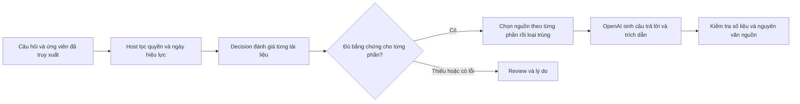

# Decision chọn tài liệu + OpenAI trả lời có dẫn chứng

Ví dụ chọn **bộ tài liệu đủ để trả lời một câu hỏi**, dùng `decision-adapter`
đánh giá nội dung rồi OpenAI `gpt-6-luna` sinh câu trả lời từ các nguồn đã chọn.
Dữ liệu chính sách SLA, tenant và số liệu đều là fixture giả lập.

## Bài toán

Acme dùng gói Enterprise tại EU, uptime tháng là 99.8% do sự cố ngoài lịch bảo
trì. Người dùng hỏi mức service credit và cách gửi claim. Một tài liệu chỉ có
mức credit; một tài liệu khác có hạn gửi và hồ sơ cần nộp. Catalog còn có bản
cũ, bản nháp, chính sách US/Starter, hợp đồng riêng của Beta, FAQ gần chủ đề và
ghi chú cố điều khiển model.

Chọn một tài liệu có điểm cao nhất sẽ thiếu thủ tục claim. Luôn chọn bản mới
nhất sẽ sai khi người dùng hỏi về một thời điểm trong quá khứ.

| Ca | Kết quả cần đạt |
| --- | --- |
| `current-policy` | Chọn SLA hiện hành và thủ tục claim: credit 10%, hạn 30 ngày sau cuối tháng, invoice ID + incident ID + uptime report |
| `historical-policy` | Theo ngày 2025-02-01: chọn hai bản cũ, credit 5%, hạn 90 ngày, invoice ID + incident ID |
| `missing-procedure` | Thiếu nguồn về thủ tục: trả `review`, không sinh câu trả lời thiếu bằng chứng |
| `maintenance-exclusion` | Chọn tài liệu ngoại lệ: bảo trì đã thông báo không được credit |
| `tenant-boundary-vi` | Câu hỏi tiếng Việt; không gửi nội dung hợp đồng Beta tới model |

## Luồng xử lý



Host lọc tenant, khu vực, gói, trạng thái phê duyệt và thời gian **trước khi**
gửi body tài liệu tới decision. `asOf` là ngày cần áp dụng, có thể ở quá khứ.
Metadata này phải lấy từ hệ thống quyền và kho tài liệu đáng tin cậy; không để
người gửi tài liệu tự khai báo tenant hay quyền truy cập.

Một task dùng lại ba câu hỏi: điểm relevance 0–3, có bằng chứng về quyền nhận
credit không, có deadline và hồ sơ claim không. `evaluateBatch` giới hạn hai
request đồng thời. Host chọn nguồn đạt điểm tối thiểu 2 có bằng chứng cho
**từng phần** (`entitlement`, `procedure`), kiểm tra loại tài liệu rồi loại trùng.
Đây là điểm relevance theo rubric, không phải xác suất câu trả lời đúng.

Nếu một ứng viên lỗi, sample trả `candidate-failure`; nếu thiếu một phần bằng
chứng, trả `missing-evidence`. Writer chỉ chạy khi chọn đủ nguồn. Câu trả lời
gồm phần diễn giải, các số liệu có cấu trúc và quote nguyên văn theo document ID.

## Chạy

Chạy từ root sau khi cài dependencies và build packages. Node cần hỗ trợ chạy
TypeScript trực tiếp như các runner hiện có của dự án.

```sh
pnpm build
pnpm sample:decision-documents --help

# OpenAI làm decision và sinh câu trả lời
pnpm sample:decision-documents --providers openai

# TypeSafe làm decision, OpenAI sinh câu trả lời
pnpm sample:decision-documents --providers typesafe --cases current-policy

# So sánh hai provider trên cả năm ca
pnpm sample:decision-documents --providers typesafe,openai --out artifacts/decision-documents/my-run
```

Root `.env` được nạp tự động nếu có:

```dotenv
OPENAI_API_KEY=...
TYPESAFE_API_KEY=...
OPENAI_DOCUMENT_SAMPLE_MODEL=gpt-6-luna
TYPESAFE_MODEL=jev-latest
```

OpenAI dùng tối thiểu `gpt-6-luna` theo [quy định dự án](../../AGENTS.md).
Runner từ chối model cũ và không fallback. Writer luôn cần OpenAI key; TypeSafe
key chỉ cần khi chọn provider đó. Mặc định runner so sánh cả hai provider.

Task có timeout 60 giây mỗi ứng viên; batch 120 giây; toàn ca 180 giây. Không
retry, cache kết quả hay sửa output bằng một model khác. Agent writer mới cho
mỗi ca, không mang lịch sử từ ca trước; không tắt prompt caching của provider.

`results.json` ghi từng đánh giá, model trả về, usage, nguồn được chọn, các check
và mã lỗi an toàn. `REPORT.md` có câu trả lời và quote thực sự được sinh. Exit
code 1 nếu có bất kỳ ca thất bại; review do lỗi provider không được chấm như một
lần từ chối trả lời đúng.

```sh
pnpm exec vitest run tests/unit/decision-document-selection-sample.spec.ts --maxWorkers=1
pnpm exec tsc --noEmit -p samples/decision-document-selection/tsconfig.json
```

## Dùng với dữ liệu của ứng dụng

Thay catalog trong [data.ts](./data.ts) bằng ứng viên từ search/vector store,
gắn metadata từ kho nguồn và dùng [createDocumentSelector](./selection.ts):

```ts
const select = createDocumentSelector(
  decisions.decisionModel({ provider: 'typesafe', model: 'jev-latest' }),
)
const result = await select(query, retrievedDocuments, requestSignal)
if (result.selection.status === 'review') {
  return { status: 'review', reason: result.selection.reason,
    missingFacets: result.selection.missingFacets }
}
// Đưa result.selection.selected vào writer của ứng dụng.
```

Đổi model handle sang OpenAI qua `llmDecisionPlugin` để giữ cùng logic chọn
nguồn. [run.mts](./run.mts) có ví dụ cấu hình cả hai runtime và writer OpenAI.
Thêm các phần câu hỏi và rubric riêng cho sản phẩm tại [selection.ts](./selection.ts),
thay vì ép mọi bài toán vào hai phần SLA của fixture này.

Sample bắt đầu từ một tập ứng viên nhỏ, không triển khai truy xuất, chunking,
indexing hay xử lý PDF. Facets và ngữ cảnh quyền do host cung cấp; không được
suy ra quyền truy cập bằng model. Chi phí decision tăng theo số ứng viên, nên
giới hạn shortlist trước khi đánh giá trên kho lớn.

Grader so nguồn với nhãn chuẩn, kiểm tra credit/deadline/fields và quote có thực
sự nằm trong từng tài liệu được chọn. Nó chưa kiểm tra mọi khẳng định trong
prose có được quote chứng minh hay không. Luồng chọn một nguồn cho mỗi phần
cũng chưa giải quyết các tài liệu hợp lệ mâu thuẫn hoặc một câu trả lời cần
tổng hợp nhiều nguồn cho cùng một phần. Khi mở rộng cần chính sách ưu tiên
nguồn, xử lý mâu thuẫn và đánh giá trên dữ liệu riêng.

Nhãn chuẩn chỉ dùng ở scorer, không gửi tới decision/writer. Xem
[kết quả API thật](./BENCHMARK.md) để đọc các giới hạn quan sát được.
