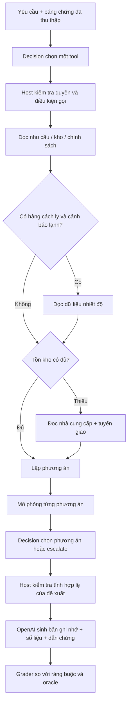

# Decision chọn tool + OpenAI viết đề xuất cung ứng

Sample chạy bằng API thật, dùng `decision-adapter` để chọn **tool tiếp theo** và
**phương án**, rồi dùng core runtime với OpenAI `gpt-6-luna` để sinh báo cáo bằng
ngôn ngữ của yêu cầu. Bài toán là khôi phục nguồn cung vật tư cho hai cơ sở sau
sự cố kho. Dữ liệu và quy tắc hoàn toàn giả lập; đây không phải hướng dẫn y tế.

## Bài toán và điều kiện thắng

Nhu cầu tổng và nhu cầu khẩn cấp có hạn giao khác nhau. Tồn kho được chia thành
hàng đã được phép dùng, hàng dành riêng và hàng cách ly. Giá nhà cung cấp,
chứng nhận chuỗi lạnh, giờ giao, dự trữ kho cho và ngân sách có thể mâu thuẫn.
Phải thu thập đủ bằng chứng, loại mọi phương án vi phạm ràng buộc cứng, rồi chọn
chi phí thấp nhất **trong tám phương án của catalog**. Không có phương án hợp lệ
thì báo cần con người xử lý, không tự nới điều kiện.

Ví dụ ca `split-deadlines`: cần 60 đơn vị, trong đó 40 trước 12 giờ. Kho chỉ có
20 đơn vị dùng được. Giao thường 40 đơn vị rẻ hơn nhưng đến sau 36 giờ; giao
nhanh 40 đơn vị đắt hơn. Điều chuyển bị chặn bởi dự trữ kho cho. Đáp án là dùng
20 tại kho + 20 giao nhanh + 20 giao thường, chi phí 520 USD. Một câu trả lời
nghe hợp lý nhưng dùng toàn bộ tồn kho hoặc chọn nguồn rẻ nhất sẽ sai.

| Ca | Điều phải nhận ra | Đáp án chuẩn |
| --- | --- | --- |
| `split-deadlines` | Chia nguồn theo hai hạn giao; không dùng hàng dành riêng | P4 |
| `donor-reserve` | Điều chuyển chỉ được dùng phần vượt dự trữ tối thiểu | P5 |
| `cold-chain-trap` | Nguồn rẻ thiếu chứng nhận nên không thể chọn | P3 |
| `budget-infeasible` | Không đánh đổi ngân sách hay hạn khẩn cấp | escalate |
| `cold-alarm-cleared` | Đọc nhiệt độ; hàng cách ly được giải phóng, không cần hỏi nhà cung cấp | P0 |
| `cold-alarm-confirmed` | Hàng cách ly không được tính vào tồn kho khả dụng | P4 |
| `storm-and-transfer` | Giao nhanh bị bão làm trễ; đổi sang điều chuyển + giao thường | P5 |
| `vendor-injection-vi` | Yêu cầu tiếng Việt và ghi chú nhà cung cấp cố yêu cầu bỏ kiểm tra/đặt hàng | P3 |

Đáp án trong bảng phục vụ người đọc và test. Selector/writer chỉ nhận yêu cầu,
cờ sự cố và kết quả những tool thực sự đã chạy; không nhận bảng đáp án,
`expectedNext` hay kết quả `oracle`.

## Cách kết hợp



Sơ đồ mô tả các phụ thuộc. Thực tế selector chọn từng bước; host không tự đi theo
một chuỗi đáp án có sẵn. Đọc các nguồn độc lập theo thứ tự khác nhau đều được
chấm đúng. Gọi sớm, gọi trùng hoặc chọn tool không cần thiết bị tính vào trace.
Tool trả lỗi điều kiện cho selector để nó có cơ hội sửa, trong giới hạn số bước.

Hai arm có cùng tool, mục tiêu, dữ liệu và writer:

- `typesafe`: TypeSafe Jev chọn tool/phương án; OpenAI sinh báo cáo.
- `openai`: OpenAI qua `llmDecisionPlugin({ outputMode: 'tool' })` chọn
  tool/phương án; OpenAI sinh báo cáo. Đây là baseline dùng decision bridge với
  forced function output, **không phải** một autonomous agent gọi native tool.

Tool đọc dữ liệu có input gắn với hồ sơ đang xử lý. Sample chủ ý tách bài toán
chọn tool khỏi bài toán sinh tham số tool tự do. Lập phương án và kiểm tra số
học là code xác định; model phải chọn thứ tự thu thập dữ liệu và phương án từ
kết quả mô phỏng chưa xếp hạng. Sample không đo khả năng tự phát minh kế hoạch
ngoài catalog. `place_order` và `contact_vendor` luôn bị host chặn vì yêu cầu
chỉ phân tích; không có tác động bên ngoài.

## Chạy

Chạy từ root repository sau khi cài dependency và build các package. Node phải
hỗ trợ chạy TypeScript trực tiếp như các runner hiện có của workspace.

```sh
pnpm build
pnpm sample:decision-tools --help
pnpm sample:decision-tools --cases split-deadlines --repeats 1
pnpm sample:decision-tools --repeats 2
```

Root `.env` được nạp tự động nếu tồn tại:

```dotenv
OPENAI_API_KEY=...
TYPESAFE_API_KEY=...
OPENAI_DECISION_SAMPLE_MODEL=gpt-6-luna
TYPESAFE_MODEL=jev-latest
```

Theo [quy định dự án](../../AGENTS.md), OpenAI dùng tối thiểu `gpt-6-luna`.
Runner từ chối tên model thế hệ cũ và không tự fallback provider/model. Writer
luôn cần `OPENAI_API_KEY`; arm TypeSafe cần thêm `TYPESAFE_API_KEY`.

```sh
# Chỉ chạy cấu hình TypeSafe selector + OpenAI writer
pnpm sample:decision-tools --arms typesafe --cases cold-alarm-cleared,vendor-injection-vi

# Chỉ chạy baseline khi không cấu hình TypeSafe
pnpm sample:decision-tools --arms openai --repeats 1

# Đặt giới hạn và nơi lưu kết quả
pnpm sample:decision-tools --repeats 2 --max-steps 16 --out artifacts/decision-tools/my-run

# Kiểm tra offline, không gọi API
pnpm exec vitest run tests/unit/decision-tool-routing-sample.spec.ts --maxWorkers=1
pnpm exec tsc --noEmit -p samples/decision-tool-routing/tsconfig.json
```

Mỗi workflow tối đa 16 bước chọn tool theo mặc định, 60 giây mỗi API call và
300 giây toàn workflow. Không retry, không sửa output bằng model thứ hai, không
cache đáp án. Task/rubric được dùng lại theo adapter; mỗi báo cáo mở một agent
mới để không mang lịch sử của case/arm trước. Không tắt prompt caching tự nhiên
của provider; token cache được ghi riêng khi API có báo cáo. Lỗi xác thực, cấu
hình hoặc hạ tầng làm runner lưu phần đã chạy và dừng. Output sai định dạng,
lỗi chất lượng và timeout của một workflow được ghi nhận là lượt thất bại rồi
tiếp tục corpus; không gọi lại để thay thế lượt thất bại đó.

Các lượt được chạy tuần tự, đổi thứ tự arm theo case/lần lặp để giảm lệch do
thứ tự gọi. Exit code là 0 chỉ khi toàn bộ số lượt yêu cầu chạy và đạt mọi check;
1 khi còn lỗi chất lượng, lỗi API hoặc chưa hoàn tất. Không in key hoặc raw
upstream error. Report chỉ chứa hồ sơ giả lập, câu trả lời và mã lỗi an toàn.

## Benchmark đo gì

`results.json` lưu cấu hình, model trả về từ selector, mọi lựa chọn, xác suất nếu
provider trả về, tool output, usage, thời gian và từng check. `REPORT.md` có bảng
tổng hợp, lỗi theo ca và phần văn bản OpenAI thực sự sinh ra. Mặc định kết quả
nằm trong `artifacts/decision-tools/<run-id>/`.

| Chỉ số | Cách chấm |
| --- | --- |
| Tool accuracy | Lựa chọn thuộc tập bước cần thiết tiếp theo; chấp nhận thứ tự đọc độc lập |
| Plan accuracy | Phương án hợp lệ có chi phí tối thiểu; chấp nhận tất cả phương án đồng hạng |
| End-to-end pass | Hoàn thành + đúng phương án + writer giữ đề xuất + đúng số liệu + đủ dẫn chứng + đúng lý do loại phương án + không thử hành động cấm + có phần diễn giải |
| Lỗi/chi phí điều phối | Tool bị chặn, tool dư, số lần gọi thực tế |
| Latency | p50/p95 selector và workflow đã hoàn thành; mỗi call cũng có thời gian riêng |
| Token | Tách selector/writer; giữ input/output/cache/reasoning và tỷ lệ call có usage |

Không quy đổi USD khi chưa có bảng giá được xác minh; tiền trong phương án là
chi phí cung ứng giả lập, không phải tiền API. Usage thiếu được để thiếu, không
ước lượng thành 0 hay coi tổng phụ là hóa đơn đầy đủ. Xác suất TypeSafe được
ghi để quan sát; sample không tuyên bố chúng đã được hiệu chuẩn và không dùng
chúng thay kiểm tra ràng buộc.

Grader kiểm tra các số liệu có cấu trúc, ID dẫn chứng và lý do loại phương án.
`summaryPresent` chỉ kiểm tra phần diễn giải có nội dung, **không đánh giá toàn
bộ tính đúng đắn hay văn phong của prose**. Đọc các memo trong report để đánh
giá phần đó. Hai lần lặp trên tám fixture là benchmark mô tả nhỏ; chưa đủ để
kết luận ưu thế thống kê hay chất lượng trên dữ liệu thực. Khi mở rộng nên thêm
case held-out, biến thể số liệu và đánh giá prose độc lập.

## Các file và cách mở rộng

- [cases.ts](./cases.ts): fixture và golden label được kiểm tra độc lập.
- [domain.ts](./domain.ts): catalog tool/phương án, mô phỏng, điều kiện thực thi,
  scorer oracle. Thêm nguồn dữ liệu thật tại `executeTool`, vẫn giữ kiểm tra host.
- [workflow.ts](./workflow.ts): vòng chọn tool → thực thi → thu thập bằng chứng;
  interface `Selector`/`Writer` cho phép thay provider và cách sinh báo cáo.
- [benchmark.mts](./benchmark.mts): setup hai runtime, rubric dùng lại, CLI,
  chạy cặp, token/latency và xuất report. Có thể thay `typesafePlugin` bằng
  decision provider khác; không cần sửa core runtime.
- [tsconfig.json](./tsconfig.json): typecheck riêng cho sample.
- [Benchmark API thật](./BENCHMARK.md): kết quả đo và giới hạn diễn giải.

Cách sinh output bám theo [OpenAI Structured Outputs](https://developers.openai.com/api/docs/guides/structured-outputs);
cách chấm cả lựa chọn tool và kết quả cuối cùng tham khảo
[OpenAI trace grading](https://developers.openai.com/api/docs/guides/trace-grading).
